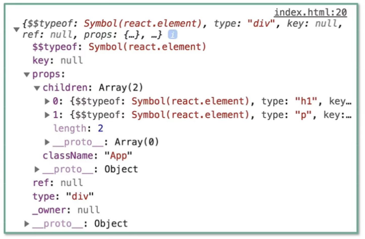

# **Virtual DOM**


## **Real DOM**

在认识 virtual dom 之前，先认识一下 Real DOM：

Real DOM，真实 `DOM`，意思为文档对象模型，是一个结构化文本的抽象，在页面渲染出的每一个结点都是一个真实 `DOM` 结构，如下：


Real DOM（真实DOM）是浏览器原生提供的，它表示当前页面的实际HTML结构。当页面中的数据发生变化时，Real DOM 会进行重新渲染和更新。它是我们与网页进行交互的基础，通过操作Real DOM，我们可以改变网页的内容、样式和行为。

然而，直接操作Real DOM可能会引发重排（reflow）和重绘（repaint），这些操作是昂贵的，因为它们需要浏览器重新计算元素的布局和渲染页面的某些部分，消耗大量的计算资源。


## **Virtual DOM**

虚拟 DOM 顾名思义不是真实的 DOM，它不需要浏览器的 DOM API 支持。

虚拟 DOM 是在 DOM 的基础上建立一个抽象层，其实质是一个 JavaScript 对象，当数据和状态发生了变化，都会被自动高效的同步到虚拟 DOM 中，**最后再将仅变化的部分同步到真实 DOM 中**。

将 DOM 抽象成一个 JavaScript 对象：

```js
const element = {
  // 节点标签名
  tagName: 'ul',
  // DOM属性,用一个对象存储键值对
  props: {
    id: 'list',
  },
  // 该节点的子节点
  children: [
    { tagName: 'li', props: { class: 'item' }, children: ['Item 1'] },
    { tagName: 'li', props: { class: 'item' }, children: ['Item 2'] },
    { tagName: 'li', props: { class: 'item' }, children: ['Item 3'] },
  ],
};
```

对应的 DOM 树中的 HTML 写法：

```html
<ul id="list">
  <li class="item">Item1</li>
  <li class="item">Item2</li>
  <li class="item">Item3</li>
</ul>
```

在浏览器控制台显示的 Virtual DOM 结构:




##  **Diff 算法**

### **思路**


### 实现流程

1. **生成新的虚拟 DOM**：当组件的状态或属性发生变化时，React 会重新调用组件的渲染方法，生成一个新的虚拟 DOM 树。
2. **分层比较**：React 会将虚拟 DOM 树按层级（即深度优先遍历的顺序）进行比较，而不是对整个树进行一次性比较。
3. **同层节点比较**：React 会对新旧两个虚拟 DOM 树的同层节点进行比较。如果节点顺序或数量有变化，React 会采用特定的算法来找出最小的操作集合，使得旧的 DOM 树能够转变为新的 DOM 树。
4. **节点类型与属性比较**：对于每个变化的节点，React 会比较其类型和属性。如果节点类型不同，React 会直接删除旧的 DOM 节点并创建新的 DOM 节点。如果节点类型相同但属性有变化，React 会仅更新变化的属性。
5. **子节点比较**：对于节点的子节点，React 会采用一种称为“key”的机制来优化比较过程。如果子节点有唯一的 `key` 属性，React 可以更高效地识别出哪些子节点是新增的、哪些子节点是删除的、哪些子节点是移动的。这样，即使子节点的顺序发生了变化，React 也可以只进行必要的 DOM 操作，而不是重新渲染整个子节点列表。
6. **应用 DOM 操作**：一旦找出了虚拟 DOM 树之间的差异，React 就会将这些差异应用到实际的 DOM 上。这通常包括添加、更新或删除 DOM 节点，以及修改节点的属性。
7. **更新完成**：一旦 DOM 更新完成，React 会触发相应的生命周期方法或钩子（如 `componentDidUpdate` 或 `useEffect`），以便开发者可以执行更新后的逻辑。


## **为什么不直接操作 Real dom, 而是使用 Virtual dom**？

1. **性能优化**：

   * 直接操作Real DOM通常涉及重排（reflow）和重绘（repaint），这是非常消耗计算资源的。浏览器需要重新计算元素的布局和渲染页面的某些部分。

   * 相比之下，Virtual DOM是一个轻量级的JavaScript对象树，对其进行操作比直接操作Real DOM要快得多。

   * 当组件状态改变时，React会重新构建Virtual DOM，并与前一个版本进行比较，从而确定Real DOM中需要更新的部分。然后，React只将这些更新的部分应用到Real DOM上，避免了不必要的重排和重绘。

     > 传统的原生 `api` 或 `jQuery` 去操作 `DOM` 时，浏览器会从构建 `DOM` 树开始从头到尾执行一遍流程:
     >
     > * 当你在一次操作时，需要更新 10 个 `DOM` 节点，浏览器没这么智能，收到第一个更新 `DOM` 请求后，并不知道后续还有 9 次更新操作，因此会马上执行流程，最终执行 10 次流程
     >
     > 而通过 `VNode`，同样更新 10 个 `DOM` 节点，虚拟 `DOM` 不会立即操作 `DOM`，而是将这 10 次更新的 `diff` 内容保存到本地的一个 `js` 对象中，最终将这个 `js` 对象一次性 `attach` 到 `DOM` 树上，避免大量的无谓计算

2. **简化复杂操作**：

   * 对于复杂的页面UI，往往会定义大量的Real DOM元素。频繁地操作这些元素不仅会降低性能，还会使代码变得复杂且难以维护。
   * 使用Virtual DOM可以将这些操作抽象化，使开发人员能够更专注于业务逻辑和UI设计，而不是陷入繁琐的DOM操作中。

3. **跨平台兼容性**：

   * Virtual DOM使得React等框架能够更容易地实现跨平台兼容性。
   * 由于Virtual DOM是一个抽象的JavaScript对象树，它可以被转换成不同平台的原生UI组件，从而实现一次编写、多处运行的目标。


## **Real DOM 和 Virtual DOM 对比** 

|            |                    Real DOM                    |                      Virtual DOM                       |
| :--------: | :--------------------------------------------: | :----------------------------------------------------: |
|  **优点**  |                                                |                                                        |
|   可靠性   |  高，直接操作实际DOM元素，确保可靠渲染和交互   |           较高，通过抽象和比较，实现有效更新           |
| 功能丰富性 |          提供原生的API和事件处理机制           |         可以结合React等框架提供丰富的组件和API         |
| 跨平台能力 |             原生支持，无需额外转换             |       通过框架支持，如React Native，可实现跨平台       |
|  **缺点**  |                                                |                                                        |
|    性能    | 当数据变化频繁时，性能下降，需要频繁重排、重绘 | 在复杂应用中，初次渲染可能较慢，但在后续更新中性能较好 |
|  内存消耗  |   数据变化时，需要更新整个DOM树，内存消耗大    |      较小，只存储JavaScript对象树，不直接操作DOM       |
|   便捷性   |          操作繁琐，容易出错，维护困难          |            简单方便，减少直接操作DOM的需求             |
|  优化空间  |      优化空间有限，直接操作DOM的代价昂贵       |    可进行一定程度的优化，但在极端性能要求下可能受限    |

两者的区别如下：

- 虚拟 DOM 不会进行排版与重绘操作，而真实 DOM 会频繁重排与重绘
- 虚拟 DOM 的总损耗是“虚拟 DOM 增删改+真实 DOM 差异增删改+排版与重绘”，真实 DOM 的总损耗是“真实 DOM 完全增删改+排版与重绘”

* Real DOM具有可靠性和功能丰富性，但由于直接操作DOM，性能较低且内存消耗大。

* 而Virtual DOM则通过抽象和比较实现有效更新，提高了性能和内存效率，但在初次渲染时可能较慢。此外，Virtual DOM还可以结合框架实现跨平台开发，提供了更多的便捷性和优化空间。