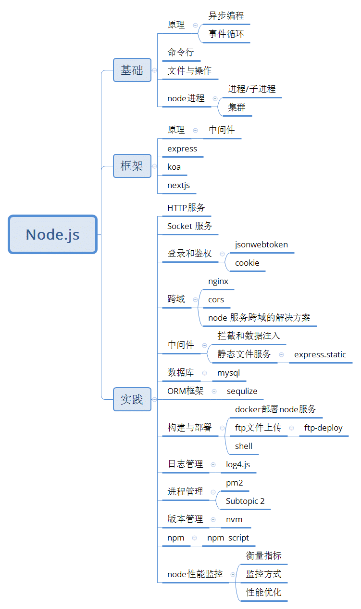
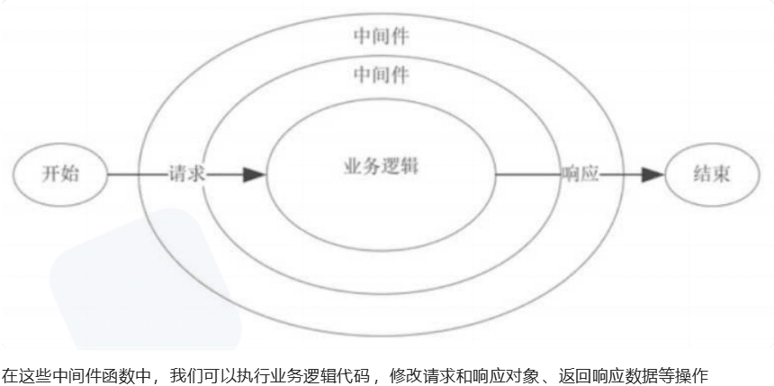
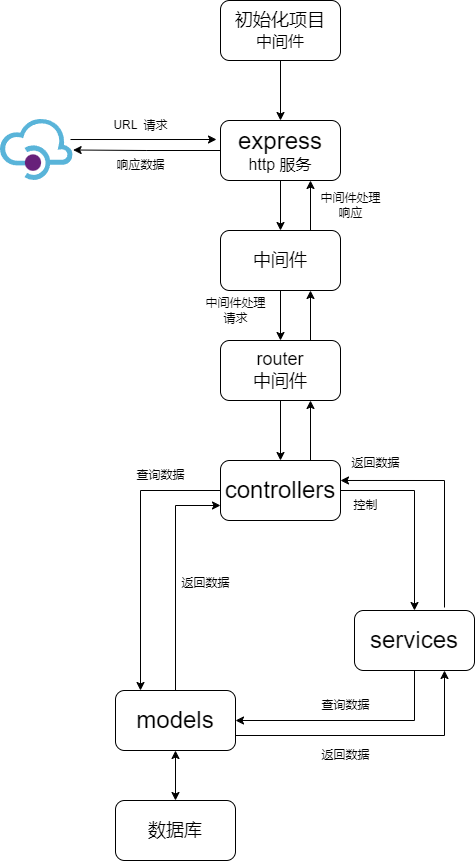
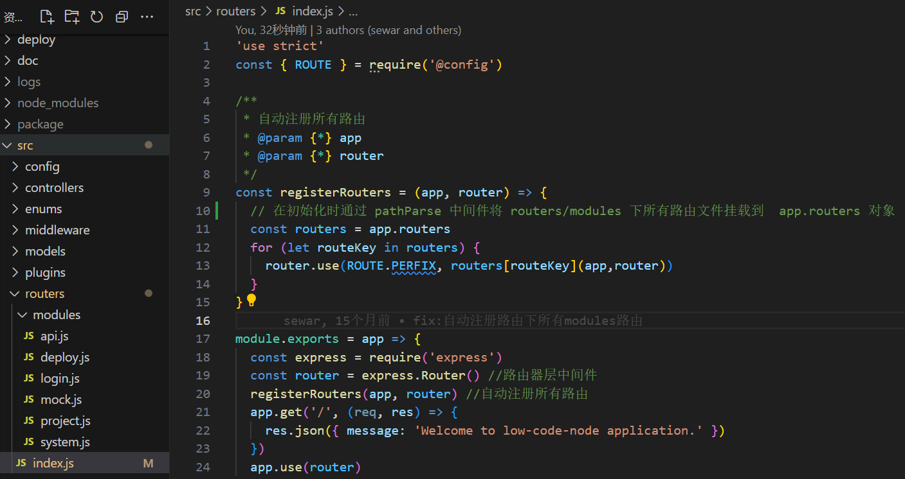
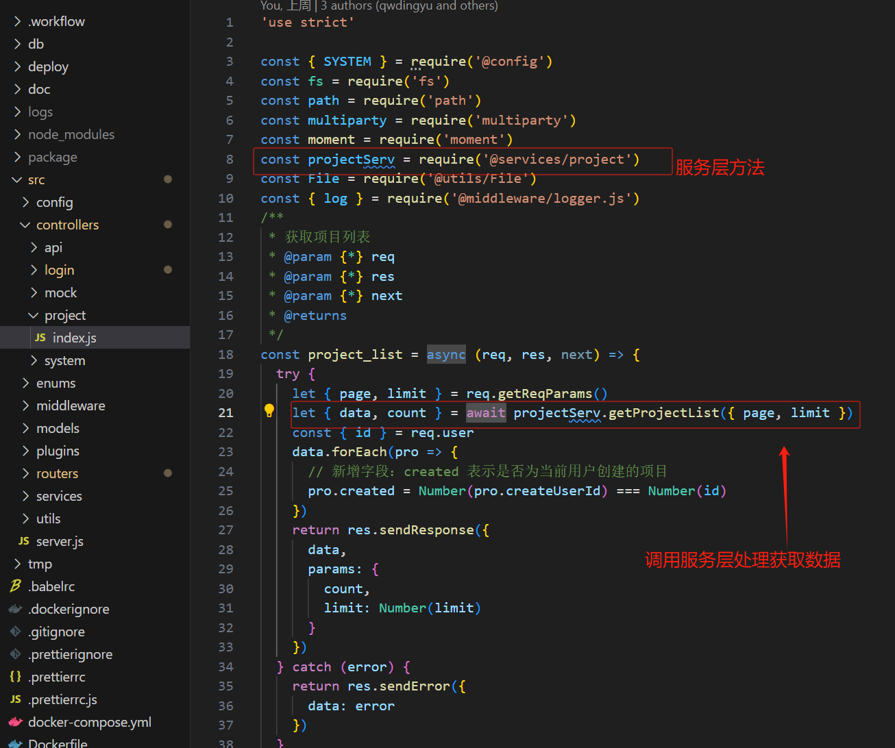
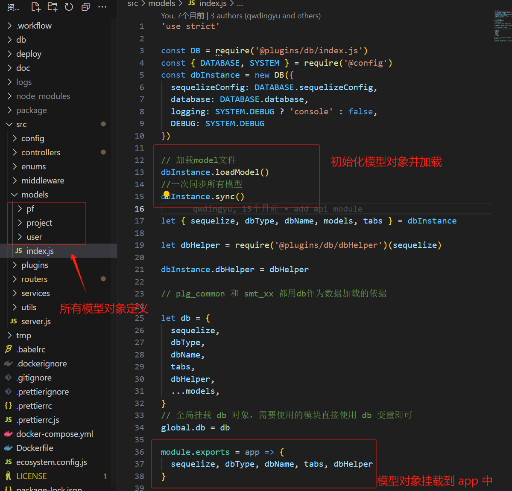
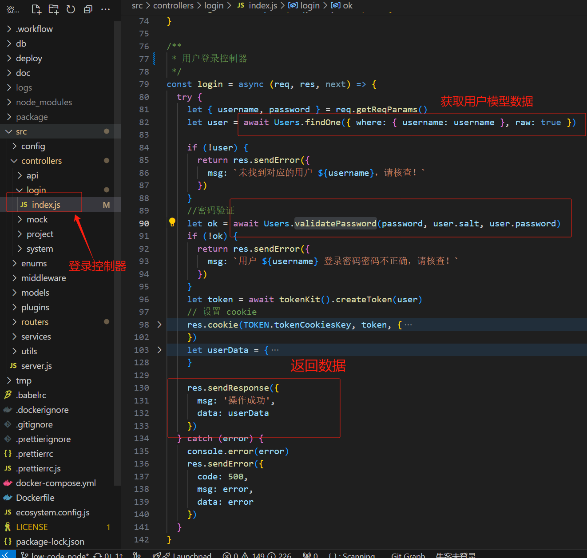

# Node

## 总览




## [中间件](https://express.nodejs.cn/en/guide/writing-middleware.html)

### 概念

* 在  NodeJS 中 ,  中间件主要是指封装  http 请求细节处理的方法
  * 例如在  express 、koa 等  web 框架中， 中间件的本质为 一个回调函数， 参数包含请求对象 、响应对象和`next` 函数的函数，`next` 函数是 Express 路由中的一个函数，当被调用时，它会在当前中间件之后执行中间件。
* 中间件函数可以执行以下任务：
  - 执行任何代码。
  - 更改请求和响应对象。
  - 结束请求-响应周期。
  - 调用堆栈中的下一个中间件。
* 如果当前中间件函数没有结束请求-响应循环，它必须调用 `next()` 将控制权传递给下一个中间件函数。 否则，请求将被挂起。




### 中间件封装

>  中间件封装思路参考：[express - 中间件](https://express.nodejs.cn/en/guide/writing-middleware.html)

以下是在 node express 项目中通过封装中间件的实践项目介绍

中间件通常放入统一的文件管理，我的 node express 项目中通过 `/middleware` 中统一管理

在 `/middleware/index.js` 文件中统一引入中间件

```js
const bodyParser = require('body-parser')
const cookieParser = require('cookie-parser')
const static = require('./static.js')
const cors = require('./cors.js')
const errorHandlers = require('./error.js')
const authHandlers = require('./auth.js')
const axiosPlugin = require('./axios.js')
const httpFunc = require('./httpFunc.js')
const { loggerMiddleware } = require('./logger.js')
const { SYSTEM } = require('@config/index.js')

//notice: 中间件装入顺序很重要：首先装入的中间件函数也首先被执行。
module.exports = app => {
  // 跨域中间件
  app.use(cors)
  // 解析 application/json 格式的请求体
  app.use(bodyParser.json())
  // 解析 application/x-www-form-urlencoded 格式的请求体
  app.use(bodyParser.urlencoded({ extended: true }))
  // 静态资源中间件
  app.use(SYSTEM.STATIC, static)
  // 解析 HTTP 请求中的 cookie，使得服务器可以方便地访问和处理 cookie 数据
  app.use(cookieParser())
  //  请求响应参数格式化中间件，在 req 请求对象中挂载请求相关方法 
  app.use(httpFunc)
  // axios 中间件
  app.use(axiosPlugin)
  // 日志管理模块
  app.use(loggerMiddleware)
  // 校验客户端请求token中间件,处理检查请求头部token是否正确
  app.use(authHandlers)
  //Express 中间件是按顺序执行的。您应该在所有其他中间件之后，最后定义错误处理程序。否则，您的错误处理程序将不会被调用
  app.use(errorHandlers)
}

```

 

### 日志中间件

> 日志管理使用 [log4js](https://www.npmjs.com/package/log4js) 做统一的日志管理

项目中常用的日志分类：

* 错误日志：记录错误信息
* 普通日志：记录访问信息
* 调试日志：用于调试线上bug

在日志中间件中，主要定义了两个函数：

1. 日志中间件函数：记录 http 请求和响应信息，在请求和响应时记录，并在错误时候记录报错信息；
2. `log` 打印函数：用于在业务代码中主动记录日志；

代码实现：

```js
/**
 * =======================================================================================
 *  日志管理中间件
 * =======================================================================================
 */

const log4js = require('log4js')
const { LOG, SYSTEM } = require('@config/index.js')
const { red } = require('color-name')
// 日志配置
log4js.configure({
  PM2: SYSTEM.USE_PM2,
  // 定义日志各种分类执行的事件
  appenders: {
    error: {
      // 错误日志
      type: 'dateFile',
      filename: `${LOG.LOG_CONFIG.dir}/error/error`,
      pattern: 'yyyy-MM-dd.log',
      alwaysIncludePattern: true,
      layout: { type: "coloured" }
    },
    info: {
      // 普通日志
      type: 'dateFile',
      filename: `${LOG.LOG_CONFIG.dir}/info/info`,
      pattern: 'yyyy-MM-dd.log',
      alwaysIncludePattern: true,
      layout: { type: "coloured" } // 输出带颜色的日志信息
    },
    debug: {
      // 调试日志
      type: 'dateFile',
      filename: `${LOG.LOG_CONFIG.dir}/debug/info`,
      pattern: 'yyyy-MM-dd.log',
      alwaysIncludePattern: true,
      layout: { type: "coloured" } // 输出带颜色的日志信息
    },
  },
  //指定要记录的日志分类
  categories: {
    error: {
      appenders: ['error'],
      level: 'error'
    },
    info: {
      appenders: ['info'],
      level: 'info'
    },
    debug: {
      appenders: ['debug'],
      level: 'debug'
    },
    default: {
      //默认日志
      appenders: ['info'],
      level: 'info'
    }
  }
})

// 创建日志记录器
const errorLogger = log4js.getLogger('error')
const infoLogger = log4js.getLogger('info')
const debugLogger = log4js.getLogger('debug')
// 定义 middleware 函数
const loggerMiddleware = (req, res, next) => {
  // 保存当前时间
  const now = new Date()

  // 定义日志信息对象
  const logInfo = {
    method: req.method,
    url: req.originalUrl,
    ip: req.ip,
    headers: req.headers,
    referer: req.headers['referer'], // 请求的源地址
    userAgent: req.headers['user-agent'], // 客户端信息 设备及浏览器信息
    body: req.body,
    query: req.query,
    params: req.params,
    timestamp: now.toISOString(),
    responseTime: null
  }

  // 将日志信息对象添加到响应对象中,在响应结束时可以获取到日志信息并记录日志
  res.logInfo = logInfo

  // 定义错误处理函数
  const errorHandler = err => {
    // 将错误信息添加到日志信息对象中
    logInfo.error = err.message

    // 根据错误类型选择日志记录器
    if (err instanceof Error) {
      errorLogger.error(logInfo)
    } else {
      infoLogger.info(logInfo)
    }
  }

  // 定义响应处理函数
  const responseHandler = () => {
    // 记录完成的时间 作差计算响应时间
    logInfo.responseTime = `${Date.now() - now} ms`
    // 根据响应状态选择日志记录器
    if (res.statusCode >= 400) {
      errorLogger.error(logInfo)
    } else {
      infoLogger.info(logInfo)
    }
  }

  // 在响应结束时记录日志
  res.on('finish', responseHandler)

  // 在发生错误时记录日志
  res.on('error', errorHandler)
  res.log = log
  next()
}

// 输出存储信息函数
const log = (errorType, message) => {
  // 根据错误类型选择日志记录器
  const logMap = {
    'error': errorLogger,
    'info': infoLogger,
    'debug': debugLogger
  }
  logger = logMap[errorType] || infoLogger
  logger[errorType](message)
}

// 导出模块
module.exports = {
  loggerMiddleware,
  log
}

```


### 请求响应参数封装

> 请求响应参数封装中间是通过统一的请求参数格式化方法和响应参数格式化方法，统一解析请求参数和统一返回响应格式

代码实现：

```js
/**
 * =======================================================================================
 * 请求响应参数格式化中间件，注意：在使用 body 参数之前，需要使用 body-parser 中间件来解析请求体
 * =======================================================================================
 */

const { codeEnums, codeMsgEnums } = require('@enums/response.js')
const { log } = require('./logger')
/**
 * 获取请求参数
 * @returns
 */
const getReqParams = (req, res, next) => {
  req.getReqParams = () => {
    // 根据请求方法获取参数对象
    let params = {}
    const queryMethods = ['GET', 'DELETE']
    if (queryMethods.indexOf(req.method) > -1) {
      params = req.query
    } else {
      params = req.body
    }
    return params
  }
  next()
}

/**
 * 请求参数校验
 * @param {*} req
 * @param {*} res
 * @param {*} next
 */
const validateReqParams = (req, res, next) => {
  req.validateReqParams = (rules = []) => {
    const errors = []
    const reqParams = req.getReqParams()
    // 遍历每个参数，进行校验
    rules.forEach(param => {
      const value = reqParams[param.key]
      if (param.required && !value) {
        errors.push(`参数 '${param.key}' 必填.`)
      }
      if (param.minLength && value && value.length < param.minLength) {
        errors.push(`参数 '${param.key}' 至少 ${param.minLength} 个字符.`)
      }
      // 添加其他自定义校验规则
    })

    return errors
  }
  next()
}

/**
 * 响应参数格式化
 * @param {*} req
 * @param {*} res
 * @param {*} next
 */
const responseFormatter = (req, res, next) => {
  // 在 res 对象中定义一个 sendResponse 方法
  res.sendResponse = ({ code, msg = codeMsgEnums[codeEnums.OK], data = {}, params = {} } = {}) => {
    const status = code || codeEnums.OK
    const response = {
      code: status,
      msg,
      data,
      ...params
    }
    // 记录错误日志
    log && log('info', Object.assign({}, response, res.logInfo))
    return res.status(status).json(response)
  }
  next()
}

/**
 * 错误响应格式化
 * @param {*} req
 * @param {*} res
 * @param {*} next
 */
const responseErrorFormatter = (req, res, next) => {
  // 在 res 对象中定义一个 sendResponse 方法
  res.sendError = ({ code, msg = codeMsgEnums[codeEnums.BadRequest], data = {}, params = {} } = {}) => {
    const status = code || codeEnums.BadRequest
    const response = {
      code: status,
      msg,
      data,
      ...params
    }
    // 记录错误日志
    log && log('error', Object.assign({}, response, res.logInfo))
    return res.status(status).json(response)
  }
  next()
}

module.exports = [getReqParams, validateReqParams, responseFormatter, responseErrorFormatter]

```


### 文件路径别名中间件

> 文件路径别名中间件：通过给指定路径设置别名。
>
> 文件路径解析中间件，将文件路径转为对象，将文件内容挂载到 app 实例对象，便于获取文件上下文，将 controllers 中的文件位置映射为应用对象

```js
/**
 * 文件路径解析中间件，将文件路径转为对象，将文件内容挂载到 app 实例对象，便于获取文件上下文
 * 将 controllers 中的文件位置映射为应用对象
 */
const Path = require('path')
const { getFiles } = require('../utils/File.js')
module.exports = (app, options = {}) => {
  const { rules = [] } = options
  const defaultRules = [
    {
      // 获取控制器下所有文件
      path: Path.join(__dirname, '../controllers'),
      name: 'controllers',
      onlyIndexFiles: true, // 是否仅仅识别 index.js 文件
      content: {}
    },
    {
      // 获取路由下所有文件
      path: Path.join(__dirname, '../routers/modules'),
      name: 'routers',
      onlyIndexFiles: false,
      content: {}
    }
  ]
  if (!app) {
    throw new Error('the app params is necessary!')
  }
  rulesArray = [...rules, ...defaultRules]
  const appKeys = Object.keys(app)
  if (rulesArray.length > 0) {
    rulesArray.forEach(item => {
      let { path, name, content, onlyIndexFiles } = item
      if (appKeys.includes(name)) {
        throw new Error(`the name of ${name} already exists!`)
      }
      getFiles({ path, content, onlyIndexFiles })
      app[name] = content
    })
  }
}

```


## **express 流程**



### MVC模式概述

MVC是一种软件设计模式，它将应用程序分为三个核心部分：模型（Model）、视图（View）和控制器（Controller），旨在提高代码的可维护性、可重用性和可测试性。

- **模型（Model）**：代表数据和业务逻辑，是应用程序的核心。在Node.js应用中，这通常包括数据库交互、数据验证等。
- **视图（View）**：负责呈现数据给用户，通常是HTML页面或其他格式的文档。在Express应用中，视图可以是通过模板引擎（如EJS、Pug等）渲染的HTML文件。
- **控制器（Controller）**：处理用户的输入，调用模型和视图完成用户的请求。在Express应用中，控制器通常是由路由处理函数和中间件组成的。

* **服务层（Service ）**：处理业务逻辑。服务层包含复杂的业务规则和数据处理逻辑。

> 下面以 **[go-view-node](https://github.com/Sewar-x/go-view-node)** 项目为例，说明 express 的流程。

### 1.初始化

1. 创建 express 实例 app;
2. 在 express 实例中 app，挂载对象：
   * 将文件路径转为对象挂载到 app 上，便于获取文件上下文；
   * 挂载数据库模型对象；
   * 挂载中间件;
3. 在 app 中挂载路由，并注册所有路由，添加公共路由前缀；
4. express app 实例启动 http 服务，并监听指定端口号；


在项目中通过运行 `src/server.js` 脚本，启动一个 node express 服务：


### 2.配置中间件

中间件（Middleware） 本质上是一个函数，可以访问请求对象（`req`）、响应对象（`res`）和应用程序的请求/响应循环中的下一个中间件函数。

当Express接收到一个HTTP请求时，它会根据请求的路径和HTTP方法，在内部中间件堆栈中查找匹配的中间件函数。

**`app.use()` 允许你将这些中间件函数添加到这个堆栈中**。

**堆栈中的执行顺序**： 当请求到达Express应用程序时，请求会按照中间件在堆栈中注册的顺序进行处理。

每个中间件函数都可以决定是否调用`next()`函数来将控制权传递给堆栈中的下一个中间件，或者是否通过发送HTTP响应来结束请求/响应循环。

**中间件函数可以执行以下任务**：

- 执行代码。
- 修改请求和响应对象。
- 结束请求-响应循环。
- 调用堆栈中的下一个中间件。


常用的中间件包括：

- 静态文件服务（如`express.static`用于托管静态文件如HTML、CSS、图片等）。
- 请求体解析（如`body-parser`，虽然Express 4.16.0+已内置了`express.json()`和`express.urlencoded()`）。
- 路由（如`express.Router()`）。
- 错误处理。


在项目中，通过 `src/middleware` 集中管理中间件：


### 3. 定义路由

路由决定了应用如何响应客户端对特定端点的请求。你可以使用`app.METHOD(path, callback)`来定义路由，其中`METHOD`是HTTP请求方法（如`GET`、`POST`等），`path`是URL路径，`callback`是当路由匹配时执行的函数。

```javascript
app.get('/user', (req, res) => {  
  res.send('User profile');  
});
```

路由第一个参数是匹配路径，第二个参数是路由的控制器方法。

处理用户的输入，调用模型和视图完成用户的请求。

在Express应用中，控制器通常是由路由处理函数和中间件组成的。


**项目路由分析：**

1. 项目中，在初始化时通过 pathParse 中间件将 `src/routers/modules` 下所有路由文件挂载到  app.routers 对象；

2.  挂载路由时，通过遍历所有路由文件，注册所有路由；

   




### 4. 接收请求

当客户端（如浏览器或移动应用）通过HTTP请求访问你的Express应用时，请求首先被Express的HTTP服务器监听器捕获。

服务器监听器根据请求的URL和HTTP方法（如GET、POST等）将请求转发给相应的路由 控制器 处理函数。


在项目中，通过路由控制器处理请求：


> 如上图，当请求 `/goview/sys/login` 到达时，会通过 `app.controllers.login.login` 控制器处理该请求（`app.controllers.login.login`  是一个控制器，`app.controllers` 是通过 pathParse 中间件 将 `src/controllers` 文件夹下所有文件模块挂载的对象）


### 5. 处理请求（控制器层处理）

#### **控制器层处理**

**1. 接收和处理用户请求**

- **接收请求**：控制器层是应用程序的入口点，负责接收来自用户（通常是通过前端界面）的请求。这些请求可能包含各种信息，如路径、参数、请求体等。
- **解析请求**：控制器层需要解析这些请求，理解用户的意图，并准备相应的处理逻辑。
  - 控制器中获取到路由中传入的回调方法参数：请求体 request, 响应体：response,  next 方法。


控制器中为用户的实际处理逻辑：


> 控制器中进行接口处理逻辑，在控制器中接收三个参数：
>
> * 访问请求对象（`req`）
> * 响应对象（`res`）
> * 应用程序的请求/响应循环中的下一个中间件函数
>
> 控制器中可以调用模型，获取用户数据，也可以调用 Service 层进行处理。


**2. 调用服务层处理业务逻辑**

- **转发请求**：控制器层在理解用户请求后，会根据请求的内容调用相应的服务层（Service Layer）来处理业务逻辑。服务层包含复杂的业务规则和数据处理逻辑。
- **接收响应**：服务层处理完业务逻辑后，会将结果返回给控制器层。




#### **服务层处理**

* 服务层调用模型层获取数据，或直接处理


#### **模型层处理**

* 模型层可以封装数据访问逻辑，如数据验证、数据库查询等，供控制器调用。

* 在路由处理函数中，你可以执行各种操作来处理请求，如读取请求体中的数据、查询数据库、进行逻辑处理等。
* 在Express项目中实现Model层，你通常需要选择一个ORM（Object-Relational Mapping）库来帮助你处理数据库操作。ORM允许你使用高级编程语言（如JavaScript）中的类和对象来操作数据库，而无需编写原始的SQL语句。


**项目分析：**

项目中使用 sequelize 作为 ORM 库操作数据库，并对 进行二次封装，封装成了一个 DB 类：

>  DB 类用于初始化 sequelize 并加载指定文件夹下的所有模型文件。

```js

/**
 * ==================================================
 *  数据库模型对象
 * ==================================================
 */

'use strict'
const fs = require('fs')
const path = require('path')
const { Sequelize, DataTypes } = require('sequelize')

class DB {
  //构造函数
  constructor({ database, sequelizeConfig, knexConfig, logging, DEBUG = true }) {
    try {
      //创建一个sequelize实例
      this.sequelize = new Sequelize(sequelizeConfig.database, sequelizeConfig.username, sequelizeConfig.password, sequelizeConfig.connect, {
        // 控制台输出查询日志
        logging: logging.info,
        // 事务隔离级别：可串行化(Serializable)
        isolationLevel: Sequelize.Transaction.ISOLATION_LEVELS.SERIALIZABLE
      })
    } catch (err) {
      console.error(err)
    }

    this.tabs = []
    this.models = {}
    this.dbType = database.DATABASE
    this.dbName = database.DB_NAME
  }

  /**
   * 加载指定路径下的所有模型，如果没有传入 路径，默认加载 models 路径下的模型
   * @param {*} _path
   * @returns
   */
  loadModel(_path) {
    try {
      // 获取 Models 的路径
      const folderPath = _path || path.join(__dirname, '../../models')
      // 获取models 下的文件夹和文件
      const modelsFolder = fs.readdirSync(folderPath)
      if (!modelsFolder || modelsFolder.length === 0) return false
      // 过滤出 models 下的文件夹
      const folders = modelsFolder.filter(file => {
        // 过滤掉index.js，因为index.js就是这份代码
        let fix = file.substring(file.lastIndexOf('.'), file.length) //后缀名
        return fix.indexOf('.') !== 0 && file !== 'index.js' && fix !== '.js'
      })
      folders.forEach(foldersName => {
        this.loadModelFiles(folderPath, foldersName)
      })
    } catch (err) {
      console.log(err)
    }

    return this.modelAssociate()
  }

  /**
   * 加载指定文件夹下的所有模型文件
   * @param {*} parentFolder model 下文件夹
   * @param {*} foldersName model 的文件夹目录名称
   */
  loadModelFiles(parentFolder, foldersName) {
    // 获取 models 文件夹下的文件夹路径
    const chilFolderPath = path.join(parentFolder, foldersName)
    const folderFiles = fs.readdirSync(chilFolderPath)
    folderFiles.forEach(fileName => {
      //import的方式创建model，并把它存储到db这个对象中
      const modelsFile = require(path.join(chilFolderPath, fileName))
      let model = modelsFile(this.sequelize, DataTypes) // 6.x 版本写法
      this.models[model.name] = model
      this.tabs.push(model.name)
    })
  }

  // 加载所有模型后调用 associate 方法以避免依赖性问题
  async modelAssociate() {
    let _models = this.models
    Object.keys(_models).forEach(function (modelName) {
      if ('associate' in _models[modelName]) {
        _models[modelName].associate(_models)
      }
    })
    this.models = _models
    return _models
  }

  async hasConection() {
    try {
      return await sequelize.authenticate()
    } catch (error) {
      console.error('connect to db error ', error)
      return false
    }
  }

  // 一次同步所有模型,同步表结构,Sequelize 自动对数据库执行 SQL 查询.(请注意,这仅更改数据库中的表,而不更改 JavaScript 端的模型) 如果表不存在,则创建该表(如果已经存在,则不执行任何操作)
  async sync() {
    this.sequelize.sync({
      // force: true //将创建表,如果表已经存在,则将其首先删除
      // alter: true // - 这将检查数据库中表的当前状态(它具有哪些列,它们的数据类型等),然后在表中进行必要的更改以使其与模型匹配.
    })
  }
}

module.exports = DB

```

在项目初始化时，在入口文件中已经通过 ` models(app)` 方法对该 model 进行挂载，并同步所有模型：




sequelize 模型对象定义：模型对象定义了数据库表中所有字段。


**5. 返回响应给前端或视图层**

- **选择视图或响应**：控制器层根据服务层返回的结果，选择合适的视图层（View Layer）进行展示，或者直接生成响应返回给客户端（如HTTP响应）。
- **数据封装**：在将数据返回给前端或视图层之前，控制器层可能会对数据进行格式化或封装，以满足前端展示的需求。


**项目分析：**

最后在控制器中，处理模型层获取的数据并返回：




### 6. 发送响应

处理完请求后，你需要使用响应对象（`res`）来发送响应给客户端。这可以包括设置响应头（如`Content-Type`）、发送状态码（如200表示成功）、发送响应体（如HTML、JSON数据等）。

```javascript
app.get('/data', (req, res) => {  
  res.json({ name: 'John Doe', age: 30 });  
});
```

### 7. 结束请求-响应循环

一旦响应被发送（无论是通过`res.send()`、`res.json()`等方法），Express将结束当前的请求-响应循环，并将控制权返回给Node.js的HTTP服务器，以便处理下一个请求。

### 8. 错误处理

在整个过程中，如果发生任何错误（如请求处理函数中的异常），Express允许你定义全局或路由特定的错误处理中间件来捕获和处理这些错误，确保应用的健壮性和用户体验。


## JWT 鉴权机制


### 概念

JWT（JSON Web Token）是一种开放标准（RFC 7519），用于在网络应用间传递信息的一种方式。它是一种基于JSON的轻量级、自包含的安全令牌，用于在客户端和服务器之间进行身份验证和授权。

JWT由三部分组成：头部（Header）、载荷（Payload）和签名（Signature）。

- 头部（Header）：描述JWT的元数据和签名算法。

  - ```js
     {  "alg": "HS256",  "type": "JWT" }
    ```

    > * `alg`: 声明算法类型
    >
    > 因为 JWT 是字符串，还需要对 JWT 进行 base64 编码，最终为一串字符串：
    >
    > `eyJhbGciOiJIUzI1NiIsInR5cCI6IkpXVCJ9`

- 载荷（Payload）：包含要传递的信息，如用户身份、权限等。

  - 载荷即消息体， 这里会存放实际的内容， 也就是 token 的数据声明 ，例如用户的 id 和 name，默认情况下也会携带令牌的签发时间 iat，还可以设置过期时间

    ```js
    {
        "sub": "1234567890",
        "name": "John Doe",
        "iat": 1516239022
    }
    ```

    > 同样会进行 base64 编码，生成字符串：`eyJzdWIiOiIxMjM0NTY3ODkwIiwibmFtZSI6IkpvaG4gRG9lIiwiaWF0IjoxNTE2MjM5MDIyfQ`

- 签名（Signature）：使用密钥对头部和载荷进行签名，用于验证JWT的真实性和完整性。

  - 公式：`Signature = HMACSHA256(base64Url(header)+.+base64Url(payload),secretKey)`
  - 一旦前面两部分数据被篡改，只要服务器加密用的密钥没有泄露，得到的签名肯定和之前的签名不 一致。

JWT的优点包括：

1. **无状态和可扩展性**：由于JWT是自包含的，服务端不需要存储会话信息，使其成为无状态的身份验证解决方案。这使得应用程序具有更好的可扩展性，可以轻松地添加或删除服务器实例。
2. **跨平台和跨语言**：JWT是基于标准的**JSON格式**，可以在不同的平台和编程语言之间进行交互和使用。这使得它成为构建跨平台应用程序和微服务架构的理想选择。
3. **安全性**：**JWT使用签名进行验证，确保令牌的真实性和完整性**。通过使用密钥进行签名，可以防止令牌被伪造或篡改。此外，可以使用加密的JWT来保护敏感信息。
4. **灵活性**：JWT的载荷部分可以包含自定义的信息，可以根据应用程序的需求灵活定义和使用。这使得JWT成为在身份验证和授权之外传递其他相关信息的有效方式。

然而，JWT也有一些缺点：

1. **无法撤销**：一旦JWT被签发，就无法撤销或失效，除非等待其过期时间。因此，在某些情况下，例如用户密码被重置或权限被撤销时，需要采取额外的机制来处理失效的令牌。
2. **增加网络传输负载**：由于JWT包含了自身的信息和签名，因此它的大小相对较大，可能会增加网络传输的负载。这在大量的API请求中可能会产生一定的开销。
3. **不适用于存储敏感信息**：尽管JWT可以进行签名和加密，但不建议在JWT中存储敏感信息，因为JWT的载荷部分是可以被解码的。对于敏感信息的保护，应该使用其他安全机制。


### 为什么使用 JWT？

JWT （JSON Web Token）主要作用是用户身份认证，通过 JWT 可以识别登录的唯一用户，获取用户信息。

JWT适用于许多情况，特别是在以下场景中需要使用JWT：

1. **分布式身份验证**：当应用程序由多个独立的服务组成时，JWT可以作为一种有效的身份验证解决方案。用户在登录成功后，服务器颁发一个JWT给客户端，并在后续的请求中使用该令牌**进行身份验证**，而无需在每个服务中进行数据库查询或共享会话状态。
2. **跨域身份验证**：当应用程序的前端和后端部署在不同的域名下时，由于浏览器的同源策略限制，传统的基于Cookie的身份验证无法直接使用。在这种情况下，可以使用JWT作为身份验证的方式，因为JWT可以在HTTP请求头或URL参数中进行传递。
3. **单点登录（SSO）**：JWT可以用作实现单点登录的一种方式。用户在通过身份验证后，可以使用JWT在多个关联的应用程序之间进行无缝的身份验证和授权。
4. **移动应用程序身份验证**：对于移动应用程序，JWT可以作为一种轻量级和安全的身份验证机制。移动应用程序可以在用户登录后，将JWT保存在本地，并在后续的请求中附加JWT作为身份验证凭证。
5. **微服务架构**：在微服务架构中，各个服务可以使用JWT进行身份验证和授权，而无需依赖中心化的身份验证服务。这样可以简化系统的复杂性并提高可扩展性。


### 使用流程

* 服务端：登录验证，成功后，服务端根据用户信息生成 token;
* 客户端：本地保存 token，每次请求时请求头带上 token 信息；
* 服务端：验证token ： 访问某些资源或者接口时 ， 验证token。


### Node Token 中间件

> token 中间件使用 jsonwebtoken 封装

* JWT 对象：创建、验证 Token:

  ```js
  'use strict'
  
  
  /**
   * ==================================================
   *  token 方法插件封装
   * ==================================================
   */
  
  const jwt = require('jsonwebtoken')
  const { TOKEN, APP } = require('@config')
  const { codeEnums, codeMsgEnums, tokenCodeMsgEnums, tokenCodeEnums } = require('@enums/response.js')
  class JwtToken {
    constructor(expiresIn, secret) {
      this.expiresIn = expiresIn
      this.secret = secret
    }
  
    async createToken(user) {
      if (user) {
        user.password = null
        return await jwt.sign({ role: 'USER', ...user }, this.secret, { expiresIn: this.expiresIn })
      } else {
        return await jwt.sign({ role: 'GUEST', id: null, username: null }, this.secret, { expiresIn: this.expiresIn })
      }
    }
  
    /**
     * 验证 Token
     * @param {*} token
     * @returns
     */
    async verifyToken(token) {
      let res_data = {
        code: tokenCodeEnums.Unauthorized,
        name: tokenCodeMsgEnums[tokenCodeEnums.Unauthorized],
        message: tokenCodeMsgEnums[tokenCodeEnums.Unauthorized],
        data: null
      }
      if (!token) {
        return res_data
      }
  
      if (token.startsWith(TOKEN.tokenStartsWithStr)) {
        // Remove tag from string
        token = token.slice(TOKEN.tokenStartsWithStr.length, token.length)
      }
      try {
        const decoded = await jwt.verify(token, this.secret)
        res_data = {
          code: codeEnums.OK,
          name: codeMsgEnums[codeEnums.OK],
          message: codeMsgEnums[codeEnums.OK],
          data: decoded
        }
      } catch (err) {
        res_data = {
          code: tokenCodeEnums.InvalidToken,
          name: err.name,
          message: err.message,
          data: err
        }
      } finally {
        return res_data
      }
    }
  }
  
  module.exports = (expiresIn, secret) => {
    return new JwtToken(expiresIn || TOKEN.sessionExpiresIn, secret || APP.APP_SECRET)
  }
  
  ```

* token 中间件：请求时候，根据路由名单，验证用户 token:

  ```js
  /**
   * =====================================================
   * 校验客户端请求token中间件,处理检查请求头部token是否正确
   * 文档：https://www.npmjs.com/package/jsonwebtoken
   * 参考资料：https://segmentfault.com/a/1190000015255975
   * =====================================================
   */
  
  const { TOKEN } = require('@config')
  const tokenKit = require('@plugins/token')
  const { codeEnums, tokenCodeMsgEnums, tokenCodeEnums } = require('@enums/response.js')
  
  /**
   * 以下是一些常见的标准的 token 错误码：
   * 401 Unauthorized：没有提供 token 或者提供的 token 无效。
   * 403 Forbidden：提供的 token 是有效的，但用户没有足够的权限访问所请求的资源。
   * 419 Authentication Timeout（或 440 Login Timeout）：token 已过期或超时。\
   * 498 Invalid Token：提供的 token 无效。
   * 499 Token Required：没有提供 token。
   * 500 Internal Server Error：服务器在尝试验证 token 时遇到了内部错误。
   */
  
  /**
   * token 验证中间件
   * @param {*} req
   * @param {*} res
   * @param {*} next
   */
  const tokenAuth = async (req, res, next) => {
    if (!TOKEN.tokenAuthWhiteList.some(v => req.path.indexOf(v) >= 0)) {
      //判断当前访问路径是否存在于白名单,不存在白名单内进行验证
      const token = req.headers.authorization
      if (!token) {
        return res.sendError({
          code: tokenCodeEnums.Unauthorized,
          msg: tokenCodeMsgEnums[tokenCodeEnums.Unauthorized]
        })
      }
  
      try {
        const decoded = await tokenKit().verifyToken(token)
        if (decoded.code === codeEnums.OK) {
          // 将用户信息存储到请求对象中
          req.user = decoded.data
          next()
        } else {
          return res.sendError({
            code: tokenCodeEnums.InvalidToken,
            data: decoded.data
          })
        }
      } catch (e) {
        return res.sendError({
          code: tokenCodeEnums.InvalidToken,
          msg: tokenCodeMsgEnums[tokenCodeEnums.InvalidToken],
          data: e
        })
      }
    } else {
      // 白名单域名
      next()
    }
  }
  module.exports = tokenAuth
  
  ```

* 服务端创建 token: 用户登录成功后，根据用户信息，创建 token 并返回。

  ```js
  const passwordValidator = require('password-validator')
  const tokenKit = require('@plugins/token')
  const { TOKEN } = require('@config')
  const { Users } = db
  const { codeEnums } = require('@enums/response.js')
  
  /**
   * 用户注册
   */
  
  const regsiter = async (req, res, next) => {
    try {
      let { username, password } = req.getReqParams()
      const schema = new passwordValidator()
      const validMsg = {
        min: '长度必须至少为8个字符',
        uppercase: '必须包含至少一个大写字母',
        lowercase: '必须包含至少一个小写字母',
        digits: '必须包含至少一个数字',
        spaces: '不能包含空格'
      }
      schema
        .is()
        .min(8, validMsg.min)
        .has()
        .uppercase(1, validMsg.uppercase)
        .has()
        .lowercase(1, validMsg.lowercase)
        .has()
        .digits(1, validMsg.digits)
        .has()
        .not()
        .spaces(1, validMsg.spaces)
  
      const isValidPassword = schema.validate(password, { list: true })
      if (isValidPassword.length !== 0) {
        const msgs = isValidPassword.map(msg => validMsg[msg])
        return res.sendError({
          code: codeEnums.OK,
          msg: `密码设置错误! 密码 ${msgs.join(';')}`,
          data: null
        })
      }
  
      // 创建新用户记录
      const [user, created] = await Users.findOrCreate({
        where: {
          username
        },
        defaults: {
          password: password
        }
      })
      if (!created) {
        return res.sendError({
          code: codeEnums.OK,
          msg: '该用户已存在！',
          data: null
        })
      } else {
        user.password = null
        user.salt = null
        return res.sendResponse({
          msg: '注册成功!',
          data: user
        })
      }
    } catch (error) {
      res.sendError({
        msg: '系统错误',
        data: error
      })
    }
  }
  
  /**
   * 用户登录
   */
  const login = async (req, res, next) => {
    try {
      let { username, password } = req.getReqParams()
      let user = await Users.findOne({ where: { username: username }, raw: true })
  
      if (!user) {
        return res.sendError({
          msg: `未找到对应的用户 ${username}，请核查！`
        })
      }
      //密码验证
      let ok = await Users.validatePassword(password, user.salt, user.password)
      if (!ok) {
        return res.sendError({
          msg: `用户 ${username} 登录密码密码不正确，请核查！`
        })
      }
      let token = await tokenKit().createToken(user)
      // 设置 cookie
      res.cookie(TOKEN.tokenCookiesKey, token, {
        httpOnly: true,
        secure: false,
        sameSite: 'none'
      })
      let userData = {
        token: {
          tokenName: 'Authorization',
          tokenValue: TOKEN.tokenStartsWithStr + token,
          isLogin: true,
          loginId: user.id,
          loginType: 'login',
          tokenTimeout: TOKEN.tokenExpMinutes,
          sessionTimeout: TOKEN.tokenExpMinutes,
          tokenSessionTimeout: TOKEN.tokenExpMinutes,
          tokenActivityTimeout: TOKEN.tokenExpMinutes,
          loginDevice: null,
          tag: null
        },
        userinfo: {
          id: user.id,
          username: user.username,
          password: null,
          nickname: user.nick,
          department_id: user.department_id,
          depId: null,
          posId: null,
          depName: null,
          posName: null
        }
      }
  
      res.sendResponse({
        msg: '操作成功',
        data: userData
      })
    } catch (error) {
      console.error(error)
      res.sendError({
        code: 500,
        msg: error,
        data: error
      })
    }
  }
  /**
   * 退出登录
   * @param {*} req
   * @param {*} res
   * @param {*} next
   */
  const logout = async (req, res, next) => {
    const token = req.headers.authorization
    if (!token) {
      res.sendError({
        code: codeEnums.Unauthorized,
        msg: '未授权',
        data: null
      })
    }
  
    try {
      // 删除客户端 cookies
      res.clearCookie(TOKEN.tokenCookiesKey)
      res.sendResponse({
        msg: '注销成功',
        data: null
      })
    } catch (error) {
      res.sendError({
        code: codeEnums.BadRequest,
        msg: '注销失败',
        data: error
      })
    }
  }
  
  module.exports = {
    regsiter,
    login,
    logout
  }
  
  ```


### 前端如何保存 Token?

#### 前端保存 Token 流程

* 前端登录，登录成功后，服务端返回 token;
* 前端本地存储 token;
* 在所有请求中，加入 token；

#### 前端实现

**第一步：前端本地存储 token **

> 前端本地存储Token的常见方案包括以下几种：
>
> 1. **LocalStorage**：LocalStorage是HTML5提供的一种本地存储方案，可以将数据以键值对的形式存储在浏览器中。使用LocalStorage存储Token时，可以使用`localStorage.setItem('token', 'your-token')`进行存储，使用`localStorage.getItem('token')`进行获取。LocalStorage中的数据会一直保留，除非主动清除或用户清除浏览器缓存。
> 2. **SessionStorage**：SessionStorage与LocalStorage类似，也是HTML5提供的本地存储方案，但是数据的生命周期仅限于会话期间。当用户关闭浏览器标签页或浏览器时，SessionStorage中的数据会被清除。使用方法与LocalStorage类似，可以使用`sessionStorage.setItem('token', 'your-token')`进行存储，使用`sessionStorage.getItem('token')`进行获取。
> 3. **Cookie**：Cookie是一种在浏览器和服务器之间传递的小型数据片段，可以用于存储Token。使用JavaScript可以通过`document.cookie`来操作Cookie。存储Token时，可以将Token作为Cookie的值进行设置，例如`document.cookie = 'token=your-token'`。在后续的请求中，浏览器会自动将Cookie作为请求头的一部分发送给服务器。
> 4. **IndexedDB**：IndexedDB是浏览器提供的一种高级的客户端存储数据库，可以用于存储大量结构化数据。与LocalStorage和SessionStorage相比，IndexedDB提供更丰富的查询和事务支持。存储Token时，需要使用IndexedDB的API进行操作，例如创建数据库、创建对象存储空间、存储Token数据等。

在前端本地存储 token 一般封装一个公共类或扩展工具函数，在此处使用 `js-cookie` 封装；

* 使用 `js-cookie` 封装 storage 工具函数：

  ```js
  import Cookies from 'js-cookie'
  
  export function SetCookies(key, value, options) {
    if (value !== null && typeof value === 'object') {
      value = JSON.stringify(value)
    }
    Cookies.set(key, value, options)
  }
  
  export function GetCookies(key) {
    const value = Cookies.get(key)
    let result = null
    try {
      result = JSON.parse(value)
    } catch (e) {
      result = value
    }
    return result
  }
  
  export function RemoveCookies(key, options) {
    Cookies.remove(key, options)
  }
  
  ```

* Token 存储封装： 

  ```js
  import { SetCookies, GetCookies, RemoveCookies } from '@/utils/storage.js'
  import { createIframe, destroyIframe } from '@/utils/index.js'
  import Settings from '@/settings/encrypt.js'
  import { OaUrl } from '@/settings/constants.js'
  const { TokenKey, OATokenKeys, OALoginToken } = Settings.TOKEN
  
  
  /**
   * 设置 Token 信息
   * @param {*} param
   */
  export function setTokenInfo({ token, expire, key, ticketName, ticketValue }) {
    SetCookies(TokenKey, token)
    setOAToken(ticketName, ticketValue)
  }
  
  /**
   * 移除 Token 信息
   */
  export function removeAuthToken() {
    removeToken()
    removeOAToken()
  }
  
  /**
   * 获取 Token
   * @param {*} key
   * @returns
   */
  export function getToken(key) {
    return GetCookies(key || TokenKey)
  }
  
  /**
   * 设置 Token
   * @param {*} token
   * @returns
   */
  export function setToken(token) {
    return SetCookies(TokenKey, token)
  }
  
  /**
   * 移除 Token
   * @returns
   */
  export function removeToken() {
    return RemoveCookies(TokenKey)
  }
  
  /**
   * 获取 Token, 由于 OA 使用三个 token，因此需要遍历获取 token
   * @returns
   */
  export function getOAToken() {
    let key = null
    let oaToken = null
  
    for (const keys of OATokenKeys) {
      oaToken = GetCookies(keys, {
        domain: '.tcl.com'
      })
      if (oaToken) {
        key = keys
        break
      }
    }
  
    return {
      key,
      oaToken
    }
  }
  
  /**
   * 设置 OA token
   * @param {*} tokenKey
   * @param {*} token
   * @returns
   */
  export function setOAToken(tokenKey, token) {
    return SetCookies(tokenKey, token, {
      expires: new Date(new Date().getTime() + 1 * 60 * 60 * 1000),
      domain: ''
    })
  }
  
  /**
   * 清空所有 oa token
   */
  export function removeOAToken() {
    OATokenKeys.forEach(key =>
      RemoveCookies(key, {
        domain: ''
      })
    )
  }
  
  /**
   * 获取新 oa token:LtpaToken, 通过创建 iframe,重定向获取 oa 登录 token
   */
  export function getOALoginToken() {
    // 存在 token 或 开发环境下不获取
    const { oaToken } = getOAToken()
    if (
      getToken(OALoginToken) ||
      !oaToken ||
      process.env.NODE_ENV === 'development'
    ) { return }
    const dom = document.body
    const iframe = createIframe({
      dom,
      onload: () =>
        setTimeout(() => {
          destroyIframe(iframe)
        }, 500),
      src: OaUrl,
      hidden: true,
      onerror: destroyIframe(iframe)
    })
  }
  
  ```

**第二步：请求携带 Token**

* 在此处使用 axios 作为请求工具，在 axios 请求拦截器中，请求时候在请求头中添加token：

  ```js
   config.headers['accessToken'] = getToken()
  ```

完整 axios 请求拦截配置代码：

```js
import axios from 'axios'
import { OnlyMessageBox } from '@/plugins/modules/onlyMsgbox.js'
import { MessageBox } from 'element-ui'
import store from '@/store'
import { getToken } from '@/utils/auth'

// create an axios instance
const service = axios.create({
  baseURL: process.env.VUE_APP_BASE_API, // url = base url + request url
  // withCredentials: true, // send cookies when cross-domain requests
  timeout: 60000 // request timeout
})

// request interceptor
service.interceptors.request.use(
  async config => {
    // do something before request is sent

    if (store.getters.token) {
      // let each request carry token
      config.headers['accessToken'] = getToken()
    }
    return config
  },
  error => {
    // do something with request error
    console.log(error) // for debug
    return Promise.reject(error)
  }
)

// response interceptor
service.interceptors.response.use(
  /**
   * If you want to get http information such as headers or status
   * Please return  response => response
  */

  /**
   * Determine the request status by custom code
   * Here is just an example
   * You can also judge the status by HTTP Status Code
   */
  response => {
    const res = response.data
    const code = Number(res.code)
    if (code === 40029) { // 登录过期
      MessageBox.confirm('您的登录时间已过期,请重新登录!', '登录过期', {
        confirmButtonText: '确定',
        type: 'warning',
        callback: action => {
          store.dispatch('user/logout')
          return Promise.reject(new Error(res.msg || 'Error'))
        }
      })
    } else if (code !== 200) {
      OnlyMessageBox.error({
        message: res.msg || 'Error',
        duration: 3 * 1000
      })
      return Promise.reject(new Error(res.msg || 'Error'))
    } else {
      return res
    }
  },
  error => {
    OnlyMessageBox.error({
      message: error || 'Error',
      type: 'error',
      duration: 3 * 1000
    })
    return Promise.reject(error)
  }
)

export default service

```


 ## 常见问题

### Node.js 中 readFile 和 createReadStream 的区别？

* Node.js 提供了两种读取和执行文件的方式，分别是使用 readFile 和 CreateStream。

* **readFile() 是一个完全缓冲的进程**，只有当完整的文件被推入缓冲区并被读取时才返回响应。这是一个内存密集型过程，在大文件的情况下，处理速度可能非常慢。因此`readFile`适用于读取较小的文件。

  ````js
  const fs = require('fs');
  
  fs.readFile('file.txt', 'utf8', (err, data) => {
    if (err) throw err;
    console.log(data);
  });
  ```
  ````

*  **createReadStream 是部分缓冲的**，用于创建一个可读流来逐块读取文件内容。整个文件被分成块，然后被处理并作为响应一一发回。完成后，它们最终会从缓冲区中删除。与 readFile 不同，createReadStream 对于大文件的处理非常有效。

  ```js
  const fs = require('fs');
  
  const readStream = fs.createReadStream('file.txt', 'utf8');
  readStream.on('data', (chunk) => {
    console.log(chunk);
  });
  readStream.on('end', () => {
    console.log('File reading completed.');
  });
  ```

  

 

## 参考资料

[Node中文文档](https://dev.nodejs.cn/)
[W3Cschool Node 教程](https://www.w3cschool.cn/nodejs/8boq1itc.html)

[NestJS 中文文档](https://docs.nestjs.cn/10/awesome)

