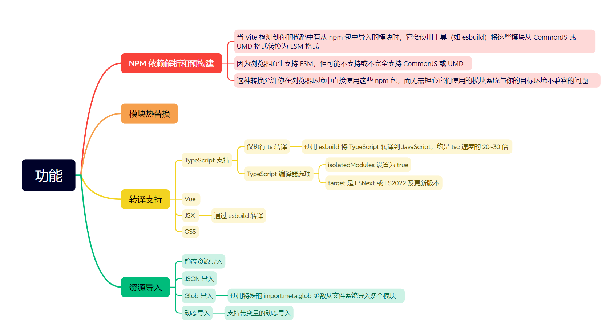
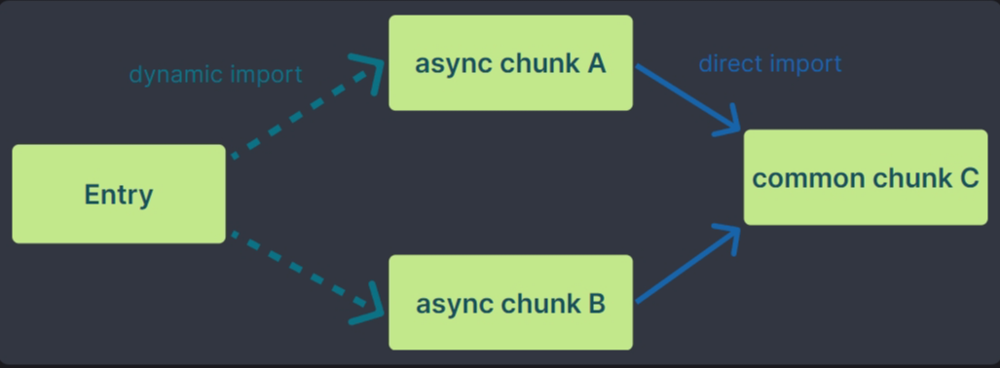
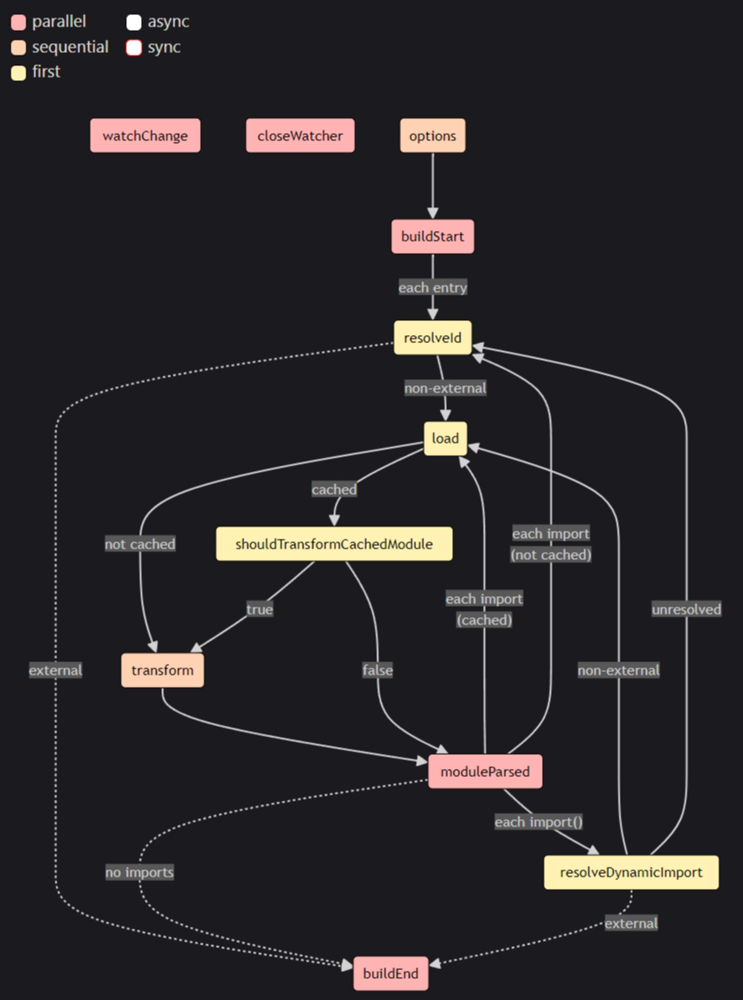
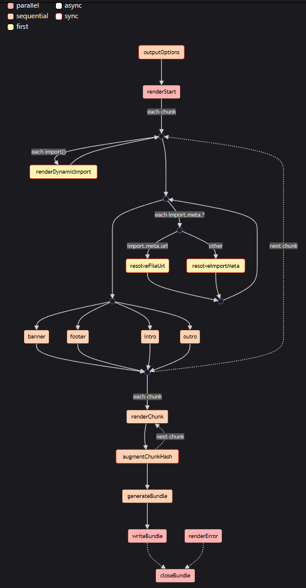

# Vite

## **基础**


## **原理**

### **构建原理**

>  官方文档 [为什么选 Vite | Vite 官方中文文档 (vitejs.dev)](https://cn.vitejs.dev/guide/why.html) 章节中，详细讲述了 Vite 产生的背景和 Vite 原理。

Vite通过利用浏览器原生支持的ES模块特性、按需编译、快速开发服务器和静态代码分析等技术手段，实现了快速的开发服务器启动时间：

* **ES模块特性**：Vite利用现代浏览器对ES模块的原生支持，将每个文件作为一个独立的模块进行处理。这样，在开发过程中无需像传统的构建工具那样将所有模块打包成一个bundle文件，而是保持模块的原始状态。
* **快速开发服务器**： 启动构建时 `vite `会直接启动开发服务器，不需要进行打包操作，也就意味着不需要分析模块的依赖、不需要编译，因此启动速度非常快。

* **按需编译**：当浏览器请求某个模块时，Vite会根据该模块的源码进行即时的按需编译并返回给浏览器。这样，只有被请求的模块才会被编译，减少了不必要的编译时间和资源消耗。
* **静态代码分析**：Vite通过静态分析项目中的代码，了解模块之间的依赖关系，并生成对应的依赖关系图。这种静态分析的方式允许Vite在需要编译模块时，只编译当前模块及其直接依赖的模块，而不需要重新编译整个项目。

原理图如下所示：


在热模块`HMR`方面，当修改一个模块的时候，仅需让浏览器重新请求该模块即可，无须像`webpack`那样需要把该模块的相关依赖模块全部编译一次，效率更高。

### **HRM**

#### **HMR工作原理**

1. **文件监听**：在开发模式下，Vite 使用一个文件系统监视器（watcher）来监听源代码文件的变化。当文件被修改、添加或删除时，watcher 会立即捕获到这些变化。
2. **服务器编译与推送**：一旦文件更改被捕获，Vite 启动一个服务器并执行相应的编译过程。它根据需要重新构建受影响的模块，并生成新版本。接着，服务器通过 WebSocket 与客户端保持连接，并将更新消息推送给浏览器。
3. **浏览器处理新模块**：浏览器在收到更新消息后，会下载和加载新版本的模块，而无需刷新整个页面。对于支持 HMR 的前端框架（如 Vue.js 和 React），它们可以在接收到新模块内容后进行局部渲染或组件重载操作，实现热更新效果。

#### **优势**

1. **快速更新**：HMR 能够将变更仅限于修改的模块，从而避免了重新构建和刷新整个页面。这大大缩短了调试和开发周期，提高了开发效率。
2. **保持状态**：在模块更新时，HMR 能够保持应用程序的状态和数据。这意味着修改模块后，不会丢失已有的应用状态，使开发过程更加流畅。
3. **模块级热更新**：Vite 的 HMR 实现了模块级别的热替换。这意味着可以在不影响其他模块的情况下，只更新当前修改的模块，从而最小化代码刷新带来的影响。

Vite 中的 HMR 技术为开发者提供了更加高效和流畅的开发体验，通过减少不必要的构建和刷新，提高了开发效率并保持了应用状态。


## **功能**



 **Vite 的主要功能：**

|            功能             |                             描述                             |
| :-------------------------: | :----------------------------------------------------------: |
|  **NPM 依赖解析和预构建**   | 当 Vite 检测到你的代码中有从 npm 包中导入的模块时，它会使用工具（如 esbuild）将这些模块从 CommonJS 或 UMD 格式转换为 ESM 格式 |
|       **开发服务器**        |  Vite 在开发期间作为一个服务器，提供快速的冷启动和热更新。   |
|      **原生 ESM 支持**      | Vite 支持原生 ECMAScript 模块（ESM），允许使用 `import` 和 `export` 语法。 |
|    **模块热替换（HMR）**    | Vite 提供了一套原生 ESM 的 HMR API，支持即时、准确的更新，无需重新加载页面或清除应用程序状态。 |
|      **模块导入重写**       |  Vite 会重写导入为合法的 URL，以便浏览器能够正确导入它们。   |
| **index.html 作为入口文件** | Vite 将 `index.html` 视为源码和模块图的一部分，解析其中的 `<script>` 和 `<link>` 标签。 |
|     **支持 TypeScript**     | Vite 天然支持引入 `.ts` 文件，并使用 `esbuild` 进行快速转译。 |
|      **内置 CSS 支持**      | Vite 支持在 JavaScript 中直接导入 CSS 模块，并利用其特有功能进行解析和处理。 |
|      **环境变量处理**       | Vite 会自动处理环境变量，并提供在生产构建时替换变量的功能。  |
|        **构建优化**         | Vite 提供了代码拆分、Tree Shaking 等构建优化功能，以减小打包后的文件体积。 |
|        **插件系统**         | Vite 支持插件系统，允许开发者通过插件扩展其功能，如支持新的框架或库。 |

### NPM 依赖解析和预构建

**官方原文：**

> 原生 ES 导入不支持下面这样的裸模块导入：
>
> ```js
> import { someMethod } from 'my-dep'
> ```
>
> 上面的代码会在浏览器中抛出一个错误。Vite 将会检测到所有被加载的源文件中的此类裸模块导入，并执行以下操作:
>
> 1. [预构建](https://cn.vitejs.dev/guide/dep-pre-bundling.html) 它们可以提高页面加载速度，并将 CommonJS / UMD 转换为 ESM 格式。预构建这一步由 [esbuild](http://esbuild.github.io/) 执行，这使得 Vite 的冷启动时间比任何基于 JavaScript 的打包器都要快得多。
> 2. 重写导入为合法的 URL，例如 `/node_modules/.vite/deps/my-dep.js?v=f3sf2ebd` 以便浏览器能够正确导入它们。
>
> **依赖是强缓存的**
>
> Vite 通过 HTTP 头来缓存请求得到的依赖，所以如果你想要编辑或调试一个依赖，请按照 [这里](https://cn.vitejs.dev/guide/dep-pre-bundling.html#浏览器缓存) 的步骤操作。

**补充解释说明：**

**JavaScript 生态模块系统介绍：**

> 在 JavaScript 生态系统中，存在多种模块系统。其中，CommonJS 和 UMD 是两种较为早期的模块系统，而 ESM (ECMAScript Modules) 是较新的模块系统，主要在 ECMAScript 2015 (ES6) 中引入。
>
> 让我们简要地了解这三种模块系统：
>
> 1. **CommonJS (CJS)**: 这是 Node.js 使用的模块系统。当你使用 `require` 导入模块时，你正在使用 CommonJS。CJS 模块是同步加载的，这意味着它们会在导入时立即执行。
> 2. **UMD (Universal Module Definition)**: UMD 是一种策略，允许你的模块在多种环境中工作，如浏览器全局变量、AMD 和 CommonJS。UMD 本质上是一个包装器，它根据环境决定如何定义模块。
> 3. **ESM (ECMAScript Modules)**: 这是 ECMAScript 2015 (ES6) 引入的模块系统。它使用 `import` 和 `export` 关键字，并且模块是异步加载的。ESM 在浏览器和 Node.js 中都得到了原生支持（尽管 Node.js 的原生支持是在较新的版本中引入的）。
>
> 在 Vite 的上下文中，“将 CommonJS / UMD 转换为 ESM 格式”意味着，**当 Vite 检测到你的代码中有从 npm 包中导入的模块时，它会使用工具（如 esbuild）将这些模块从 CommonJS 或 UMD 格式转换为 ESM 格式。这是因为浏览器原生支持 ESM，但可能不支持或不完全支持 CommonJS 或 UMD。**
>
> 这种转换允许你在浏览器环境中直接使用这些 npm 包，而无需担心它们使用的模块系统与你的目标环境不兼容的问题。
>
> 转换的好处还包括：
>
> - **更快的加载速度**：ESM 是异步加载的，这通常比 CJS 的同步加载更快。
> - **更好的代码优化**：工具如 esbuild 可以在转换过程中进行各种优化，从而提高代码的运行效率。
> - **更现代的编程体验**：使用 ESM，你可以享受诸如静态导入、导出分析、代码拆分等现代功能。

**ESM 模块介绍：**

> ESM (ECMAScript Modules) 是一种在 ECMAScript 标准中定义的模块系统，主要用于 JavaScript 代码的模块化组织和管理。它是 ES6（ECMAScript 2015）及以后版本的一部分，提供了 `import` 和 `export` 关键字来导入和导出模块的功能。
>
> ESM 模块系统的主要特点包括：
>
> 1. **静态解析**：ESM 支持静态解析，这意味着在代码运行之前，导入和导出的依赖关系就已经确定。这有助于实现代码拆分、树摇（tree-shaking）等优化。
> 2. **异步加载**：ESM 模块是异步加载的，这意味着它们不会阻塞代码的执行。这有助于改善应用的启动性能和响应速度。
> 3. **支持多种文件类型**：除了 JavaScript 文件（`.js`），ESM 还支持其他类型的文件作为模块，如 JSON、CSS 等。

**为什么 Vite 将原生 ES 导入转换为 ESM 格式？**

> 与原生 ES 导入（即直接使用 `import` 关键字导入模块）相比，ESM 模块系统提供了更加标准和统一的模块导入和导出机制。
>
> 原生 ES 导入通常指的是在没有使用任何打包工具或模块加载器的情况下，直接在浏览器或 Node.js 环境中使用 `import` 和 `export` 关键字。
>
> 然而，在浏览器环境中，原生的 ES 导入可能受到一些限制，例如不支持裸模块导入（即不指定文件扩展名或路径的导入），也不支持动态导入（即使用 `import()` 函数的导入）。而 ESM 模块系统则解决了这些问题，提供了更加灵活和强大的模块管理功能。
>
> 此外，ESM 模块系统还与其他现代前端工具（如打包器、构建工具等）紧密集成，使得开发者能够更加方便地管理和构建大型的 JavaScript 应用。


### **代码拆分**

#### **动态导入拆分**

在 Vite 中，代码拆分主要是通过使用动态导入（`import()` 语法）和构建工具的特性来实现的。

Vite 和其背后的 Rollup 构建工具都支持 ES 模块的动态导入，这使得我们可以按需加载代码，从而实现代码拆分。

**代码拆分的实现**：

1. **动态导入**：使用 `import()` 语法来动态导入模块。例如，`import('./module.js')`。这种方式允许你根据需要在运行时加载模块，而不是在应用程序启动时一次性加载所有模块。
2. **构建工具**：Vite 在构建过程中会自动识别动态导入，并将它们拆分成单独的代码块。然后，这些代码块可以通过 HTTP/2 服务器推送或其他优化手段来按需加载。
3. **异步组件**：在前端框架（如 React、Vue）中，你可以使用动态导入来异步加载组件。这样，只有当组件实际被需要时，才会加载其对应的代码。

**在项目中使用代码拆分功能**：

1. **使用动态导入**：在你的代码中，使用 `import()` 语法来动态导入模块或组件。例如，在 React 中，你可以这样使用：

```javascript
const MyComponent = React.lazy(() => import('./MyComponent'));
```

1. **配置构建工具**：确保你的构建工具（如 Vite、Webpack 等）配置正确，以支持代码拆分。对于 Vite，它已经内置了代码拆分的功能，所以你只需要使用动态导入即可。
2. **优化加载**：你还可以利用 HTTP/2 服务器推送、预加载（`<link rel="preload">`）或预获取（`<link rel="prefetch">`）等技术来进一步优化代码的加载性能。
3. **路由拆分**：对于单页面应用（SPA），你可以根据路由来拆分代码。每个路由对应一个代码块，当用户导航到不同的路由时，只加载对应的代码块。
4. **代码拆分插件**：虽然 Vite 本身支持代码拆分，但你也可以使用额外的插件来进一步定制或优化拆分策略。

代码拆分的主要目标是减少初始加载时间，并通过按需加载来提高应用程序的性能。因此，在决定拆分哪些代码块时，应该考虑哪些代码是用户最初不需要的，哪些代码可以在后续的用户交互中按需加载。


#### **自定义拆分**

Vite 和 Rollup 的默认配置通常已经足够好，能够处理大多数代码拆分的需求。在需要自定义的情况下，你可以通过 `vite.config.js` 中的 `rollupOptions` 来扩展 Rollup 的配置。

如果你想对 Rollup 的配置进行更深入的定制，可以通过 `vite.config.js` 中的 `build.rollupOptions` 字段来传递额外的 Rollup 配置。这允许你覆盖或扩展默认的 Rollup 配置。

以下是如何在 `vite.config.js` 中配置 Rollup 来影响代码拆分的一些示例：

```javascript
// vite.config.js  
import { defineConfig } from 'vite';  
  
export default defineConfig({  
  build: {  
    rollupOptions: {  
      // 你可以在这里添加 Rollup 插件  
      plugins: [  
        // 例如，使用一个插件来进一步控制代码拆分  
      ],  
        
      // Rollup 输出配置  
      output: {  
        // 你可以在这里定义额外的输出选项  
        // 例如，设置 chunk 文件名格式  
        chunkFileNames: 'static/js/[name]-[hash].js',  
          
        // 设置入口文件名格式  
        entryFileNames: 'static/js/[name]-[hash].js',  
          
        // 设置资产文件名格式  
        assetFileNames: 'static/assets/[name]-[hash].[ext]',  
      },  
        
      // 优化选项  
      optimizeDeps: {  
        // 控制依赖项的优化  
      },  
        
      // 控制代码拆分的其他 Rollup 配置...  
    },  
  },  
});
```

请注意，直接修改 Rollup 配置可能会对 Vite 的默认行为产生影响，因此请谨慎操作，并确保你了解所做的更改可能带来的后果。

如果你想要进行更细粒度的代码拆分控制，通常建议的做法是使用动态导入（`import()` 语法）来分割你的代码。Vite 会自动捕获这些动态导入，并使用 Rollup 进行代码拆分。


## **Vite 构建优化**

|                           优化措施                           |                             描述                             |                             说明                             |
| :----------------------------------------------------------: | :----------------------------------------------------------: | :----------------------------------------------------------: |
|                        **快速冷启动**                        |   利用原生 ESM 进行快速启动，避免不必要的打包转换和捆绑。    | 当开发者启动 Vite 开发服务器时，由于直接利用原生 ESM，无需进行额外的模块转换或打包，从而实现了快速的启动速度。 |
|                    **模块热替换（HMR）**                     | 提供高效的 HMR API，实现即时模块更新，无需重新加载页面或清除状态。 | 当开发者在开发过程中修改了某个组件的代码并保存后，Vite 会利用 HMR 功能，仅更新修改的部分，而无需重新加载整个页面，从而提高了开发效率。 |
| [**预构建依赖**](https://cn.vitejs.dev/guide/dep-pre-bundling.html#dependency-pre-bundling) |    预构建裸模块导入，转换为 ESM 格式，优化页面加载速度。     | 当开发者在项目中导入一个第三方库时，Vite 会在构建过程中预构建这个库的 ESM 版本，并在浏览器中按需加载，从而提高了页面加载速度。 |
|                       **依赖构建缓存**                       | 1. 使用文件系统缓存V：ite 将预构建的依赖项缓存到 `node_modules/.vite` 中；<br />2.浏览器缓存：已预构建的依赖请求使用 HTTP 头 `max-age=31536000, immutable` 进行强缓存，以提高开发期间页面重新加载的性能。一旦被缓存，这些请求将永远不会再次访问开发服务器。如果安装了不同版本的依赖项（这反映在包管理器的 lockfile 中），则会通过附加版本查询自动失效。 |                                                              |
|                    **代码拆分和动态导入**                    |    将应用程序拆分为多个小块，按需加载，减少初始加载时间。    | 1. 在一个大型应用中，开发者可以使用动态导入（`import()` 语法）将某些非核心功能拆分为单独的模块，并在需要时异步加载，从而减少初始加载时间。<br />2.CSS 代码分割：Vite 会自动地将一个异步 chunk 模块中使用到的 CSS 代码抽取出来并为其生成一个单独的文件。 |
|          **Tree Shaking 和 Dead Code Elimination**           | 利用 ES 模块静态结构，移除未使用的代码和依赖，减小打包体积。 | 这个 CSS 文件将在该异步 chunk 加载完成时自动通过一个 `<link>` 标签载入，该异步 chunk 会保证只在 CSS 加载完毕后再执行，避免发生 [FOUC](https://en.wikipedia.org/wiki/Flash_of_unstyled_content#:~:text=A flash of unstyled content,before all information is retrieved.) 。当开发者构建生产版本的应用时，Vite 会利用 Tree Shaking 功能，移除那些未被导入或使用的代码和依赖，从而减小打包后的文件体积。 |
|                        **压缩和优化**                        |    使用现代压缩算法和优化技术，对生成代码进行压缩和优化。    | Vite 在构建过程中会使用如 Terser 等压缩工具，对生成的代码进行压缩和优化，以减小文件大小并提高加载速度。 |
|                         **缓存策略**                         | 利用浏览器缓存策略，通过内容哈希确保文件唯一性，避免重复请求。 | 当开发者构建应用并部署到生产环境时，Vite 会为每个文件生成一个唯一的哈希值，并将其作为文件名的一部分。这样，只要文件内容没有变化，浏览器就会从缓存中加载文件，而不是重新请求服务器。 |
|                         **插件系统**                         | 提供灵活的插件系统，允许开发者扩展功能，如添加新的加载器、优化器或自定义构建逻辑。 | 开发者可以使用 Vite 的插件系统来扩展其功能，例如添加对特定框架或库的支持，或自定义构建逻辑以满足特定需求。 |
|                      **预加载指令生成**                      | Vite 会为入口 chunk 和它们在打包出的 HTML 中的直接引入自动生成 `<link rel="modulepreload">` 指令。 |                                                              |
|                   **异步 Chunk 加载优化**                    | Vite 将使用一个预加载步骤自动重写代码，来分割动态导入调用，以实现当 某个模块被请求时，该模块依赖模块也将 **同时** 被请求 |                                                              |

### **异步 Chunk 加载优化**

在实际项目中，Rollup 通常会生成 “共用” chunk —— 被两个或以上的其他 chunk 共享的 chunk。

与动态导入相结合，会很容易出现下面这种场景：



在无优化的情境下，当异步 chunk `A` 被导入时，浏览器将必须请求和解析 `A`，然后它才能弄清楚它也需要共用 chunk `C`。这会导致额外的网络往返：

```js
Entry ---> A ---> C
```

Vite 将使用一个预加载步骤自动重写代码，来分割动态导入调用，以实现当 `A` 被请求时，`C` 也将 **同时** 被请求：

```js
Entry ---> (A + C)
```

`C` 也可能有更深的导入，在未优化的场景中，这会导致更多的网络往返。Vite 的优化会跟踪所有的直接导入，无论导入的深度如何，都能够完全消除不必要的往返。


## **插件 **

>  [Vite 基于 rollup 的插件系统](https://cn.vitejs.dev/guide/api-plugin.html)
>
> 插件使用流程参考：[使用插件 | Vite 官方中文文档 (vitejs.dev)](https://cn.vitejs.dev/guide/using-plugins)
>
> 详细插件API 参考： [插件 API | Vite 官方中文文档 (vitejs.dev)](https://cn.vitejs.dev/guide/api-plugin.html)

### [强制插件排序](https://cn.vitejs.dev/guide/using-plugins#enforcing-plugin-ordering)

**Vite 中修改插件排序**

> 为了与某些 Rollup 插件兼容，可能需要强制修改插件的执行顺序，或者只在构建时使用。这应该是 Vite 插件的实现细节。可以使用 `enforce` 修饰符来强制插件的位置:
>
> - `pre`：在 Vite 核心插件之前调用该插件
> - 默认：在 Vite 核心插件之后调用该插件
> - `post`：在 Vite 构建插件之后调用该插件
>
> ```js
> 解释// vite.config.js
> import image from '@rollup/plugin-image'
> import { defineConfig } from 'vite'
> 
> export default defineConfig({
>   plugins: [
>     {
>       ...image(),
>       enforce: 'pre',
>     },
>   ],
> })
> ```
>
> 查看 [Plugins API Guide](https://cn.vitejs.dev/guide/api-plugin.html#plugin-ordering) 获取细节信息，并在 [Vite Rollup 插件](https://vite-rollup-plugins.patak.dev/) 兼容性列表中注意 `enforce` 标签和流行插件的使用说明。
>
>  解析后的插件将按照以下顺序排列：`enforce``enforce``pre``post`
>
> 1. 调用 Alias 插件：Vite 支持配置别名，以方便你在项目中引用模块。
> 2. 带有 的用户插件`enforce: 'pre'`
> 3. Vite 核心插件；
> 4. 没有 enforce 值的用户插件；
> 5. Vite 构建用的插件；
> 6. 带有 的用户插件`enforce: 'post'`；
> 7. Vite 后置构建插件（最小化，manifest，报告）；


**Rollup 修改插件排序**

> 变钩子的执行：
>
> - `order: "pre" | "post" | null`
>   如果有多个插件实现此钩子，则可以先运行此插件（`"pre"`），最后运行此插件（`"post"`），或在用户指定的位置运行（没有值或 `null`）。
>
>   ```js
>   export default function resolveFirst() {
>   	return {
>   		name: 'resolve-first',
>   		resolveId: {
>   			order: 'pre',
>   			handler(source) {
>   				if (source === 'external') {
>   					return { id: source, external: true };
>   				}
>   				return null; 	
>   			}
>   		}
>   	};
>   }
>   ```
>
>   如果有多个插件使用 `"pre"` 或 `"post"`，Rollup 将按用户指定的顺序运行它们。此选项可用于所有插件钩子。对于并行钩子，它会更改同步部分运行的顺序。

### [按需应用插件](https://cn.vitejs.dev/guide/using-plugins#conditional-application)

> 默认情况下插件在开发 (serve) 和生产 (build) 模式中都会调用。如果插件在服务或构建期间按需使用，请使用 `apply` 属性指明它们仅在 `'build'` 或 `'serve'` 模式时调用：
>
> ```js
> // vite.config.js
> import typescript2 from 'rollup-plugin-typescript2'
> import { defineConfig } from 'vite'
> 
> export default defineConfig({
>   plugins: [
>     {
>       ...typescript2(),
>       apply: 'build',
>     },
>   ],
> })
> ```

### 插件开发

> Vite 插件扩展了设计出色的 Rollup 接口，带有一些 Vite 独有的配置项。 因此，你只需要编写一个 Vite 插件，就可以同时为开发环境和生产环境工作。
>
> Vite 插件开发遵循 Rollup 插件开发，可以参考 [Rollup 插件文档](https://rollupjs.org/plugin-development/)

#### **Rollup 插件**

**是什么？**

> Rollup 插件是一个对象，具有 [属性](https://cn.rollupjs.org/plugin-development/#properties)、[构建钩子](https://cn.rollupjs.org/plugin-development/#build-hooks) 和 [输出生成钩子](https://cn.rollupjs.org/plugin-development/#output-generation-hooks) 中的一个或多个，Rollup的 [约定](https://cn.rollupjs.org/plugin-development/#conventions)。
>
> 插件应作为一个导出一个函数的包进行发布，该函数可以使用插件特定的选项进行调用并返回此类对象。

**作用**

插件允许你通过例如在打包之前进行转译代码或在`node_modules`文件夹中查找第三方模块来自定义 Rollup 的行为。

**示例**

>  参见 [使用插件](https://cn.rollupjs.org/tutorial/#using-plugins)。插件列表可以在 [github.com/rollup/awesome](https://github.com/rollup/awesome) 上找到。

以下插件将拦截任何不通过访问文件系统的 `virtual-module` 导入:

创建 `rollup-plugin-my-example.js` 文件定义插件逻辑：

```js
//rollup-plugin-my-example.js
export default function myExample () {
  return {
    name: 'my-example', // 此名称将出现在警告和错误中
    resolveId ( source ) {
      if (source === 'virtual-module') {
        // 这表示 rollup 不应询问其他插件或
        // 从文件系统检查以找到此 ID
        return source;
      }
      return null; // 其他ID应按通常方式处理
    },
    load ( id ) {
      if (id === 'virtual-module') {
        // "virtual-module"的源代码
        return 'export default "This is virtual!"';
      }
      return null; // 其他ID应按通常方式处理
    }
  };
}

```

使用 `rollup-plugin-my-example.js` 插件：

```js
// rollup.config.js
import myExample from './rollup-plugin-my-example.js';
export default ({
  input: 'virtual-module', // 由我们的插件解析
  plugins: [myExample()],
  output: [{
    file: 'bundle.js',
    format: 'es'
  }]
});
```

> [约定](https://cn.rollupjs.org/plugin-development/#conventions)：
>
> - 插件应该有一个明确的名称，并以`rollup-plugin-`作为前缀。
> - 在`package.json`中包含`rollup-plugin`关键字。
> - 插件应该被测试，我们推荐 [mocha](https://github.com/mochajs/mocha) 或 [ava](https://github.com/avajs/ava)，它们支持 Promise。
> - 可能的话，使用异步方法，例如 `fs.readFile` 而不是 `fs.readFileSync`

### **编写 Vite 插件**

要创建一个 Vite 插件，你可以按照以下步骤进行：

1. 创建一个新的 JavaScript 或 TypeScript 文件。
2. 导出一个函数，该函数接收 `options` 参数并返回一个对象，该对象定义了 Vite 生命周期钩子的处理函数。
3. 在每个钩子处理函数中，打印出钩子的名称。

下面是一个简单的示例，展示了如何创建一个 Vite 插件，该插件在 Vite 的所有事件钩子和生命周期中打印输出钩子名称：

```javascript
// vite-plugin-print-hooks.js  
  
export default function vitePluginPrintHooks() {  
  return {  
    name: 'vite-plugin-print-hooks',  
    configResolved(config) {  
      console.log('configResolved hook called');  
    },  
    configureServer(server) {  
      console.log('configureServer hook called');  
    },  
    transform(code, id) {  
      console.log('transform hook called for', id);  
      return code;  
    },  
    buildStart() {  
      console.log('buildStart hook called');  
    },  
    buildEnd() {  
      console.log('buildEnd hook called');  
    },  
    // ... 其他钩子可以在这里添加  
  };  
}
```

这个插件定义了几个常见的 Vite 钩子，如 `configResolved`、`configureServer`、`transform`、`buildStart` 和 `buildEnd`。当这些钩子被 Vite 调用时，它们会打印出相应的钩子名称。

> Vite 专属的插件需要遵循以下规范：
>
> - Vite 插件应该有一个带 前缀、语义清晰的名称。`vite-plugin-`
> - 在 package.json 中包含 关键字。`vite-plugin`
> - 在插件文档增加一部分关于为什么本插件是一个 Vite 专属插件的详细说明（如，本插件使用了 Vite 特有的插件钩子）。

要在 Vite 项目中使用这个插件，你需要在 `vite.config.js` 文件中引入并注册它：

```javascript
// vite.config.js  
  
import { defineConfig } from 'vite';  
import vitePluginPrintHooks from './vite-plugin-print-hooks';  
  
export default defineConfig({  
  plugins: [vitePluginPrintHooks()],  
  // ... 其他配置  
});
```

现在，当你运行 Vite 开发服务器或构建项目时，你应该能在控制台中看到各个钩子被调用的信息。

### **Vite 插件通用钩子**

Vite 开发服务器会创建一个插件容器来调用 [Rollup 构建钩子](https://rollupjs.org/plugin-development/#build-hooks)，与 Rollup 如出一辙。

>  Rollup 钩子主要分为：构建钩子和输出生成钩子。
>
>  所有钩子详细文档：[插件开发 | Rollup 中文文档 (rollupjs.org)](https://cn.rollupjs.org/plugin-development/#build-hooks)

#### **构建钩子**

构建钩子在构建阶段运行，该阶段由 `rollup.rollup(inputOptions)` 触发。它们主要涉及在 Rollup 处理输入文件之前定位、提供和转换输入文件。

构建阶段的第一个钩子是 [`options`](https://cn.rollupjs.org/plugin-development/#options)，最后一个钩子始终是 [`buildEnd`](https://cn.rollupjs.org/plugin-development/#buildend)。如果有构建错误，则在此之后将调用 [`closeBundle`](https://cn.rollupjs.org/plugin-development/#closebundle)。

钩子钩子如下：

| 钩子名称       | 作用                                                         |
| -------------- | ------------------------------------------------------------ |
| `options`      | 在构建阶段的第一个钩子，用于替换或操作传递给`rollup.rollup()`的选项对象。 |
| `buildStart`   | 在构建阶段开始时调用的钩子，允许插件执行一些初始化操作。     |
| `resolveId`    | 解析每个入口点的钩子，用于解析模块的ID。                     |
| `load`         | 加载模块的钩子，用于加载模块的代码。                         |
| `transform`    | 转换模块的钩子，用于对模块进行转换。                         |
| `moduleParsed` | 每次Rollup完全解析一个模块时调用的钩子，用于获取有关模块的信息。 |
| `onLog`        | 修改日志的钩子，允许插件修改日志级别或内容。                 |
| `closeWatcher` | 关闭监视器的钩子，用于在构建结束时执行清理操作。             |
| `buildEnd`     | 在构建结束时调用的钩子，允许插件执行一些清理操作。           |

**构建钩子流程**




#### **输出生成钩子**

输出生成钩子可以提供有关生成的产物的信息并在构建完成后修改构建。

它们的工作方式和类型与 [构建钩子](https://cn.rollupjs.org/plugin-development/#build-hooks) 相同，但是对于每个调用 `bundle.generate(outputOptions)` 或 `bundle.write(outputOptions)`，它们都会单独调用。仅使用输出生成钩子的插件也可以通过输出选项传递，并且因此仅针对某些输出运行。

输出生成阶段的第一个钩子是 [`outputOptions`](https://cn.rollupjs.org/plugin-development/#outputoptions)，最后一个钩子是 [`generateBundle`](https://cn.rollupjs.org/plugin-development/#generatebundle)（如果通过 `bundle.generate(...)` 成功生成输出），[`writeBundle`](https://cn.rollupjs.org/plugin-development/#writebundle)（如果通过 `bundle.write(...)` 成功生成输出），或 [`renderError`](https://cn.rollupjs.org/plugin-development/#rendererror)（如果在输出生成期间的任何时候发生错误）。

输出钩子：

| 钩子名称              | 作用                                                     |
| --------------------- | -------------------------------------------------------- |
| `outputOptions`       | 输出生成阶段的第一个钩子，允许插件修改输出选项对象。     |
| `renderChunk`         | 转换单个块的钩子，用于转换每个Rollup输出块的代码。       |
| `renderDynamicImport` | 处理动态导入表达式的钩子，用于处理动态导入的情况。       |
| `resolveFileUrl`      | 自定义文件URL解析的钩子，允许插件修改文件的URL解析方式。 |
| `generateBundle`      | 生成产物的钩子，用于生成输出文件或资源。                 |
| `writeBundle`         | 写入产物的钩子，用于将生成的文件或资源写入磁盘。         |
| `renderStart`         | 渲染开始时调用的钩子，用于处理渲染开始时的逻辑。         |
| `renderError`         | 渲染错误时调用的钩子，用于处理渲染过程中的错误情况。     |

**输出钩子流程**：




#### **开发服相关钩子**

以下钩子在服务器启动时被调用：

- [`options`](https://rollupjs.org/plugin-development/#options)
- [`buildStart`](https://rollupjs.org/plugin-development/#buildstart)

以下钩子会在每个传入模块请求时被调用：

- [`resolveId`](https://rollupjs.org/plugin-development/#resolveid)
- [`load`](https://rollupjs.org/plugin-development/#load)
- [`transform`](https://rollupjs.org/plugin-development/#transform)

以下钩子在服务器关闭时被调用：

- [`buildEnd`](https://rollupjs.org/plugin-development/#buildend)
- [`closeBundle`](https://rollupjs.org/plugin-development/#closebundle)

请注意 [`moduleParsed`](https://rollupjs.org/plugin-development/#moduleparsed) 钩子在开发中是 **不会** 被调用的，因为 Vite 为了性能会避免完整的 AST 解析。


#### **Vite 独有钩子**

| 钩子名称                      | 作用                                                         |
| ----------------------------- | ------------------------------------------------------------ |
| `config`                      | 在解析Vite配置前调用，允许插件修改配置或返回部分配置对象。   |
| `configResolved`              | 在解析Vite配置后调用，用于读取和存储最终解析的配置。         |
| `configureServer`             | 用于配置开发服务器的钩子，常用于添加自定义中间件或存储服务器实例供其他钩子访问。 |
| `configurePreviewServer`      | 用于配置预览服务器的钩子，与`configureServer`类似，但用于预览服务器。 |
| `transformIndexHtml`          | 专用于转换index.html的钩子，允许插件修改HTML字符串或注入标签。 |
| `handleHotUpdate`             | 执行自定义HMR更新处理的钩子，用于过滤和缩小受影响的模块列表或执行自定义HMR处理。 |
| `client-server-communication` | 提供实用工具处理与客户端的通信，包括服务端到客户端和客户端到服务端的通信。 |
| `CustomEventMap`              | 用于自定义事件的TypeScript类型定义指南，允许为自定义事件标注类型。 |

> 详细钩子用法参考：[插件 API | Vite 官方中文文档 (vitejs.dev)](https://cn.vitejs.dev/guide/api-plugin.html#vite-specific-hooks)


## **Vite VS Webpack**

|      项目      |                       Vite                        |                    Webpack                     |
| :------------: | :-----------------------------------------------: | :--------------------------------------------: |
|    **优点**    |                                                   |                                                |
|   冷启动速度   | 非常快，利用浏览器原生ESM支持，按需加载和编译模块 |           相对较慢，需要打包整个应用           |
|   热更新速度   |         快速，只重新请求和加载改变的模块          |  相对较慢，可能需要重新加载整个应用或相关模块  |
|  对Vue.js支持  |             非常好，由Vue.js作者开发              |            良好，但可能不如Vite完善            |
|   配置简单性   |           配置简单明了，易于使用和学习            |           配置相对复杂，学习曲线较高           |
|   生态丰富度   |          生态不如Webpack丰富，但逐渐增长          |          非常丰富的loader和plugin生态          |
|    **缺点**    |                                                   |                                                |
|   生态丰富度   |           相对较少的loader和plugin支持            |                       无                       |
|  生产环境配置  |               生产环境配置相对复杂                |         相对简单，有现成配置和插件可用         |
| 对其他框架支持 |   对Vue.js支持最好，对其他框架支持可能不够完善    |             对各种框架都有良好支持             |
|    **原理**    |                                                   |                                                |
|    加载机制    |     利用浏览器原生ESM支持，按需加载和编译模块     |       打包整个应用，生成一个或多个bundle       |
|    依赖处理    |      预构建依赖，将CommonJS/UMD转换为ESM格式      | 使用loader和plugin处理依赖，进行模块转换和编译 |
|    **性能**    |                                                   |                                                |
|  初始构建速度  |             非常快，无需打包整个应用              |          相对较慢，需要处理整个代码库          |
|  增量构建速度  |              快速，只处理改变的模块               |     取决于项目的规模和使用的loader/plugin      |
|    内存使用    |               较低，按需加载和编译                |            较高，需要处理整个代码库            |
|    缓存效率    |      利用浏览器缓存和Vite内置缓存，效率较高       |        使用缓存机制，但可能不如Vite高效        |


### **构建速度**

**Vite 构建速度比 Webpack 快**

1. **按需加载**：

   * 在HMR（热更新）方面，webpack 那样需要把该模块的相关依赖模块全部编译一次，再加载内容；
   * Vite 的热更新（HMR）中，当一个模块被修改后，只有这个模块会被重新请求和加载，而不是整个应用程序或所有相关依赖。这种方式避免了不必要的加载和重新渲染，提高了应用的响应速度和用户体验。

2. **按需编译**：

   * **Webpack 全量编译**：在启动时需要经历 bundle 模式，即将项目中的各类源文件转化为浏览器可识别的文件，并建立源文件之间的依赖关系，最后将大量源文件合并为少量的输出文件。这个过程相对耗时，特别是当项目规模较大时。过程是先打包再启动开发服务器；

     

   * **Vite 按需编译**：Vite 利用了浏览器对 ESM（EcmaScript Modules）规范的支持，采用了不同于 Webpack 的 unbundle 机制。 Vite 则在启动服务器后，**`vite` 不需要做全量的打包**，只有当请求某个模块时才会对该模块进行编译，这种**按需加载**的方式极大地缩减了编译时间。vite 是直接启动开发服务器，然后按需编译依赖文件，由于 vite在启动的时候`不需要打包`，也就意味着不需要分析模块的依赖、不需要编译，因此启动速度非常快。

     

     > 区分按需加载和按需编译：
     >
     > * **按需加载（On-demand Loading）**:按需加载是指在应用**程序运行过程中**，只有当某个模块或资源被实际使用时，才会加载该模块或资源。
     > * **按需编译（On-demand Compilation）**:按需编译是指在**开发过程中**，只有当浏览器请求某个模块时，才会对该模块进行编译。
     >
     > "按需加载" 侧重于在运行时动态加载模块，而 "按需编译" 侧重于在开发过程中动态编译模块。虽然这两个概念都旨在提高性能和效率，但它们针对的是不同的阶段和过程。

3. **依赖解析：**
   * webpack 是使用 JavaScript 编写的打包器。
   * `vite` 在解析模块依赖关系时，利用了 `esbuild`，速度更快（esbuild 使用 Go 编写，并且比以 JavaScript 编写的打包器预构建依赖快 10-100 倍）
4. **构建模式**：
   * Webpack 的构建模式主要基于打包（bundling），需要经历 入口分析、依赖解析、转换和编译、打包输出 几个阶段。
   * Vite 采用[预构建](https://cn.vitejs.dev/guide/dep-pre-bundling.html) 提高页面加载速度，并将 CommonJS / UMD 转换为 ESM 格式。由于现代浏览器本身就支持 `ES Module`，会自动向依赖的Module发出请求。vite充分利用这一点，将开发环境下的模块文件，就作为浏览器要执行的文件，而不是像 webpack 那样进行打包合并。