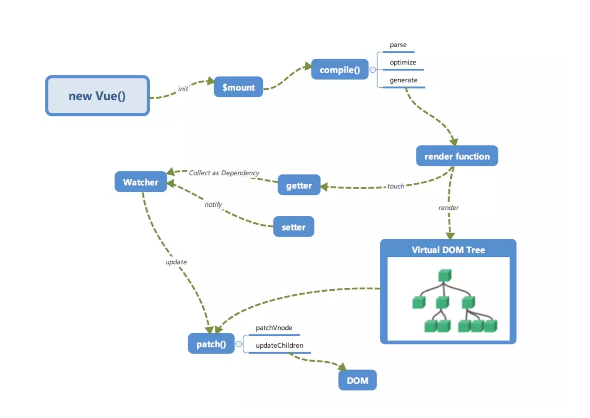

# Vue3源码分析


## 响应式原理

> 详细可以参考官方文档：[深入响应式系统 | Vue.js (vuejs.org)](https://cn.vuejs.org/guide/extras/reactivity-in-depth.html#reactivity-in-depth)

### Vue2 响应式原理

#### **核心API**

* Vue.js  是一款  MVVM  框架，数据模型仅仅是普通的  JavaScript  对象，但是对这些对象进行操作时，却能影响对应视图，它的核心实现就是「 响应式系统」。

* 响应式系统核心使用 ES5的 [Object.defineProperty()](https://developer.mozilla.org/en-US/docs/Web/JavaScript/Reference/Global_Objects/Object/defineProperty) API 实现 ： 

  * 参数：第一个参数是需要定义属性的对象，第二个 参数是需要定义的属性，第三个是该属性描述符。
  * 属性的描述符有四个属性：value 属性的值，writable 属性是否可写， enumerable 属性是否可枚举，configurable 属性是否可配置修改。
  * 缺陷：有一些对属性的操作，使用这种方法无法拦截：比如说通过下标方式修改数组数据或者给对象新 增属性
    * vue 内部通过重写函数解决了这个问题：在 Vue3.0 中已经不使用这种方式了，而是 通过使用 Proxy 对对象进行代理，从而实现数据劫持。
    * 使用 Proxy 的好处是它可以完美的监 听到任何方式的数据改变，唯一的缺点是兼容性的问题，因为这是 ES6 的语法。

  


#### **响应式系统流程**

* **创建实例：**新建一个vue实例，在构造函数中调用 oserver() 传入 data 数据并创建一个观察者对象;
* **定义响应式数据：**observer 函数遍历 data 的属性，调用 defineReactive，在方法内创建一个依赖收集对象并使用 `Object.defineProperty` 修改data 的属性
* **依赖收集：**runder funtion 读取数据时，触发数据的 getter()，在属性的 getter 中往依赖收集对象中添加属性的 watcher对象；
* **派发更新：**修改数据时，触发数据的 setter()，在 setter 中调用依赖收集对象的 notify 方法，notify 方法再调用对应的 watcher 对象的 update 方法更新视图。

#### 简单实现响应式系统

```javascript
/**
 * 依赖收集对象
 */
class Dep {
  constructor() {
    //存放watcher类的数组
    this.subs = []
  }
  //添加watcher类
  addSub(sub) {
    this.subs.push(sub)
  }
  //通知更新视图方法
  notify() {
    //遍历watcher类,调用update更新视图
    this.subs.forEach((sub) => {
      sub.update()
    })
  }
}

/**
 * 观察者类
 */
class Watcher {
  constructor() {
    //在 new 一个 Watcher 对象时将该对象赋值给 Dep.target，在 get 中会用到
    Dep.target = this
  }
  //模拟更新视图方法
  update(val) {

    // 默认情况下都会进入else的分支，同步则直接调用watcher的run方法
    if (this.lazy) {
      this.dirty = true
    } else if (this.sync) {
      this.run()
    } else {
      queueWatcher(this) 
    }

  }
}

/**
 * 异步更新队列
 * @param {Watcher} watcher 
 */
function queueWatcher(watcher) {
  //将观察者对象添加进入队列等操作

  //...

  // 调用nextTick在此次事件循环结尾的时候刷新watcher队列检查的dom更新操作
  nextTick(flushSchedulerQueue)
}


/**
 * 定义响应式方法
 * @param {*} obj 
 * @param {*} key 
 * @param {*} val 
 */
function defineReactive(obj, key, val) {
  const dep = new Dep() // 创建数据的依赖收集对象
  Object.defineProperty(obj, key, {
    enumerable: true,       //属性可枚举 
    configurable: true,     // 属性可被修改或删除 
    get: function reactiveGetter() { //渲染时触发getter依赖收集
      dep.addSub(Dep.target) //依赖收集:把 Watcher 实例存放到对应的 Dep 对象中去
      return val
    },
    set: function reactiveSetter(newVal) { /*设置数据时触发setter更新视图 */
      if (newVal === val) return
      val = newVal //更新数据
      dep.notify() //依赖收集对象通知视图更新
    }
  })
}

/**
 * 观察者方法
 * @param {*} value 
 */
function observer(value) {
  if (!value || (typeof value !== 'object')) {
    return
  }
  //遍历对象属性，给对象每一个值重写setter和getter
  Object.keys(value).forEach((key) => {
    defineReactive(value, key, value[key])
  })
}


/**
 * vue类
 */
class Vue {
  /* Vue 构造类 */
  constructor(options) {
    this._data = options.data
    observer(this._data)
    new Watcher() // 新建一个Watcher观察者对象，这时候Dep.target会指向这个Watcher对象
    console.log('当前数据', this._data.test)
  }
}


let testVue = new Vue({
  data: {
    test: "测试数据"
  }
})
testVue._data.test = "hello,test."

Dep.target = null
```

