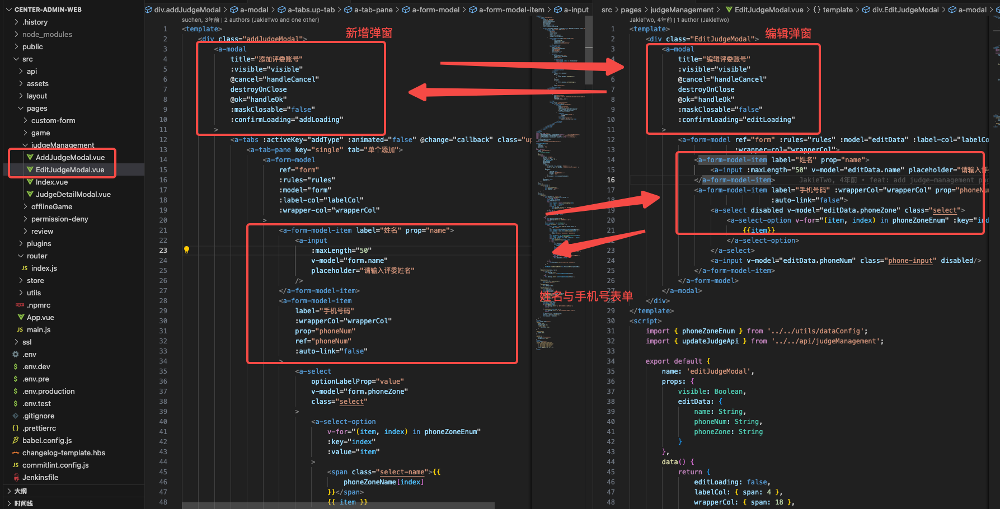
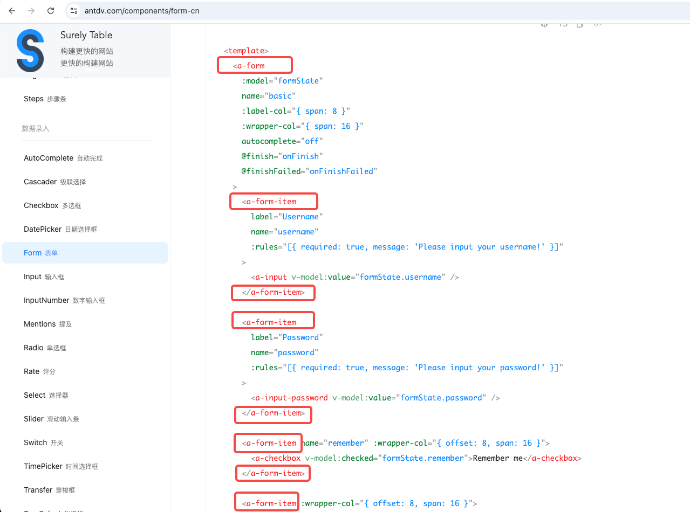
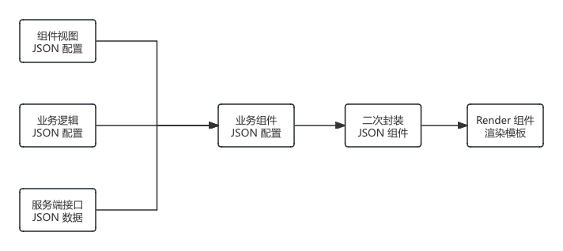

# 组件库设计方案

## 为什么要封装组件库？

### 背景

**当前公司/团队内部维护着部分B端系统，B 端系统与C端系统对比，通常有以下特点**：

1. **组件重复度较高**，用户界面定制化程度相对较小：通常主要为表格、表单、搜索、弹窗等；
2. **存在大量数据展示**：包含更多的表单、表格、图表和仪表盘。
3. **与服务端数据交互频繁**：B端系统可能需要处理大量数据和复杂计算，需要更多的数据接口；


**当前团队内部 B 端/内部系统 现状**：

* B 端/内部系统缺乏统一封装组件，**在系统内部组件重复开发**：
  * 如表格操作中的 查看、新增、编辑 通常表单项差异较小，三种操作类型通常重复开发；
  * 不同表单项之间存在相同组件，需要重复开发；
* 系统之间缺乏统一组件库，每个系统各自开发组件，**系统与系统之间重复组件无法共用**；

比如在 MakeX 赛事后台管理系统中，新增和编辑裁判管理界面中：



**以上设计方案存在问题**：

* 弹窗组件重复；
* 表单组件中部分组件重复;
* 可维护性较差：通常新增和编辑表单修改时候需要同步修改，以上模式需要同步修改两个组件。

**优化方案：**

以上组件中，可以将两个组件的弹窗组件抽离成一个公共弹窗，通过传入不同配置项目，显示不同的弹窗标题、操作和内容表单，这样可以最大程度减少代码量，并在修改表单时，可以同步修改新增和编辑表单，提高可维护性。


### 开源组件库存在问题

当前 B 端开源组件库（如： Ant Design Vue、Element Plus）大同小异，组件粒度相似，以下以 [ Ant Design Vue](https://www.antdv.com/components/overview)  组件库进行分析：

组件库都包含：

* 高级组件
* 通用组件：按钮、图标、排版
* 布局组件
* 导航组件
* 数据录入
* 数据展示
* 反馈组件
* 其他组件

组件分类较多，**组件粒度较细**，导致不同组件之间重复代码多。

如：Form 组件中，分为 `<a-form/>` 和 `<a-form-item/>` 组件，Form 表单项中每一项的组件为数据录入类组件中单独的组件。

在开发 Form 表单时候，组件粒度比较细，代码重复度比较高。



以上代码中 `<a-form-item>` 重复性较高，并且不同组件表单项重复。


### 解决方案

由于 B 端/内部系统的以上组件重复度高、组件内部数据处理较多、组件粒度较细问题，针对以上问题，我们可以：

* 通过对 B 端系统的开源组件进行二次封装，封装成后台管理系统常用的组件，如：表单、表格搜索、表格、弹窗表单、弹窗表格、描述列表等。将粒度较细的组件封装到常用的组件内部，最后通过配置进行动态生成对应组件。

* 封装统一组件库，解决跨项目组件复用问题，减少编写新代码的时间，加快开发速度，并统一组件交互和规范。


## 组件库设计规范

组件设计需要考虑以下问题：

* 组件是否易用：使用是否简单，不增加心智负担，不增加代码复杂度；
* 组件是否可扩展：在组件不能满足需求时，是否方便扩展定制化；
* 组件是否可维护：在使用组件后，是否会导致代码维护性更差；
* 样式兼容
* 国际化
* 主题色


## 组件设计方案

结合 Vue3 组件特定和 Composition API 特性，目前调研了几种组件的设计方案：

| 组件设计方案                             | 描述                                                         | 参考                                                         |
| ---------------------------------------- | ------------------------------------------------------------ | ------------------------------------------------------------ |
| 基于模板的组件                           | 使用 vue 的 template 单文件组件进行封装                      | -                                                            |
| 完全 JSON Schema 配置                    | 完成使用 JSON Schema 进行配置组件                            | 百度低代码框架 [amis](https://aisuda.bce.baidu.com/amis/zh-CN/docs/index) |
| Template + JSON Schema 配置              | 使用  vue 的 template 单文件组件进行封装，<br />并结合 JSON Schema 配置，简化组件开发 | Ant Design Vue Table 组件                                    |
| Template + Hooks 组件                    | 使用 Template 接收属性和插槽，使用 Hooks 获取组件实例和方法  |                                                              |
| Template + JSON Schema 配置 + Hooks 组件 | 使用 JSON 配置生成模板，使用 Template 接收属性和插槽，使用 Hooks 获取组件实例和方法 | [Vben Admin 组件](https://doc.vvbin.cn/components/form.html#fieldmaptotime) |


## 基于模板的组件

Vue.js 中的基于模板的组件（Template-based Components）是指那些使用 `<template>` 标签来声明式地定义组件的 HTML 结构的组件。这是 Vue.js 最常见的组件形式，特别适合那些更习惯于使用 HTML 来描述 UI 的开发者。

**基本结构:**

一个基于模板的 Vue 组件通常包含三个部分：`<template>`、`<script>` 和 `<style>`，它们一起构成了一个单文件组件（Single File Component，SFC）。

```vue
<template>
  <div>
    <h1>{{ message }}</h1>
    <button @click="reverseMessage">Reverse Message</button>
  </div>
</template>

<script>
export default {
  data() {
    return {
      message: 'Hello, Vue!'
    };
  },
  methods: {
    reverseMessage() {
      this.message = this.message.split('').reverse().join('');
    }
  }
};
</script>

<style scoped>
h1 {
  color: blue;
}
button {
  margin-top: 20px;
}
</style>
```

### 优点

* **易于理解和学习**：对于熟悉 HTML 的开发者来说，Vue 的模板语法易于理解和学习。

### 缺点

* **代码量多，代码重复多**：对于 B 端后台管理系统中，粒度较细的组件使用模板标签开发，模板代码量大，模板重复多。


## 完全 JSON Schema 配置组件

完成使用 JSON Schema 配置来生成前端页面，类似于百度低代码框架 [amis](https://aisuda.bce.baidu.com/amis/zh-CN/docs/index)。

下面以 [amis](https://aisuda.bce.baidu.com/amis/zh-CN/docs/index) 配置生成的表格：左侧为使用 amis 配置生成的表格，右侧为生成该表格使用的 JSON 配置。


### 使用

以在 vue 中使用 amis 为例，说明 amis 使用方式（详细参考：[amis-快速开始](https://aisuda.bce.baidu.com/amis/zh-CN/docs/start/getting-started)）

1. **定义 Render 组件**： 使用 amis sdk 开发 render 组件，render 组件可以接收 json schema 渲染任意组件。

   ```vue
   <template><div>Loading...</div></template>
   
   <script>
   // import "amis/sdk/sdk.js";
   // import "amis/sdk/sdk.css";
   // import "amis/sdk/iconfont.css";
   
   // 可以不引用, 如果你不想要任何辅助类样式的话 (比如 `m-t-xs` 这种)
   // https://aisuda.bce.baidu.com/amis/zh-CN/style/index
   import "amis/sdk/helper.css";
   import qs from "qs";
   
   function loadScript(src, callback) {
     const script = document.createElement("script");
     script.setAttribute("type", "text/javascript");
     script.setAttribute("src", src);
     script.onload = () => callback();
     script.onerror = () => callback(new Error(`Failed to load ${src}`));
     document.body.appendChild(script);
   }
   
   function loadStyles(styles) {
     for (const path of styles) {
       const style = document.createElement("link");
       style.setAttribute("rel", "stylesheet");
       style.setAttribute("type", "text/css");
       style.setAttribute("href", path);
       document.head.appendChild(style);
     }
   }
   
   function loadSDK() {
     return new Promise((resolve, reject) => {
       if (window.amisRequire) {
         resolve();
         return;
       }
       loadStyles([
         "/amis/sdk/sdk.css",
         "/amis/sdk/helper.css",
         "/amis/sdk/iconfont.css",
       ]);
       loadScript("/amis/sdk/sdk.js", (err) => {
         if (err) {
           reject(err);
           return;
         }
         resolve();
       });
     });
   }
   
   export default {
     name: "AMISRenderer",
     components: {},
     props: {
       schema: {
         type: Object,
         default: {
           type: "page",
           body: "Hello World!",
         },
       },
       locals: {
         type: Object,
         default: () => ({}),
       },
       props: {
         type: Object,
         default: () => ({}),
       },
       env: {
         type: Object,
         default: () => ({}),
       },
     },
     data() {
       const router = this.$router;
       return {
         // 这里面的数据所有 amis 页面都可以获取到
         // 可以用来放一下公共数据，比如用户信息等
         // 不要放受控数据，受控数据应该通过 data 下发
         context: {
           siteName: "AMIS DEMO",
         },
         get location() {
           const current = router.history.current;
           return {
             pathname: current.path,
             hash: current.hash,
             query: current.query,
             search: `?${qs.stringify(current.query)}`,
           };
         },
         loading: false,
         amisInstance: null,
         unmounted: false,
       };
     },
   
     watch: {
       locals: function () {
         this.updateProps();
       },
       props: function () {
         this.updateProps();
       },
       $route: function () {
         this.updateProps();
       },
     },
     async mounted() {
       try {
         this.loading = true;
         // 加载 amis sdk
         await loadSDK();
       } finally {
         this.loading = false;
       }
       if (this.unmounted) {
         return;
       }
   
       const scoped = amisRequire("amis/embed");
       const { normalizeLink } = amisRequire("amis");
       const router = this.$router;
       // 使用 scoped.embed 传入 JSON schema，生成组件实例
       const instance = scoped.embed(
         this.$el,
         this.schema,
         {
           data: {
             ...this.locals,
           },
           context: this.context,
           location: this.location,
   
           // todo 下发 location 对象
           ...this.props,
         },
         {
           // 覆盖 amis env
           // 参考 https://aisuda.bce.baidu.com/amis/zh-CN/docs/start/getting-started#sdk
           jumpTo: (to, action) => {
             if (to === "goBack") {
               return router.go(-1);
             }
   
             to = normalizeLink(to, this.location);
   
             if (action?.actionType === "url") {
               action.blank === false ? router.push(to) : window.open(to);
               return;
             }
   
             // 主要是支持 nav 中的跳转
             if (action && to && action.target) {
               window.open(to, action.target);
               return;
             }
   
             if (/^https?:\/\//.test(to)) {
               window.location.replace(to);
             } else {
               router.push(to);
             }
           },
   
           updateLocation: (location, replace) => {
             if (location === "goBack") {
               return router.go(-1);
             }
   
             location = normalizeLink(location, this.location);
             replace ? router.replace(location) : router.replace(location);
           },
   
           ...this.env,
         },
         () => {
           this.$emit("ready", {
             instance,
           });
         }
       );
   
       this.amisInstance = instance;
     },
   
     methods: {
       updateProps() {
         this.amisInstance?.updateProps({
           data: {
             ...this.locals,
           },
           context: this.context,
           ...this.props,
         });
       },
     },
   
     destroyed() {
       this.unmounted = true;
       this.amisInstance?.unmount();
     },
   };
   </script>
   ```

2. **使用 Render 组件**：使用 Render 组件渲染一个 Form 表单为例。

   ```vue
   <template>
     <!--使用 amis render 组件渲染 form-->
     <amis-renderer :schema="schema" :locals="locals" />
   </template>
   <script>
   // 引入 amis render 组件
   import AMISRenderer from "@/components/AMISRenderer";
   
   const schema = {
     type: "page",
     title: "这是 AMIS 表单页面",
     body: [
       {
         type: "form",
         mode: "horizontal",
         api: "https://3xsw4ap8wah59.cfc-execute.bj.baidubce.com/api/amis-mock/mock2/form/saveForm",
         body: [
           {
             label: "Name",
             type: "input-text",
             name: "name",
           },
           {
             label: "Email",
             type: "input-email",
             placeholder: "请输入邮箱地址",
             name: "email",
           },
           {
             type: 'editor',
             name: 'js',
             label: 'JS',
             language: 'javascript',
           }
         ],
       },
     ],
   };
   export default {
     name: "Form",
     components: {
       "amis-renderer": AMISRenderer,
     },
     computed: {},
     data: () => ({
       schema: schema,
       locals: {
         // 传递初始值
         name: "Your Name",
       },
     }),
   };
   </script>
   ```

   

### 优点

使用完全 JSON Schema 配置开发组件优缺点非常明显：

* **代码量少，上手简单**：以上表格用 amis 只需要 **157** 行 JSON 配置（其中 47 行只有一个括号）；
* **不需要懂前端**：不需要深入了解 Vue/React 等框架语法，只需要学习配置即可开发前端页面；


### 缺点

* **不适应与大量定制 UI**：SON 配置使得 amis 更适合做有大量常见 UI 组件的页面，但对于面向普通客户（toC）的页面，往往追求个性化的视觉效果，这种情况下用 amis 就不合适，实际上绝大部分前端 UI 组件库也都不适合，只能定制开发。（引用自 [amis 官网](https://aisuda.bce.baidu.com/amis/zh-CN/docs/index)）

  * 由于 amis 使用完全 JSON Schema 配置，未预留模板插槽，因此在使用复杂定制化 UI 时，无法使用模板，但可以使用 amis  custom 组件临时扩展。

* **不适用复杂或特殊的交互**：有些复杂的前端功能，比如 可视化编辑器，其中有大量定制的拖拽操作，这种需要依赖原生 DOM 实现的功能无法使用 amis。

  

  


## Template + JSON Schema 组件

结合以上基于模板的组件和完全 JSON Schema 配置组件优缺点：

* 代码量比较：基于模板组件模板标签代码量多，代码重复度高，组件粒度较细时组件封装复杂，但基于 JSON Schema 模板模式代码量小，粒度较细的组件方便复用。
* 完全基于 JSON Schema 的组件对于定制化程度较高、交互较复杂的组件实现复杂，而基于模板组件实现相对简单，代码清晰。

根据以上两种模式优点和缺点，我们可以结合两种模式的优点，对现有开源组件进行二次封装：

* **使用 JSON Schema 配置模式封装开源组件**；
* **开放开源组件插槽，预留模板插槽**；对于复杂交互组件，使用模板组件开发，并使用插槽插入 JSON Schema 配置组件。


### 基于 Ant Design Vue 二次封装 JSON Schema 组件

JSON 配置组件是对 [Ant Design Vue](https://www.antdv.com/components/form-cn) 组件的二次封装，通过二次封装 Ant Design Vue  组件后，可以通过 JSON 配置生成 Ant Design Vue 组件，使用插槽定义组件的预留位置，并保留 Ant Design Vue 原有插槽位置，保证组件的灵活性。


### **设计思路**



一个业务组件，是对基础组件的二次封装，可以将业务组件拆分为以下几个部分：

* **组件视图  JSON 配置**：描述视图有哪些组件组成的 JSON 对象；
* **业务逻辑 JSON 配置**：描述组件的逻辑，包括组件事件描述，组件对象描述；
* **服务端数据 JSON 对象**： 渲染组件数据内容，通过数据动态渲染组件内容；

业务逻辑组件通过对以上 JSON 对象处理，生成业务组件 JSON 配置，然后通过业务 JSON 对象传递给 Ant Design Vue 组件，Ant Design Vue 组件中底层使用 Ant Design Vue 组件和 component 标签 组件解析 JSON 对象，生成最终的业务组件 。

通过解析 JSON 中的插槽配置，将插槽模板透传进入 Ant Design Vue 组件对应插槽位置，保留组件灵活性。

> Q：为什么像 amis 一样，直接使用 `render ` 组件渲染配置，而是需要对 Ant Design Vue 做二次封装再使用 `render`组件渲染？

A: 为了保留 Ant Design Vue 组件插槽和特性，需要通过对  Ant Design Vue 重新二次封装，预留出原有插槽，并能准确将模板插入 Ant Design Vue 组件原插槽位置，不破坏 Ant Design Vue 组件的特性和使用。


### Render 组件介绍

Render 组件是使用 Vue 的 `<component />` 组件实现（也可以使用 Vue 原生渲染函数实现），主要用于将 JSON 配置渲染成组件。

通过组件递归方式，可以实现子组件的渲染。

::: details Render 组件实现代码

```vue
<template>
  <component
    v-if="hasTemPlate"
    :is="compName"
    v-model:[dataKey]="value"
    v-bind="attr"
    v-on="options?.event || {}"
    :ref="options?.ref"
  >
    <template
      v-for="slotName in slotNames"
      :key="slotName"
      v-slot:[slotName]="slotProps"
    >
      <slot
        v-if="slotName"
        :key="slotName"
        :name="slotName"
        :slotScope="Object.assign({}, slotProps, options.slotScope) || {}"
      ></slot>
    </template>
    <div v-if="options.children && options.children.length !== 0">
      <Render
        v-for="(element, index) of children"
        :key="index"
        :options="element"
      />
    </div>
    <template v-if="options.content">
      <span>
        {{ options.content.text || options.content }}
      </span>
    </template>
  </component>
  <component
    v-else
    :is="compName"
    v-model:[dataKey]="value"
    v-on="options?.event || {}"
    :ref="options?.ref"
    v-bind="attr"
    :slotScope="options?.slotScope || {}"
  ></component>
</template>

<script setup lang="ts">
import type { CompType } from "@/x-ui/ant-design-vue/types/gloabl.d.ts";
import { Render } from "@/x-ui/ant-design-vue";
import {
  defineProps,
  toRef,
  useSlots,
  useAttrs,
  ref,
  computed,
  watch,
  withDefaults,
} from "vue";
import { isString } from "@/x-ui/ant-design-vue/utils/is.ts";
const slots = useSlots();
const attrs = useAttrs();
const props = withDefaults(
  defineProps<{
    options: CompType;
    [key: string]: any;
  }>(),
  {
    options: () => {},
  }
);
const slotNames = Object.keys(slots);
const attr = computed(() =>
  Object.assign({}, attrs, props?.options?.attr || {})
);


const hasTemPlate =
  Boolean(props?.options?.children?.length) ||
  props?.options?.content ||
  Boolean(slotNames?.length);

const compName = props?.options?.is
  ? isString(props?.options?.is)
    ? `${props?.options?.is}`
    : props?.options?.is
  : attr.is;

/**
 * 依据 options 中 data 属性和 key 属性确定渲染组件的响应数据
 * 1.存在key：响应数据是响应数据对象中的某个属性，需传响应对象 data 和属性名 key
 * 2.不存在key：响应数据类型是除对象类型外的所有类型，但该数据必须是由 ref 或 reactive 包裹形成的响应数据
 */
const value =
  props?.options?.data && props?.options?.hasOwnProperty("key")
    ? toRef(props.options.data, props.options.key as string)
    : props?.options?.data
    ? props?.options?.data
    : ref(attr?.data);

//  v-model 绑定值
const dataKey = props?.options?.hasOwnProperty("key")
  ? props?.options?.key
  : attr.dataKey
  ? attr.dataKey
  : "value";

// 子元素节点
const children = props?.options?.hasOwnProperty("children")
  ? props?.options?.children
  : [];
</script>

<style scoped lang="less"></style>

```

::: 


### 获取组件实例方法

通过在 `template` 模板中使用组件的地方传入 `ref` 属性获取组件实例，通过组件实例获取组件内部方法。

 

## Template + JSON Schema + Hooks 组件

