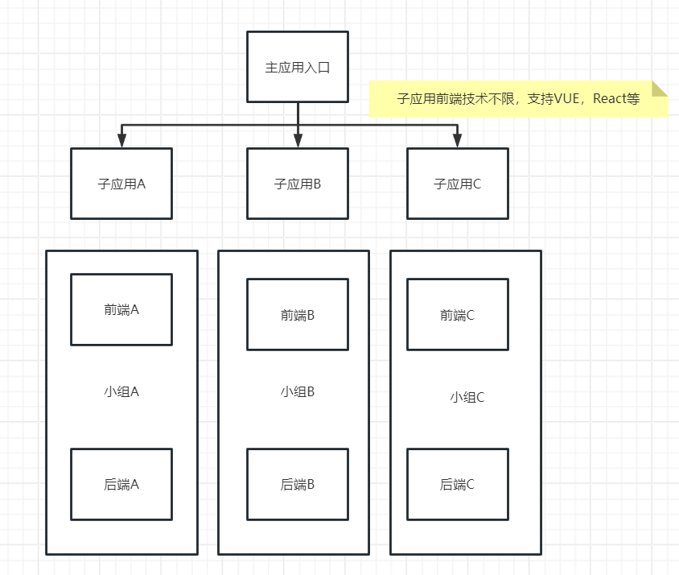
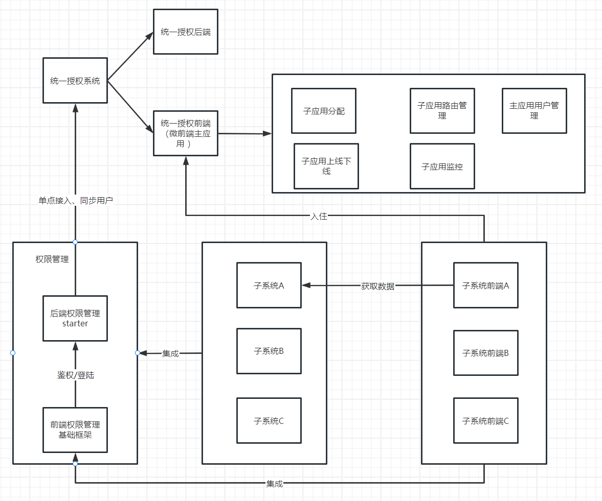

# 使用微前端重构项目

> 项目搭建 Demo: [Sewar-x/micro-app-demo: 使用京东 micro-app 微前端技术，重构的后台管理系统项目框架 demo (github.com)](https://github.com/Sewar-x/micro-app-demo)

## 背景

最近有一个多年老项目（该项目使用 PHP + JQuery 前后端不分离模式开发，由于该项目经历多手人员维护，还参杂使用 CDN 方式引入 element-ui 和 Ant-design，纯后端人员维护，总之技术栈很乱）接到一些新需求，该项目由一位多年经验后端人员维护。这些需求后端维护人员表示无法使用 JQuery 实现（简述就是实现类是任务进度看板和自定义描述列表需求）。

该项目技术栈严重落后，大量复杂需求无法实现，因此借机将重构提上日程。

----

## 需求分析

**原系统存在以下问题：**

1. 系统使用 JQuery + PHP 技术开发、技术老旧过时，多数技术已停止更新维护

2. 模块繁多，一次性全部重构上线不现实

3. 使用前后端不分离开发，重构使用前后端分离技术开发，难以兼容

4. 新旧技术不兼容，权限管理困难

   

由于原系统任然有许多模块在迭代维护，我们不能直接抛弃原系统模块重新开发。

**因此需要实现增量迭代：**

* 原模块迭代升级较小时，继续使用原技术模块开发；
* 新需求使用新技术开发；
* 系统原模块和新需求模块需要共存；

---

## 技术分析

### 原系统技术栈

*  PHP + JQuery 前后端不分离；
* 部分页面使用 Vue2 + ElementUI，使用 CDN 方式引入；

原项目页面结构：

* 侧边菜单栏
* 内容区

原项目使用 iframe 实现微前端结构，使用了统一的菜单和统一头部，内容区域使用 iframe 嵌入不同的页面

然而整套项目时候 PHP + JQuery 实现；

### **重构方案**

使用微前端技术，将原项目拆分为三个系统：主应用(基座应用)、旧应用(旧项目容器)、新应用(新项目容器)；

* **主应用(基座应用)**：可以使用 Vue/React 重构基座；
  * 基座负责控制子应用、登录、权限、状态、路由
* **旧项目容器**：使用 Vue/React 搭建一个原项目子应用，通过路由 + iframe 模式重构子项目；
  * 原项目子应用负责渲染原页面
* **新项目容器**：使用  Vue/React 搭建一个新项目子应用，负责开发新需求模块；

1. 基座控制权限和路由、状态等，根据路由渲染不同的子应用；
2. 当有新的需求模块时候，使用新应用开发；
3. 当完成旧应用某个模块时，在旧应用容器中下线对应模块路由；
4. 将`新的模块路由/重构后的模块路由`更新到基座容器路由表中。

下面会详细分析三个应用的技术方案

---

## 技术架构

### **微前端**

提供基座容器

### **组件库**

为主应用和子应用提供统一组件：

* 各应用组件资源共享
* 统一的配置化组件库
* 统一的样式结构

### **插件库**

为主应用和子应用提供统一插件：

* 各应用提供统一的逻辑处理
* 登录、token校验、权限控制
* 监控、错误处理、http

### **脚手架**

脚手架提供创建子应用项目统一配置和文件结构

* 统一的文件结构
* 统一的文件配置

### **CICD**

统一的CICD流程为各个子应用和主应用提供统一的构建/部署流程

* 统一构建发布主子应用

---

## 技术选型

### **技术栈分析**

当前主流前端框架和构建工具为：

* Vue3 + Vite
* React + WebPack5

当前适合的微前端框架：[qiankun](https://qiankun.umijs.org/zh)、[micro-app](https://qiankun.umijs.org/zh)、[无界](https://wujie-micro.github.io/doc/)、[EMP](https://emp2.netlify.app/) ，每个框架对 Vite 和 Webpack 支持程度不同。

由于当前团队内部主要技术栈为 Vue，并且组件库和插件库主要基于 Vue 封装。因此在选择主应用时，主要考虑使用 Vue 技术栈。

当前截至 2024 年 Vue 最新版本 Vue3 主要适配构建工具为 Vite，因此在选择 微前端框架时需要考虑框架对 Vite 的支持：

| 微前端框架     | Vite支持程度                                                 | Webpack支持程度                                     |
| -------------- | ------------------------------------------------------------ | --------------------------------------------------- |
| qiankun (乾坤) | 官方不支持，需要使用 **[vite-plugin-qiankun](https://github.com/tengmaoqing/vite-plugin-qiankun)** 适配 | 支持                                                |
| micro-app      | 支持                                                         | 支持                                                |
| 无界           | 官方不支持                                                   | 支持                                                |
| EPM            | 官方不支持                                                   | 支持 底层使用 webpack5、Module Federation 实现 |

由于主要使用微前端框架对旧项目技术重构升级，除了要考虑对 Vite 支持以外，还需要考虑微前端框架对 旧项目改造的侵入程度、社区活跃度等。

### **qiankun + Vue3 + Vite**

qiankun 官方不支持使用 Vite：

* 在使用 vue3 + vite 的子应用中，需要使用 **[vite-plugin-qiankun](https://github.com/tengmaoqing/vite-plugin-qiankun)** 进行适配。

* 在使用 vue3 + vite 的主应用中，可以直接使用 qiankun。

> * 使用 **[vite-plugin-qiankun](https://github.com/tengmaoqing/vite-plugin-qiankun)**  接入 qiankun,参考：[Vue3 + Vite + qiankun微前端实践 - 掘金 (juejin.cn)](https://juejin.cn/post/7116002929168875533#heading-5)
>
> * qiankun 适配 Vite 参考：[在微前端qiankun中使用Vite你踩坑了吗？ - 掘金 (juejin.cn)](https://juejin.cn/post/7054009091961651237)
>
> * `vue3 + vite` 作为子应用出现的问题解决办法：[vue3 + vite 作为子应用出现的问题解决办法 · Issue #2966 · umijs/qiankun (github.com)](https://github.com/umijs/qiankun/issues/2966)

以 `vue3 + vite `的 demo 为例，在使用 Vue3 + Vite 适配 qiankun 时，会遇到以下两个需要解决的问题：

#### **开发模式问题**

* 在开发环境下，如果我们使用 vite 来构建 vue3 子应用，基于 vite 的构建机制，会在子应的 `html` 的入口文件的 `script` 标签上携带 `type=module`。

* 而 qiankun 父应用引入子应用，本质上是将 html 做为入口文件，并通过 `import-html-entry` 库去加载子应用所需要的资源列表 Js、css，然后通过 eval 直接执行。

* 一开始`import-html-entry`会过滤掉 `type=module`的文件，导致缺失 js 却直接 eval 最终执行出错，后期这个问题官方已经支持

  > 参考文章：[ Support of type=module and nomodule attribute in import-html-entry](https://link.juejin.cn?target=https%3A%2F%2Fgithub.com%2Fumijs%2Fqiankun%2Fissues%2F507)

* 而基于 vite 构建的 js 中`import、export`并没有被转码，会导致直接报错（浏览器不允许在非 type=module 的 script 里面使用 import）

#### **生产模式**

* 生产模式下，因为 Vite 没有诸如 qiankun 中 webpack 支持运行时 `publicPath`,也就是`__webpack_public_path__`，换句话说就是 vite 不支持运行时 publicPath。
* 运行时  publicPath 其主要作用是用来解决微应用动态载入的脚本、样式、图片等地址不正确的问题。
*  目前在Vite官方文档没查阅到相关的配置，但在Github中找到一个插件[vite-plugin-dynamic-publicpath](https://link.juejin.cn/?target=https%3A%2F%2Fgithub.com%2Fjy0529%2Fvite-plugin-dynamic-publicpath)。

### 总结

虽然 qiankun 社区活跃度更高、但 micro-app 对 vite 支持度更好。

主应用需要使用 Vue3 + Vite 构建，而主应用使用 qiankun 无需其他插件适配。

因此可以采用以下技术栈适配：

* 微前端框架：micro-app;

* 主应用： Vue3 + Vite;
* 旧应用容器： Vue3 + Vite；
* 新子应用： Vue3 + Vite

---

## 项目构架

### 主应用（基座）

最外层是**基座，** 基座是微前端应用集成的一个重要平台。

基座同时也肩负着管理公共资源、依赖、规范的责任。

#### **职责**

基座主要有以下职责：

1. 子应用集成，给子应用提供渲染容器
2. 权限管理
3. 路由和菜单管理
4. 会话管理
5. 主题管理
6. 共享依赖
7. 多语言管理
8. 登录页面
9. 登录管理：登录、token 校验、token 刷新
10. 404 页面

#### **基座结构**

基座提供基础的功能和菜单栏，作为渲染容器。因此基座的页面结构为：

* 登录页面
* 内容页面：侧边栏菜单、header、footer

#### 基座权限管理和登录方案

1.统一授权系统只关心主应用配置，子应用菜单权限，接口权限由各个子系统各自管理（可在stater中统一继承）

2.子系统可与统一授权同步用户，由统一授权系统认证，子系统分配权限，也可以不同步用户（用户登陆主应用后，点击某个子系统重新输入子系统账号密码进入）

3.可快速响应需求 前端不限框架技术，不关心用户模块，同理后端也只关心业务模块

#### 主应用搭建

> 根据以上项目特点，封装了一套基座项目模板：[Sewar-x/admin-scaffolds: 基于 vue3、typescript、element-plus、xw-ui、micro-app 的后台管理系统模板 (github.com)](https://github.com/Sewar-x/admin-scaffolds)

### 子应用（旧项目容器）

旧项目容器项目，使用 Vue/React 搭建，负责管理旧应用路由和页面渲染：

1. 封装一个 iframe 组件，负责渲染旧应用页面内容
2. 通过路由参数传入 iframe 组件，渲染不同的页面

### 新应用

新需求模块和重构的需求模块在新应用中开发。
