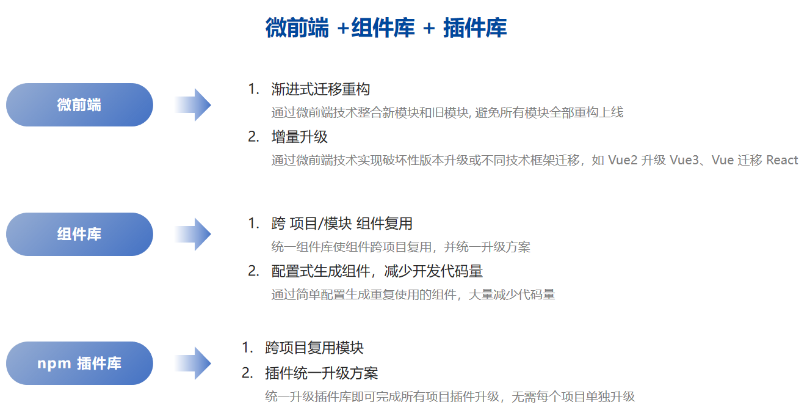

# 使用微前端重构项目

## 背景

当前部门维护了三个后台管理系统项目，其中两个项目使用 vue2 开发，一个使用 vue3开发。

| 技术/项目       | 赛场工具                                 | MakeX赛事管理后台                        | XCS-CMS                                     |
| --------------- | ---------------------------------------- | ---------------------------------------- | ------------------------------------------- |
| 前端 MVVM 框架  | `"vue": "^2.6.11"`                       | `"vue": "^2.6.11"`                       | `"vue": "3.2.41"`                           |
| UI 组件库       | `"ant-design-vue": "^1.7.5"`             | `"ant-design-vue": "^1.7.2"`             | `"ant-design-vue": "3.2.20"`                |
| HTTP 库         |                                          | ` "axios": "^0.21.1"`                    | `"axios": "^0.21.1"`                        |
| OSS             | ` "ali-oss": "^6.16.0"`                  | ` "ali-oss": "^6.14.0"`                  | `"ali-oss": "^6.17.1"`                      |
| passport-client | `"@makeblock/passport-client": "^3.4.6"` | `"@makeblock/passport-client": "^3.4.7"` | `  "@makeblock/passport-client": "^3.4.10"` |
| 低代码表单      |                                          | `"k-form-design": "^3.7.2"`              |                                             |

以上项目中，当前面临以下问题：

1. 赛场工具和 MakeX 赛事工具使用 Vue2 开发，Vue2 当前已停止维护，不适合长期使用；
2. MakeX 赛事后台使用 `"k-form-design": "^3.7.2"` 低代码表单，该表单为 Vue2版本，并且另一个项目中使用该表单的渲染器，如果直接将项目升级成 Vue3 ，则该表单也需要同时升级，另一个项目也需要升级该表单；
3. XCS—CMS 内容集成多个项目管理模块在同一个项目中，并且由多个小组共同开发；由于共同维护同一个项目，不同小组开发过程中发版会相互影响。
4. 后台管理系统组件和交互相同（都包含表格、表单、高级搜索等常用组件），但是不同项目之间组件相互隔离，导致相同组件重复开发。

----

## 目标

### 1. 渐进式 Vue2 升级 Vue3

在不影响原有功能模块前提下，同一个项目新的模块使用 Vue3 开发，旧模块仍然使用 Vue2 继续维护。在中间空闲时间再将 Vue2 旧模块逐步迁移至 Vue3。保证不影响现有系统功能，并逐步升级成 Vue3。

通过渐进式升级，减少一次性重构的时间成本和人力成本。

### 2. 拆分 XCS—CMS 项目，减少不同项目协作问题

当前 XCS—CMS  包含XCS、DesignFind、Customthings、xTool Support Center、Material EasySet、Passport、用户中心管理、消息中心 多个项目的后台管理模块，并且由不同小组维护，导致发版容易冲突。

为了减少协作问题，可以将 XCS—CMS 拆分，拆分成多个小项目，并通过微前端技术整合所有项目，通过拆分项目导航栏，将不同项目分为一级路由，项目路由作为二级横向路由；

不同项目单独发版，避免发版流程相互影响。

### 3. 搭建公共组件库，减少组件重复开发，提高开发效率

后台管理系统组件通常都都包含表格、表单、高级搜索等常用组件，通过搭建公共组件库，在赛场工具、MakeX后台管理、XCS-CMS 各个子系统中，都使用并维护同一套组件库，可以减少组件重复开发工作，提高开发效率。

### 4.搭建公共项目模板，统一后台管理系统技术方案

通过搭建统一的公共模板，提供公共的插件，提供给所有后台管理系统，统一所有项目技术栈

所有后台管理系统使用了统一的 eslint、commitlint 等规范，并且使用 Vue、axios、ali-oss  等插件和 Jenkins 配置，因此可以通过搭建统一的模板，减少项目初始化工作。

---

## **重构方案**

### 1. 使用微前端拆分应用，对应用增量升级

使用微前端技术，将原项目拆分为二个系统：主应用(基座应用)、旧应用(旧项目容器)；

#### **主应用(基座应用)**

最外层是**基座，** 基座是微前端应用集成的一个重要平台。

基座同时也肩负着管理公共资源、依赖、规范的责任。

* 基座负责控制子应用、登录、权限、状态、路由、多语言、主题、用户信息、404页面 等公共状态管理；

* 可以使用 Vue/React 重构基座应用/主应用；
* 可以使用 旧项目作为基座应用，也可以使用新项目作为基座应用；
* 由于基座应用中登录、权限、状态、路由、多语言、主题等功能变动较小，因此也可以使用旧项目作为基座使用（旧项目作为基座应用对于项目的变动影响）

#### **基座结构**

基座提供基础的功能和菜单栏，作为渲染容器。因此基座的页面结构为：

* 登录页面
* 内容页面：侧边栏菜单、header、footer

#### **子项目（新应用/旧应用）**

* 使用 Vue/React 搭建一个新项目子应用，或将原旧项目作为子应用；

* 新项目子应用负责开发新的功能和页面；

### 2.搭建统一后台组件库

* 通过 JSON 配置，封装统一的表格、表单、高级搜索 等组件，统一组件样式和交互，统一后台接口格式和字段，减少开发和对接工作量；

* 通过公共组件库，做到不同项目和模块组件最大程度复用，减少开发工作量，提高开发效率；

* 搭配完善的组件库文档

  

  

### 3.开发统一项目模板

为主应用和子应用提供统一项目模板：

* 各应用提供统一的项目规范： ESlint、StyleLint、CommitLint 等规范；
* 提供统一的目录结构
* 提供统一的公共配置：Vite 配置、Jenkins 配置，环境变量配置等；
* 提供统一的公共插件：MicroApp 插件、 登录、token校验、权限控制、错误处理、http 等插件；

## 重构项目开发流程

1. 基座控制权限和路由、状态等，根据路由渲染不同的子应用；
2. 当有新的需求模块时候，使用新应用开发；
3. 当完成旧应用某个模块时，在旧应用容器中下线对应模块路由；
4. 将`新的模块路由/重构后的模块路由`更新到基座容器路由表中。
5. 公共组件在组件库中开发测试，并发布到私有npm，各项目通过更新组件库版本更新公共组件。

---

## 技术架构

---

## 技术选型

当前主流前端框架和构建工具为：

* Vue3 + Vite
* React + WebPack5

当前适合的微前端框架：[qiankun](https://qiankun.umijs.org/zh)、[micro-app](https://qiankun.umijs.org/zh)、[无界](https://wujie-micro.github.io/doc/)、[EMP](https://emp2.netlify.app/) ，每个框架对 Vite 和 Webpack 支持程度不同。

由于当前团队内部主要技术栈为 Vue，并且组件库和插件库主要基于 Vue 封装。因此在选择主应用时，主要考虑使用 Vue 技术栈。

当前截至 2024 年 Vue 最新版本 Vue3 主要适配构建工具为 Vite，因此在选择 微前端框架时需要考虑框架对 Vite 的支持：

| 微前端框架     | Vite支持程度                                                 | Webpack支持程度                                     |
| -------------- | ------------------------------------------------------------ | --------------------------------------------------- |
| qiankun (乾坤) | 官方不支持，需要使用 **[vite-plugin-qiankun](https://github.com/tengmaoqing/vite-plugin-qiankun)** 适配 | 支持                                                |
| micro-app      | 支持                                                         | 支持                                                |
| 无界           | 官方不支持                                                   | 支持                                                |
| EPM            | 官方不支持                                                   | 支持 底层使用 webpack5、Module Federation 实现 |

由于主要使用微前端框架对旧项目技术重构升级，除了要考虑对 Vite 支持以外，还需要考虑微前端框架对 旧项目改造的侵入程度、社区活跃度等。

### **qiankun + Vue3 + Vite**

qiankun 官方不支持使用 Vite：

* 在使用 vue3 + vite 的子应用中，需要使用 **[vite-plugin-qiankun](https://github.com/tengmaoqing/vite-plugin-qiankun)** 进行适配。

* 在使用 vue3 + vite 的主应用中，可以直接使用 qiankun。

> * 使用 **[vite-plugin-qiankun](https://github.com/tengmaoqing/vite-plugin-qiankun)**  接入 qiankun,参考：[Vue3 + Vite + qiankun微前端实践 - 掘金 (juejin.cn)](https://juejin.cn/post/7116002929168875533#heading-5)
>
> * qiankun 适配 Vite 参考：[在微前端qiankun中使用Vite你踩坑了吗？ - 掘金 (juejin.cn)](https://juejin.cn/post/7054009091961651237)
>
> * `vue3 + vite` 作为子应用出现的问题解决办法：[vue3 + vite 作为子应用出现的问题解决办法 · Issue #2966 · umijs/qiankun (github.com)](https://github.com/umijs/qiankun/issues/2966)

以 `vue3 + vite `的 demo 为例，在使用 Vue3 + Vite 适配 qiankun 时，会遇到以下两个需要解决的问题：

#### **开发模式问题**

* 在开发环境下，如果我们使用 vite 来构建 vue3 子应用，基于 vite 的构建机制，会在子应的 `html` 的入口文件的 `script` 标签上携带 `type=module`。

* 而 qiankun 父应用引入子应用，本质上是将 html 做为入口文件，并通过 `import-html-entry` 库去加载子应用所需要的资源列表 Js、css，然后通过 eval 直接执行。

* 一开始`import-html-entry`会过滤掉 `type=module`的文件，导致缺失 js 却直接 eval 最终执行出错，后期这个问题官方已经支持

  > 参考文章：[ Support of type=module and nomodule attribute in import-html-entry](https://link.juejin.cn?target=https%3A%2F%2Fgithub.com%2Fumijs%2Fqiankun%2Fissues%2F507)

* 而基于 vite 构建的 js 中`import、export`并没有被转码，会导致直接报错（浏览器不允许在非 type=module 的 script 里面使用 import）

#### **生产模式**

* 生产模式下，因为 Vite 没有诸如 qiankun 中 webpack 支持运行时 `publicPath`,也就是`__webpack_public_path__`，换句话说就是 vite 不支持运行时 publicPath。
* 运行时  publicPath 其主要作用是用来解决微应用动态载入的脚本、样式、图片等地址不正确的问题。
*  目前在Vite官方文档没查阅到相关的配置，但在Github中找到一个插件[vite-plugin-dynamic-publicpath](https://link.juejin.cn/?target=https%3A%2F%2Fgithub.com%2Fjy0529%2Fvite-plugin-dynamic-publicpath)。

### 总结

虽然 qiankun 社区活跃度更高、但 micro-app 对 vite 支持度更好。

主应用需要使用 Vue3 + Vite 构建，而主应用使用 qiankun 无需其他插件适配。

因此可以采用以下技术栈适配：

* 微前端框架：micro-app;

* 主应用： Vue3 + Vite;
* 旧应用容器： Vue3 + Vite；
* 新子应用： Vue3 + Vite

---

