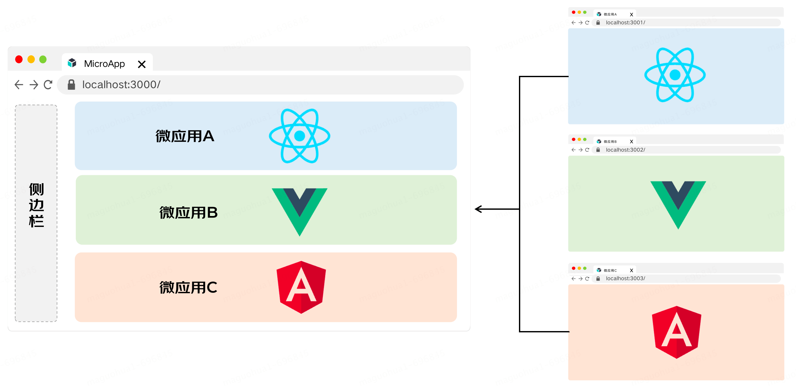

# 微前端基础

## 什么是微前端？

微前端是一种技术手段及方法策略，旨在通过多个团队独立发布功能的方式，共同构建现代化的Web应用。

它借鉴了微服务的架构理念，将一个庞大的前端应用拆分为多个独立灵活的小型应用（即微应用），每个微应用都可以独立开发、独立运行、独立部署，然后再将这些小型应用联合为一个完整的应用。

## **目标**

微前端的核心目标是将巨石应用拆解成若干可以自治的松耦合微应用，确保微应用真正具备独立开发、独立运行的能力。

这种架构既可以将多个项目融合为一，又可以减少项目之间的耦合，提升项目扩展性。相比一整块的前端仓库，微前端架构下的前端仓库更小、更灵活。

它主要解决了两个问题：

- 1、随着项目迭代应用越来越庞大，难以维护。
- 2、跨团队或跨部门协作开发项目导致效率低下的问题。

## **特点**

1. **技术栈无关**：微前端架构允许不同的团队使用不同的技术栈进行开发。这意味着，一个项目中可能同时包含使用React、Vue、Angular等不同框架构建的微应用。这种灵活性使得团队可以根据自身专长或项目需求选择合适的技术栈。
2. **独立开发、部署和演进**：每个微应用都是独立的，可以独立地进行开发、测试和部署。这种独立性极大地提高了开发效率，因为不同的团队可以并行工作，互不影响。同时，由于微应用可以独立演进，因此可以更容易地实现增量更新和升级。
3. **增量升级**：在微前端架构中，可以逐个升级微应用，而无需将整个应用一起升级。这种增量升级的特性使得应用的更新更加灵活和可控，减少了升级过程中的风险。
4. **运行时组合**：微前端架构在运行时将多个微应用组合成一个整体应用。这种组合是动态的，可以根据需要进行调整。这使得应用具有更好的可扩展性和可维护性。
5. **主从架构**：微前端通常采用主从架构，其中主应用负责整体应用的路由、状态管理、公共资源加载等，而微应用则负责各自的功能实现。主应用和微应用之间通过约定的接口进行通信和协作。
6. **隔离性**：微前端架构强调微应用之间的隔离性，以确保每个微应用的稳定性和安全性。这包括样式隔离、JavaScript 变量隔离、路由隔离等方面。
7. **弹性扩展**：由于微前端架构的模块化特性，可以方便地添加或移除微应用，以实现应用的弹性扩展。这种扩展性使得应用能够更好地适应业务需求的变化。
8. **提升开发体验**：微前端架构允许开发团队使用各自熟悉的技术栈和工具链进行开发，从而提升了开发体验和效率。同时，由于微应用之间的隔离性，开发过程中不会相互干扰，减少了开发过程中的冲突和错误。

总的来说，微前端架构通过拆分应用为多个独立的微应用，提高了应用的可维护性、可扩展性和开发效率。它允许不同的团队使用不同的技术栈进行开发，并通过约定的接口进行协作和通信，从而实现了一个更加灵活和高效的前端开发模式。

## 常见应用

根据微前端以上特点，微前端应用于以下场景：

### **项目拆分**

- 微前端架构允许不同的团队使用不同的技术栈进行开发。
- 每个微应用都是独立的，可以独立地进行开发、测试和部署。

对比巨石应用一整块的代码仓库，微前端架构下的代码仓库更加**简单**、**轻量**。各个仓库的代码可以基于**业务**、**权限**、**变更的频率**、**组织结构**、**后端微服务**等原则拆分，**界限明确**，**降低耦合**，便于开发人员在开发过程中快速定位源代码，提高开发效率，降低维护成本。

在实际项目中，各个项目会因为各种各样的原因导致使用的技术栈不一样。比如开发框架有 **react**、**vue**、**angular** 等，构建工具有 **webpack**、**rollup**、**parcel** 等，而且版本还可能不一致。使用微前端架构，可以做到将使用不同技术栈(不同版本)的子应用聚合起来。

### 增量升级

> **使用微前端方案很大一部分原因就是为了解决遗留系统迁移问题。**

每个公司项目会存在一些应用随时时间推移和迭代，导致技术落后问题。如：使用 Jquery 开发的项目随时间推移成为技术老旧项目，并且使用 Jquery 实现一些功能复杂。 

我们很难一次性将整个项目重构完成再上线，因此需要将新需求使用新技术，系统原来功能保持不变。

使用微前端可以实现以上增量升级方案。

### 技术栈升级

有些项目，在成立之初使用了当前最新的技术如 Vue2。但是随着技术的发展，Vue 已经更新到了Vue3，但项目由于一直在迭代，还是使用  Vue2。直接全部重构，肯定是不现实的，费时费力不说，风险也大。

针对这种情况，我们可以重起一个应用，使用 Vue3 循序渐进的重构应用，然后使用微前端方案将新旧应用聚合在一起。

 

## 缺点

1. **复杂性增加**：微前端架构需要处理多个独立的应用，每个应用都有自己的技术栈、构建流程和依赖关系。这可能导致整体架构的复杂性增加，需要额外的管理和协调工作。
2. **性能问题**：在微前端中，每个应用都可能需要加载和初始化自己的依赖，这可能导致页面加载时间增加。同时，页面之间的跳转可能会引入额外的延迟。因此，需要仔细优化和考虑性能问题。
3. **数据共享和状态管理**：在微前端中，不同的应用可能来自不同的团队，它们之间的数据共享和状态管理可能变得复杂。需要找到合适的方法来共享数据和状态，避免数据不一致问题。
4. **开发门槛高**：实现微前端架构需要一定的技术积累和实践经验，对于新手来说可能存在一定的学习门槛。此外，由于涉及到多个应用的整合和协作，因此也需要具备一定的团队协作和沟通能力。

---

## 微前端技术方案

| 技术方案                       | 特点                                                         | 优点                                                         | 缺点                                                         |
| :----------------------------- | :----------------------------------------------------------- | :----------------------------------------------------------- | :----------------------------------------------------------- |
| **基于Web Components**         | 使用Web Components的四个主要技术：Custom Elements、Shadow DOM、HTML Templates、HTML Imports。将前端应用程序拆分为多个Web Components。 | 标准化技术，具有广泛的浏览器支持 高内聚、低耦合，易于维护和扩展良好的封装性和隔离性 | 需要一定的学习成本来掌握Web Components的使用浏览器兼容性问题 可能需要额外处理不支持全局样式和JavaScript的共享 |
| **基于iframe**                 | 使用iframe将每个微前端应用嵌入到主框架中，实现隔离。         | 简单、快速 实现良好的隔离性，避免样式和全局变量的冲突 支持跨域通信 | 性能开销较大，因为每个iframe都是独立的浏览器上下文 难以共享资源，如全局状态、数据等页面刷新和导航问题 |
| **基于单页面应用（SPA）**      | 通过在主框架中配置路由，根据路由加载不同的微前端应用。       | 简单易用，适用于SPA架构 支持全局状态和数据共享 易于集成第三方库和框架 | 隔离性较差，样式和全局变量可能冲突 对SPA架构有依赖，不适合传统多页面应用 需要处理路由冲突和嵌套问题 |
| **基于微服务网关路由分发**     | 使用微服务网关作为微前端应用的代理和调度器，根据请求转发到不同的微前端应用。 | 支持跨域请求和API网关功能 可以实现统一的身份认证和权限管理 灵活性强，支持多种微前端技术 | 实现复杂，需要配置和维护微服务网关 对网络通信有较高要求可能增加额外的性能开销 |
| **基于自定义元素和Shadow DOM** | 使用自定义元素封装微前端应用，并使用Shadow DOM提供隔离性。   | 高内聚、低耦合，易于维护和扩展良好的封装性和隔离性 支持自定义元素和Shadow DOM的浏览器兼容性较好 | 需要一定的学习成本来掌握自定义元素和Shadow DOM的使用 不支持全局样式和JavaScript的共享可能受到浏览器兼容性的限制 |

---

## 微前端框架

|       技术框架        | 特点                                                         | 优点                                                         | 缺点                                                         |
| :-------------------: | :----------------------------------------------------------- | :----------------------------------------------------------- | :----------------------------------------------------------- |
|    **Single-SPA**     | 最早的微前端框架之一，基于路由和生命周期钩子实现微前端。     | 简单易用，轻量级 支持多种前端框架（React, Vue, Angular等） 清晰的生命周期管理 | 隔离性较弱，样式和全局变量可能冲突 需要手动处理路由冲突和嵌套问题 不自带通信机制，需要额外实现 |
|      **qiankun**      | 由蚂蚁金服开源，基于Single-SPA封装的微前端框架，提供了更加完善的隔离和通信机制。 | 兼容性强，支持主流前端框架 提供沙箱机制，实现真正的样式隔离和JS隔离 内置通信机制，方便微应用间通信 | 相对较重，可能引入一些不必要的依赖 学习成本较高，需要理解其沙箱和通信机制 对主框架有一定侵入性 |
|  **Micro-Frontends**  | 这是一个概念或策略，而不是具体的框架，它描述了将前端拆分成多个独立可部署应用的技术方法。 | 技术栈无关，支持多团队并行开发 独立开发、部署、升级 可维护性和可扩展性好 | 实现复杂，需要处理多个应用的集成和通信 可能引入额外的性能开销 需要额外的管理和监控机制 |
| **Module Federation** | Webpack 5 引入的新特性，允许在构建时动态地加载其他应用中的模块。 | 支持运行时动态加载模块 可以实现跨应用代码共享 与Webpack紧密集成，易于配置和使用 | 需要Webpack 5支持 配置相对复杂 可能引入额外的构建和部署复杂性 |
|        **EMP**        | 由饿了么前端团队开源的微前端解决方案，提供了完整的开发、构建、部署和监控能力。 | 功能全面，支持从开发到部署的全流程 提供多种通信机制和隔离策略 易于集成和扩展 | 相对较新，社区支持可能不如其他成熟框架 学习成本较高，需要理解其整体架构和组件 可能引入额外的依赖和配置复杂性 |
|       **wujie**       | 由某公司或组织开源的微前端框架，具有特定的设计和功能特点。   | （假设）提供丰富的API和插件机制 （假设）支持多种通信方式和数据共享 （假设）具有高性能和可扩展性 | （假设）可能对于某些场景或技术栈支持不够完善 （假设）学习成本可能较高，尤其是对于新手开发者 （假设）社区支持可能相对较少 |

