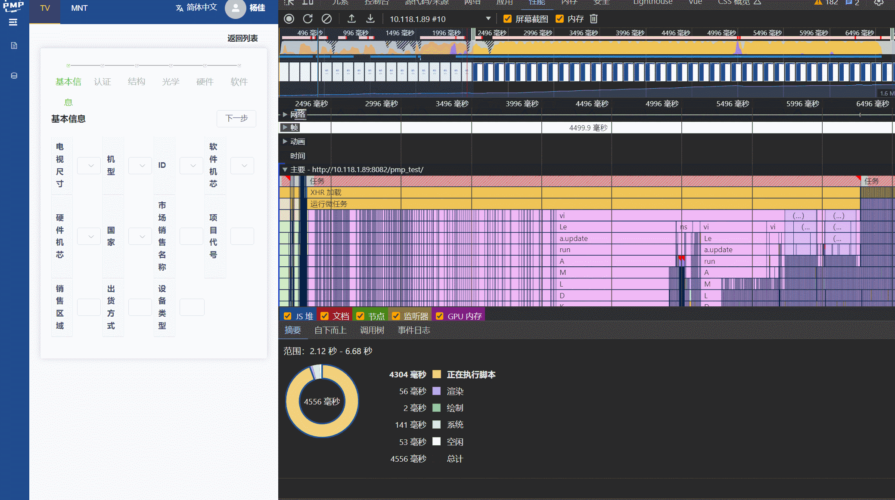
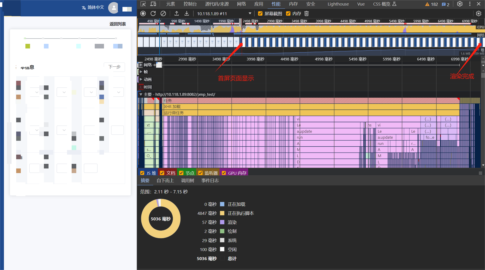

# 一次后台管理系统的性能优化

## 背景

> * 某天，xxx 实习生反馈，在他负责开发的某个前端集合页面渲染速度很慢，领导要求优化一下加载速度，跑来问我有什么优化方案？

## 分析过程

* 第一步：定位问题点
  * 选择问题定位工具
  * 分析问题可能出现原因

* 第二步：提出解决方案
* 第三步：选择最优解

## 问题定位

导致前端页面渲染慢，不一定是浏览器渲染速度慢，也有可能为以下常见的原因：

> 1. **网络请求问题**：
>    - **大量的HTTP请求**：如果页面中有大量的资源文件（如CSS、JavaScript、图片等），每个资源文件都需要进行一次HTTP请求。过多的HTTP请求会增加页面加载时间，降低渲染速度。
>    - **慢速网络连接**：如果用户的网络连接较慢，资源加载的时间会延长，导致页面渲染速度变慢。在设计和开发过程中应考虑到网络环境的不确定性。
> 2. **DOM渲染问题**：
>    - **复杂的DOM结构**：如果页面中存在复杂的、嵌套层级较深的DOM结构，浏览器需要花费更多时间来解析和渲染页面，导致渲染速度变慢。
> 3. **JavaScript执行时间问题**：
>    - **未优化的 CSS 和 JavaScript**：复杂或低效的CSS选择器、大量的 JavaScript 操作，低性能的  Javascript  算法、频繁的 DOM 操作等都会导致页面渲染速度下降。优化 CSS 和 JavaScript 代码可以改善页面渲染性能。
>    - **第三方脚本和插件**：过多的第三方脚本和插件会增加页面的加载时间和执行时间，对页面渲染速度产生负面影响。评估和精简第三方脚本和插件的使用可以改善渲染性能。
> 4. **图片加载问题**：
>    - **图片过大**：如果页面中包含大尺寸、高分辨率的图片，这些图片的加载和渲染会消耗较多的时间。优化图片大小、格式和加载方式可以提升页面渲染速度。
> 5. **缓存问题**：
>    - **缺乏浏览器缓存**：如果没有正确使用缓存机制，每次加载页面时都需要重新下载所有资源文件，增加了页面加载时间。合理使用浏览器缓存可以减少重复加载的资源，提升渲染速度。

根据以上常见的导致渲染问题，可以逐步对页面分类进行分析，通常首先考虑常见的网络问题，对网络问题进行分析

### 网络请求分析

> 网络请求分析，一般通过浏览器的开发者工具来进行性能分析：
>
> 1. 使用**浏览器的性能分析工具**：现代浏览器（如Chrome、Firefox）提供了内置的性能分析工具，可以记录和分析页面加载过程中的网络请求以及其它性能指标。你可以通过打开开发者工具（通常是按下 F12 键），切换到 "Performance"（Chrome 中）或 "Network"（Firefox 中）选项卡进行性能分析。
> 2. **检查网络请求的时间线**：在性能分析工具中，你可以查看请求的时间线，包括每个请求的开始时间、结束时间以及加载时间。观察加载时间较长的请求，尤其是文件大小较大的请求，可以帮助确定网络请求是否是导致页面渲染缓慢的原因。
> 3. **查看网络请求的详细信息**：性能分析工具通常提供了详细的网络请求信息，包括请求的 URL、响应状态码、文件大小、加载时间等。通过查看这些信息，你可以**确定是否存在大量的HTTP请求或者某些请求的加载时间较长**。
> 4. **检查缓存情况**：在性能分析工具中，你可以查看请求的缓存状态。如果某些资源没有被正确缓存，每次加载页面时都需要重新下载这些资源，导致页面渲染速度变慢。确保正确使用缓存机制可以减少重复加载的资源。
> 5. **使用网络分析工具**：除了浏览器的开发者工具，还有一些独立的网络分析工具（如WebPageTest、GTmetrix等）可以帮助你分析前端页面的性能问题。这些工具可以提供更详细的网络请求信息和性能分析报告。

* 查看接口请求情况：打开 chrome，按下 F12 打开分析工具，点击 ”网络“，查看接口请求情况：
  * 
  * 请求接口  `getModels?type=fds`，状态正常；
  * 通过网络请求瀑布图可知：
    * 1800ms 左右开始请求接口 `selectOptions`
    * 2000ms 左右开始并发请求 `getModels` 和 `info`，其中 `getModels` 耗时 74ms；
    * 因此接口网络请求时间不是消耗最长时间的主要原因

### DOM 渲染分析

#### **页面渲染录制**

打开待分析页面，点击 F12 ，使用 Chrome 性能分析工具，对页面进行录制：

* 

#### **结果分析**

##### **白屏时间分析**

> 通过 Chrome 分析工具选取上半部分时间片，选取白屏时间和loading时间段（在起始到显示初始页面之间），查看摘要：
>
> * 首屏白屏时间总耗时 2199ms;
> * JavaScript 执行时间为1493ms；

##### **首屏显示到渲染完成分析**

> 通过 Chrome 分析工具选取上半部分时间片，选取初始显示到全部内容绘制时间，查看摘要：
>
> * 总耗时 5036ms;
> * JavaScript 执行时间为 4847ms；

通过以上两段时间分析发现，从白屏到所有内容显示，总耗时为:  `2199ms +  5036ms`，JavaScript 执行总时间为`1493ms + 4847ms`；

因此可以初步定位为 JavaScript  执行时间太长，可以通过查看该页面的业务代码中 JavaScript  代码分析原因。

### JavaScript 执行时间分析

通过以上 Chrome 工具性能分析发现，是该页面的 JavaScript  执行时间太长，通过打开该页面业务逻辑代码查看：

1. 查看服务端接口，返回二维数组，该二维数组保存是的页面组件的配置信息；处理逻辑为通过服务端返回页面配置信息，动态生成页面内的表单组件；
2. 查看服务端接口数据处理代码发现处理逻辑Bug：将服务端返回的二维数组遍历分块处理，填充成三维数组！然后遍历三维数组生成表单组件配置信息。直接将原本 O(n^2)  时间复杂度升级为 O(n^3);

处理方案：通过使用 Map 表分块处理二维数组，将二维数组转化为 map 表。

处理后再次通过 chrome 工具屏幕录制分析，发现 JavaScript 执行时间为 1287ms；

