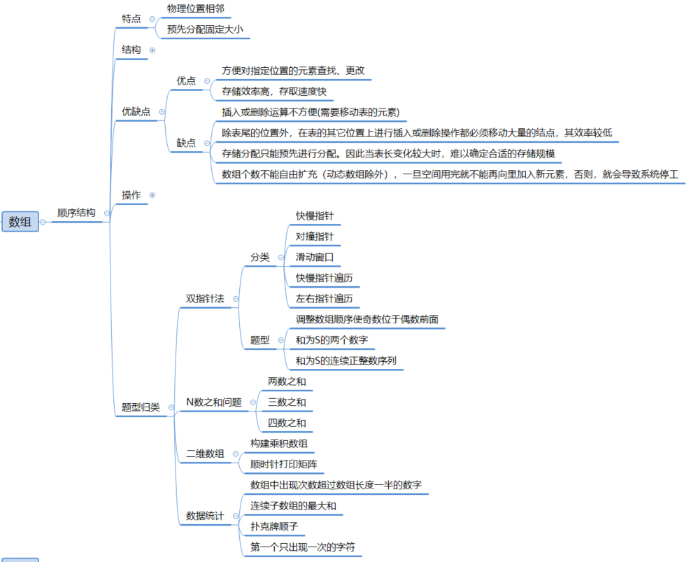
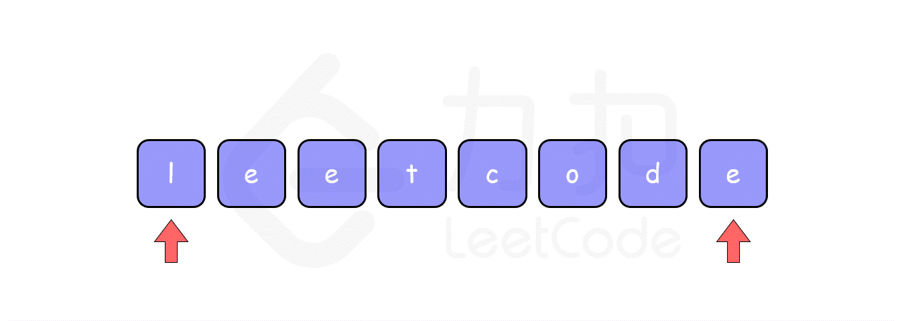
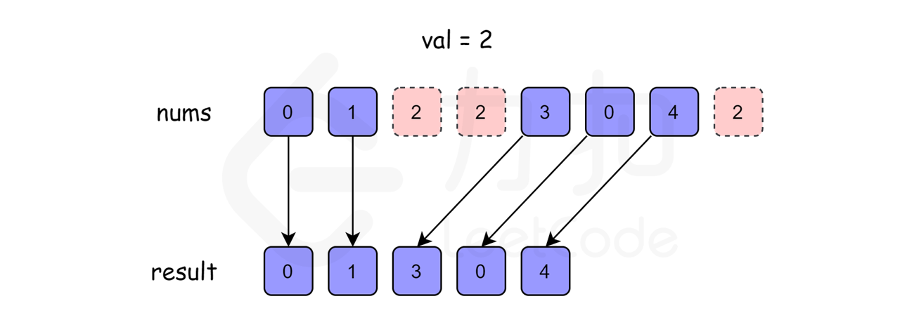
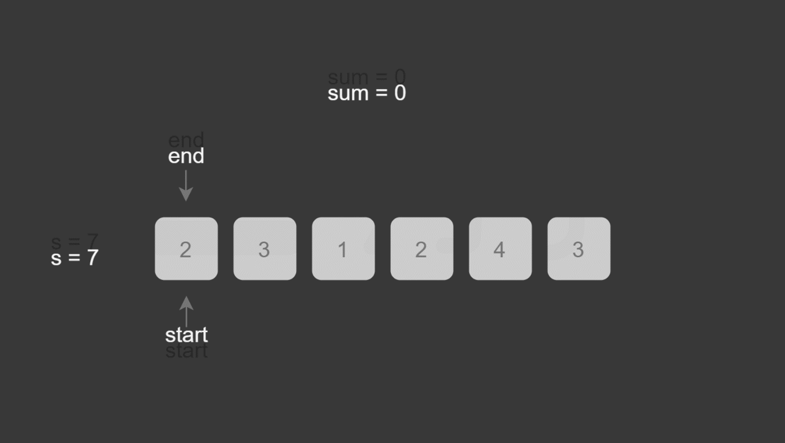
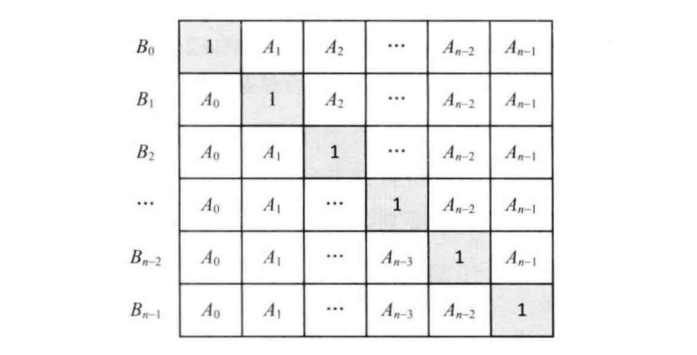
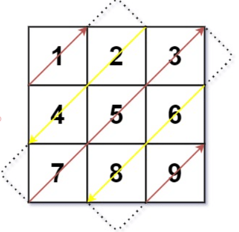

# 数组



## JS 数组 API 实现

##### [map()](https://developer.mozilla.org/zh-CN/docs/Web/JavaScript/Reference/Global_Objects/Array/map)

语法

* ```javascript
  var new_array = arr.map(function callback(currentValue[, index[, array]]) {
   // Return element for new_array 
  }[, thisArg])
  ```

注意

* `map`生成一个新数组
* 如果 `thisArg` 参数提供给`map`，则会被用作回调函数的`this`值。否则[`undefined`](https://developer.mozilla.org/zh-CN/docs/Web/JavaScript/Reference/Global_Objects/undefined)会被用作回调函数的`this`值
* `map `不修改调用它的原数组本身

实现

* 遍历数组实现

```javascript
/**
 * array.map(function(currentValue,index,arr), thisValue)方法介绍：
 * 作用：按照原始数组元素顺序依次调用处理函数处理元素
 * @param {Function} fn 元素处理函数
 * @param {Object}  context 可选。对象作为该执行回调时使用，传递给函数，用作 "this" 的值。如果省略了 thisValue，或者传入 null、undefined，那么回调函数的 this 为全局对象
 * @return array 返回一个新数组，数组中的元素为原始数组元素调用函数处理后的值
 */
Array.prototype.myMap = function (fn, context = window) {
  if (typeof fn !== "function") {
    throw new TypeError(`${fn} is not a function`)
  }
  let result = [] 						//返回的新数组
  let arr = this 						//this指向方法调用者，一般方法调用者为数组，所以这里this就是调用该遍历方法的数组
  context = context || window 			//省略context或则context为null、undefined的时候默认使用全局对象
  for (let i = 0; i < arr.length; i++) {
    //往结果数组中添加在context作用域上调用的fn函数的结果,参数为map处理函数的参数：currentValue,index,arr
    result.push(fn.call(context, arr[i], i, arr))
  }
  return result
}
```

* reduce模拟实现

```javascript
Array.prototype.myMap = function (fn, context = window) {
  if (typeof fn !== "function") {
    throw new TypeError(`${fn} is not a function`)
  }
  context = context || window
  //this指向方法调用者,一般该方法调用者为被遍历是数组，所以this指向被遍历的数组
  this.reduce((result, current, index, arr) => {
    result.push(fn.call(context, current, index, arr))
  })
}
```

##### [forEach()](https://developer.mozilla.org/zh-CN/docs/Web/JavaScript/Reference/Global_Objects/Array/forEach)

语法

```js
arr.forEach(callback(currentValue [, index [, array]])[, thisArg])
```

注意

* 如果省略了 `thisArg` 参数，或者其值为 `null` 或 `undefined`，`this` 则指向全局对象
* `forEach()` 遍历的范围在第一次调用 `callback` 前就会确定
  * 调用 `forEach` 后添加到数组中的项不会被 `callback` 访问到
  * 如果已经存在的值被改变，则传递给 `callback` 的值是 `forEach()` 遍历到他们那一刻的值
  * 已删除的项不会被遍历到。如果已访问的元素在迭代时被删除了（例如使用 [`shift()`](https://developer.mozilla.org/zh-CN/docs/Web/JavaScript/Reference/Global_Objects/Array/shift)），之后的一个元素将被跳过
* 除了抛出异常以外，没有办法中止或跳出 `forEach()` 循环

实现

```js
Array.prototype.forEach = function(callback, thisArg) {
  if (this == null) {
    throw new TypeError('this is null or not defined');
  }
  if (typeof callback !== "function") {
    throw new TypeError(callback + ' is not a function');
  }
  const O = Object(this);
  const len = O.length >>> 0;
  let k = 0;
  while (k < len) {
    if (k in O) {
      callback.call(thisArg, O[k], k, O);
    }
    k++;
  }
}
```

##### [reduce()](https://developer.mozilla.org/zh-CN/docs/Web/JavaScript/Reference/Global_Objects/Array/Reduce)

语法

* ```javascript
  arr.reduce(callback(accumulator, currentValue[, index[, array]])[, initialValue])
  ```

  

注意

* 回调函数第一次执行时，`accumulator` 和`currentValue`的取值有两种情况：
  * 如果调用`reduce()`时提供了`initialValue`，`accumulator`取值为`initialValue`，`currentValue`取数组中的第一个值；
  * 如果没有提供 `initialValue`，那么`accumulator`取数组中的第一个值，`currentValue`取数组中的第二个值。

实现

```javascript
/**
在这个示例中，我们通过 Array.prototype 对象扩展了一个名为 myReduce 的方法。该方法接受两个参数：回调函数 callback 和可选的初始值 initialValue。

在 myReduce 方法内部，我们首先根据 initialValue 的存在与否来确定初始的累加器值 accumulator。如果 initialValue 未提供，则将 accumulator 设置为 undefined，否则将其设置为 initialValue。

然后，我们使用 for 循环遍历原始数组 this（通过 this 可以访问调用 myReduce 方法的数组实例）。在每次循环中，我们将累加器 accumulator 和当前元素应用于回调函数 callback，同时传递当前元素的值、索引和原始数组作为参数。回调函数的返回值将成为下一次迭代的累加器值。

最后，我们返回最终的累加器值 accumulator。
**/
Array.prototype.myReduce = function(callback, initialValue) {
  let accumulator = initialValue === undefined ? undefined : initialValue;

  for (let i = 0; i < this.length; i++) {
    if (accumulator === undefined) {
      accumulator = this[i];
    } else {
      accumulator = callback(accumulator, this[i], i, this);
    }
  }

  return accumulator;
};

```

##### [filter()](https://developer.mozilla.org/zh-CN/docs/Web/JavaScript/Reference/Global_Objects/Array/filter)

语法

* ```javascript
  var newArray = arr.filter(callback(element[, index[, array]])[, thisArg])
  ```

注意：

* `filter` 不会改变原数组，它返回过滤后的新数组
* 如果为 `filter` 提供一个 `thisArg` 参数，则它会被作为 `callback` 被调用时的 `this` 值。否则，`callback` 的 `this` 值在非严格模式下将是全局对象，严格模式下为 `undefined`

实现

* 遍历数组实现

```javascript
Array.prototype.myFilter = function (fn, context = window) {
      if (typeof fn !== "function") {
        throw new TypeError(`${fn} is not a function`)
      }
      let result = [] //返回的新数组
      let arr = this //this指向方法调用者，一般方法调用者为数组，所以这里this就是调用该遍历方法的数组
      context = context || window //省略context或则context为null、undefined的时候默认使用全局对象
      for (let i = 0; i < arr.length; i++) {
        if (fn.call(context, arr[i], i, arr)) //调用fn执行，若结果返回为true，将数据放入结果数组
          //往结果数组中添加在context作用域上调用的fn函数的结果,参数为map处理函数的参数：currentValue,index,arr
          result.push(arr[i])
      }
 	return result
}
```

* 使用reduce实现

```javascript
Array.prototype.myFilter = function (fn, context = window) {
  if (typeof fn !== "function") {
    throw new TypeError(`${fn} is not a function`)
  }
  context = context || window
  return this.reduce((result, current, index, arr) => {
    if (fn.call(context, current, index, arr)) {
      result.push(current)
    }
  }, [])
}
```

##### [some()](https://developer.mozilla.org/zh-CN/docs/Web/JavaScript/Reference/Global_Objects/Array/some)

语法

* ```javascript
  arr.some(callback(element[, index[, array]])[, thisArg])
  ```

注意

* `some()` 被调用时不会改变数组
* 如果一个`thisArg`参数提供给some()，它将被用作调用的 `callback`的 `this` 值。否则， 它的 `this` value将是 `undefined`

实现

```javascript
Array.prototype.some=function (fn, context = window) {
    let arr = this
    context = context || window
    for(let i=0;i<arr.length;i++){
        if(fn.call(context,this[i],i,arr)) {
            return true
        }
    }
    return false
};
```

##### [every()](https://developer.mozilla.org/zh-CN/docs/Web/JavaScript/Reference/Global_Objects/Array/every)

语法

* ```javascript
  arr.every(callback(element[, index[, array]])[, thisArg])
  ```

注意

* `every` 不会改变原数组
* 如果省略 thisArg 参数，则 `callback` 被调用时的 `this` 值，在非严格模式下为全局对象，在严格模式下传入 `undefined`

实现

```javascript
Array.prototype.every=function (fn,context = window) {
    let arr = this
    context  = context || window
    for(let i=0;i<arr.length;i++){
        if(!fn.call(context,this[i],i,arr)) {
            return false
        }
    }
    return true
};
```

##### [flat()](https://developer.mozilla.org/zh-CN/docs/Web/JavaScript/Reference/Global_Objects/Array/flat)

* 数组扁平化：指将多维数组转化成一维数组

语法

```javascript
var newArray = arr.flat([depth])
```

实现

* 遍历扁平化

```javascript
/**
 * 使用扩展运算符和some方法
 * some方法：用于检测数组中的元素是否满足指定条件（函数提供）；会依次执行数组的每个元素：
 * 如果有一个元素满足条件，则表达式返回true , 剩余的元素不会再执行检测。如果没有满足条件的元素，则返回false
 * 思想：some检测数组元素中是否含有数组，如果是则扩展这一层数组，循环知道数组中没有数组
 * @param {Array} arr 多维数组
 * @return faltArr 扁平化后的数组
 */
function flatten(arr) {
  while (arr.some(Array.isArray)) {//检测数组中元素是否包含数组
    arr = [].concat(...arr) //扩展这一层数组
  }
  return arr
}
```

* 递归扁平化

```js
// 使用 reduce、concat 和递归展开无限多层嵌套的数组
var arr1 = [1,2,3,[1,2,3,4, [2,3,4]]];

function flatten(arr, d = 1) {
   return d > 0 ? arr.reduce((acc, val) => acc.concat(Array.isArray(val) ? flatten(val, d - 1) : val), [])
                : arr.slice();
};

flatten(arr1, Infinity);
// [1, 2, 3, 1, 2, 3, 4, 2, 3, 4]
```

```js
/**
 * 遍历数组元素，判断元素是否为数组，如果是，则递归扁平并合并到新数组，否则放入新数组
 * @param {Array} arr 多维数组
 * @return 扁平后的一维数组
 */
function flatten(arr) {
  let flatArr = []
  for (let i = 0; i < arr.length; i++) {
    if (Array.isArray(arr[i])) {
      flatArr = flatArr.concat(flatten(arr[i]))
    } else {
      flatArr.push(arr[i])
    }
  }
  return flatArr
}
```

```javascript
/**
递归的方式来处理嵌套数组
**/
function flatten(arr) {
  const flatArr = [];
  
  function flattenHelper(arr) {
    for (let i = 0; i < arr.length; i++) {
      if (Array.isArray(arr[i])) {
        flattenHelper(arr[i]);
      } else {
        flatArr.push(arr[i]);
      }
    }
  }
  
  flattenHelper(arr);
  
  return flatArr;
}
```

## 数组操作

### 数组插入数据

* 题目：在线性表的第i个元素中插入元素e

* 思路：

  * 方法一：将所有第i个元素数据后面元素后移一位，将元素e插入第i个位置
  * 方法二：使用数组的splice(index,howmany,item1,.....,itemX)方法实现

* 分析：时间复杂度O(n)

* 实现：

  ```javascript
  /**
   * 
   * @param { number } i 插入位置
   * @param { ElementType } e 插入元素
   * @param { ElementList } list 元素列表
   */
  function ListInsert(i, e, list) {
    if (i > list.length || i <= 0) {
      return list
    }
    list.length = list.length + 1 //数组增加一个位子
    for (let j = list.length - 2; j >= list.length - i - 1; j--) {
      list[j + 1] = list[j]
    }
    list[i - 1] = e
    return list
  }
  //----------------测试---------------------
  let a = [9, 8, 7, 6, 5, 4, 3, 2, 1]
  let b = ListInsert(3, 10, a)
  console.log(b)
  ```

  

##### 数组删除数据

* 题目：在线性表的删除第i个元素

* 思路：

  * 方法一：将所有第i个元素数据后面元素前移一位
  * 方法二：使用数组的splice(index,howmany,item1,.....,itemX)方法实现

* 分析：时间复杂度O(n)

* 实现：

  ```javascript
  function ListDelete(i, list) {
    if (i <= 0 || i > list.length) {
      return list
    }
    for (let j = i - 1; j < list.length; j++) {
      list[j] = list[j + 1]
    }
    list.length = list.length - 1
    return list
  }
  //------------------测试--------------------
  let a = [1, 2, 3, 4, 5, 6, 6, 7, 8, 9]
  let b = ListDelete(5, a)
  console.log(b)
  ```

  

### 数组去重

##### 使用双层循环

```js
/**
 * 思想：循环遍历数组，循环查找当前数组重复数字
 * 分析：时间复杂度 O(n^2)，空间复杂度 O(1)
 * @param {Array} arr 包含重复元素数组
 * @return array
 */
function unique(arr) {
  for (let i = 0; i < arr.length; i++) {
    for (let j = i + 1; j < arr.length; j++) {
      if (arr[i] === arr[j]) {
        arr.splice(j, 1)
        i-- //删除后后移下标
      }
    }
  }
}
```

##### 使用Array.indexOf()

```js
//indexOf()方法：返回数组中某个元素首次出现的位置
/**
 * 思想：使用indeof()方法判断，遍历数组，当当前数据下标不等于它首次出现位置的下标时，认为重复数据，去除
 * 分析：
时间复杂度分析：

外层循环 for (let i = 0; i < arr.length; i++) 遍历了数组中的每个元素，所以它的时间复杂度是 O(n)，其中 n 是数组的长度。
内层循环中的 arr.indexOf(arr[i]) 调用了 indexOf 方法，它需要在数组中进行线性搜索来查找元素的索引。在最坏的情况下，如果数组中没有重复元素，它需要遍历整个数组，时间复杂度为 O(n)。当删除重复元素后，剩余元素会向前移动，导致后续的 indexOf 调用的时间复杂度也是 O(n)。
splice 方法的时间复杂度是 O(n)，因为它需要移动数组中的元素来填补删除的空位。
综上所述，该算法的时间复杂度是 O(n^2)，其中 n 是数组的长度。

空间复杂度分析：
该算法没有使用额外的空间来存储元素，只是在原地修改数组。因此，它的空间复杂度是 O(1)，即常数级别的空间复杂度。

 * @param {Array} arr 包含重复元素数组
 * @return array
 */
function unique1(arr) {
  for (let i = 0; i < arr.length; i++) {
    if (arr.indexOf(arr[i]) != i) {
      arr.splice(i, 1)
      i--
    }
  }
  return arr
}
```

```js
/**
 * 思想: 使用indexOf方法：遍历数组，判断当前数据下标是否为该数据首次出现下标，如果是，则加入另一个数组；该数组为去重后的数组
 * 分析：时间复杂度O(n^2)，空间复杂度O(n)
 * @param {Array} arr 包含重复元素数组
 * @return uArray
 */
function unique2(arr) {
  let uArr = []
  for (let i = 0; i < arr.length; i++) {
    if (arr.indexOf(arr[i]) === i) { //为数据首次出现下标
      uArr.push(arr[i])
    }
  }
  return uArr
}
```

```js
/**
 * 思想：使用indexOf方法：创建一个数组，该数组为去重数据后的数组；遍历数组，判断去重数据后的数组中是否存在该数据，不存在则添加，否则跳过
 * 分析：时间复杂度O(n^2)，空间复杂度O(n)
 * @param {Array} arr 包含重复元素数组
 * @return uArray
 */
function unique3(arr) {
  let uArr = []
  for (let i = 0; i < arr.length; i++) {
    if (uArr.indexOf(arr[i] == -1)) { //判断数据是否存在
      uArr.push(arr[i])
    }
  }
  return uArr
}
```

##### 使用Array.filter()

```js
//filter():遍历并检测数组，返回一个新的数组，新数组中的元素是通过检查指定数组中符合条件的所有元素
/**
 * 思想：使用filter过滤出数组中元素首次出现的下标与当前遍历的下标值相同的元素
 时间复杂度分析：

filter 方法本身会遍历数组中的每个元素，并对每个元素执行给定的回调函数。因此，它的时间复杂度是 O(n)，其中 n 是数组的长度。
在回调函数中，arr.indexOf(current) 调用了 indexOf 方法来查找当前元素在数组中的索引位置。在最坏的情况下，如果数组中没有重复元素，则需要遍历整个数组，时间复杂度为 O(n)。当数组中有重复元素时，indexOf 方法的时间复杂度依然是 O(n)。
综上所述，该算法的时间复杂度是 O(n^2)，其中 n 是数组的长度。
空间复杂度分析：

该算法创建了一个新的数组作为结果，其大小取决于满足条件的元素数量。在最坏的情况下，当所有元素都满足条件时，新数组的大小与原始数组的大小相同。因此，空间复杂度是 O(n)，其中 n 是数组的长度。
 * @param {Array} arr 包含重复元素数组
 * @return array
 */
function unique(arr) {
  return arr.filter((current, index) => {
    arr.indexOf(current) === index //返回下标与数组首次出现下标位置相同数据
  })
}
```

```js
function unique(arr) {
  return arr.filter((current, index) => {
    arr.indexOf(current) === arr.lastIndexOf(current) //返回首次出现下标和最后一次出现下标相同数据
  })
}
```

```js
//hasOwnProperty()方法返回一个布尔值，该布尔值指示对象是否具有指定的属性作为其自身的属性（而不是继承它）
/**
 * 思想：开辟一个外部存储空间用于标示元素是否出现过，过滤出外部存储空间中没有出现过的元素
 
 时间复杂度分析：

初始化对象 container 的操作是一个常数时间的操作，不会对时间复杂度产生显著影响。
filter 方法本身会遍历数组中的每个元素，并对每个元素执行给定的回调函数。因此，它的时间复杂度是 O(n)，其中 n 是数组的长度。
在回调函数中，container.hasOwnProperty(current) 检查当前元素是否已经存在于 container 对象中。由于对象的查找操作的时间复杂度是 O(1)，所以该检查是一个常数时间的操作。
如果当前元素已经存在于 container 对象中，回调函数返回 false，表示当前元素不满足条件，将被过滤掉。否则，将当前元素添加到 container 对象，并返回 true，表示当前元素满足条件，将被保留在新数组中。
综上所述，该算法的时间复杂度是 O(n)，其中 n 是数组的长度。
空间复杂度分析：

该算法使用了一个对象 container 来存储已经出现过的元素。在最坏的情况下，当数组中的所有元素都是唯一的时候，container 对象的大小将与数组的长度相同。因此，空间复杂度是 O(n)，其中 n 是数组的长度。
额外创建的新数组的大小取决于满足条件的元素数量，但在空间复杂度分析中，通常只考虑额外使用的空间，而不考虑输入和输出的空间占用。
 * @param {Array} arr 包含重复元素数组
 */
function unique(arr) {
  let container = {}
  return arr.filter((current, index) => {
    container.hasOwnProperty(current) ? false : (container[currnet] = true)
  })
}
```

##### 使用Array.includes()

```js
/**
 * includes方法判断一个数组是否包含一个指定元素，是返回true，否则返回false
 * 思想：新建去重数组，遍历原数组判断去重数组是否存在数据，不存在则添加进去重数组
 时间复杂度分析：

循环 for (let i = 0; i < arr.length; i++) 遍历了原始数组中的每个元素，所以它的时间复杂度是 O(n)，其中 n 是数组的长度。
在循环中，使用 includes 方法来检查 uArr 数组是否已经包含当前元素。includes 方法需要遍历 uArr 数组来查找元素，所以在最坏的情况下，它的时间复杂度也是 O(n)。
uArr.push(arr[i]) 操作在每次循环中将元素添加到 uArr 数组中。在最坏的情况下，每个元素都需要被添加到 uArr 数组中，所以这个操作的时间复杂度也是 O(n)。
综上所述，该算法的时间复杂度是 O(n^2)，其中 n 是数组的长度。
空间复杂度分析：

该算法创建了一个新的数组 uArr 来存储去重后的元素。在最坏的情况下，当原始数组中的所有元素都是唯一的时候，uArr 数组的大小将与原始数组的大小相同。因此，空间复杂度是 O(n)，其中 n 是数组的长度。
需要注意的是，该算法没有使用额外的空间来存储其他中间结果，所以除了 uArr 数组外，没有额外的空间开销。
 * @param {Array} arr 包含重复元素数组
 * @return array
 */
function unique(arr) {
  let uArr = []
  for (let i = 0; i < arr.length; i++) {
    if (!uArr.includes(arr[i])) { //去重数据总不包含
      uArr.push(arr[i])
    }
  }
}
```

##### 使用Set()

```js
/**
 * 思想：创建数组的Set集合，将Set结合转化为数组
 
 时间复杂度分析：

创建 Set 对象的时间复杂度是 O(n)，其中 n 是数组的长度。在构建 Set 对象时，它会遍历数组中的每个元素并将其添加到 Set 中。由于 Set 数据结构的特性，它会自动去重，确保只有唯一的元素被保留。
Array.from 方法将 Set 对象转换为数组，时间复杂度也是 O(n)，其中 n 是 Set 中不重复元素的数量。
综上所述，该算法的时间复杂度是 O(n)，其中 n 是数组的长度。
空间复杂度分析：

该算法使用了一个额外的 Set 对象来存储不重复的元素。在最坏的情况下，如果原始数组中的所有元素都是唯一的，Set 对象的大小将与原始数组的大小相同。因此，空间复杂度是 O(n)，其中 n 是数组的长度。
Array.from 方法创建了一个新的数组，其大小与 Set 中不重复元素的数量相同。因此，额外的空间开销也是 O(n)。
需要注意的是，该算法没有使用额外的空间来存储其他中间结果。
总结：
该算法具有线性的时间复杂度和线性的空间复杂度，相对较高效。通过利用 Set 的自动去重特性，以及使用内置的 Array.from 方法，可以快速实现数组去重操作。在处理大型数据集时，该算法通常比较高效。

 * @param {Array} arr 包含重复元素数组
 * @return array
 */
function unique(params) {
  return Array.from(new Set(arr))
}

```

##### 排序后去重

```js
/**
 * 思想：数组排序后比较相邻数组是否相同，不相同时添加进入去重后的数组
 * 分析：时间复杂度O（n），空间复杂度O（n）
 * @param {Array} arr 包含重复元素数组
 * @return array
 */
function unique(arr) {
  let uArr = []
  arr.sort()//将数组排序，使相同值的数据相邻
  uArr.push(arr[0])//保存排序后第一个数据
  for (let i = 1; i < arr.length; i++) {//从数组第二个数据开始遍历，判断是否与前一个数据相同，不相同则保存
    if (arr[i] != arr[i - 1]) {
      uArr.push(arr[i])
    }
  }
  return uArr
}
```

### 类数组转化为数组

* 概念：
  * 类数组是具有**length**属性，但不具有数组原型上的方法
  * 常见的类数组有**arguments**、DOM操作方法返回的结果，比如 `document.getElementsByTagName()`

##### 使用[Array.from](https://developer.mozilla.org/zh-CN/docs/Web/JavaScript/Reference/Global_Objects/Array/from)

```js
Array.from(document.querySelectorAll('div'))
```

##### Array.prototype.slice.call()

* [slice()](https://developer.mozilla.org/zh-CN/docs/Web/JavaScript/Reference/Global_Objects/Array/slice)方法可以用来将一个类数组（Array-like）对象/集合转换成一个新数组。你只需将该方法绑定到这个对象上

```js
Array.prototype.slice.call(arguments)
```

##### 扩展运算符

```js
[...arguments]
```

##### 利用[concat()](https://developer.mozilla.org/zh-CN/docs/Web/JavaScript/Reference/Global_Objects/Array/concat)

```js
Array.prototype.concat.apply([], arguments);
```

## 算法题


### 双指法

双指针问题是数据结构和算法中常见的一类问题，其解题思路和方法可以总结如下：

1. **快慢指针**：快慢指针是双指针问题中常见的一种形式。一般情况下，快指针每次移动2步，慢指针每次移动1步，通过比较快慢指针所指的元素来解决问题。快慢指针常用于**链表相关问题**，如判断链表是否有环、找到链表的中间节点等。
2. **对撞指针**：对撞指针也称为左右指针，分别从数组或字符串的两端开始向中间移动，通过比较指针所指的元素来解决问题。对撞指针常**用于有序数组或字符串的查找问题**，如两数之和、三数之和、反转字符串等。
3. **滑动窗口**：滑动窗口是一种基于双指针的技巧，用于处理数组或字符串中的子串或子数组问题。滑动窗口由左右指针构成，左指针指向窗口的起始位置，右指针向后移动扩展窗口，通过调整左右指针的位置来滑动窗口。滑动窗口常用于求解**最长子串、最小覆盖子串**等问题。
4. **快慢指针遍历**：在某些情况下，可以使用快慢指针同时遍历数组或链表。快指针每次移动多步，慢指针每次移动一步，通过比较快慢指针所指的元素来解决问题。这种方法常用于**查找链表的倒数第k个节点、判断链表是否有环**等问题。
5. **左右指针遍历**：在某些情况下，可以使用左右指针同时从数组的两端向中间遍历。通过调整左右指针的位置来解决问题，如**反转数组、移除元素**等。

注意：处理好边界条件和循环终止条件，以确保算法的正确性和效率。


##### 合并有序数组

* 题目：

>  已知线性表LA和LB的数据元素按值非递减有序排列，现要求合并LA和LB成一个新的线性表LC，且LC也非递减有序
>
>  例如：LA=（3，5，8，11）; LB=（2，6，8，9，11，15，20）
>
>  则合并的Lc=(2，3，5，6，8，8，9，11，11，15，20)

* 思路：

>  假设LA中元素为ai,LB中元素为bi,LC中元素为ci,则当ai<=bi时，ci=ai;当ai>bi时，ci=bi

实现：

```javascript
/**
 * 合并两个数组
 * @param {Array} La 待合并数组
 * @param {Array} Lb 待合并数组
 * @return {Array} Lc 待合后数组
 */
function mergeList(La, Lb) {
  let i = j = 0;
  let Lc = []
  while (i < La.length || j < Lb.length) {
    if (La[i] <= Lb[j]) {
      Lc.push(La[i])
      i++
    } else {
      Lc.push(Lb[j])
      j++
    }
  }
  while (i < La.length) {
    Lc.push(La[i])
    i++
  }
  while (j < Lb.length) {
    Lc.push(Lb[j])
    j++
  }
  return Lc
}

//-------------------------------测试---------------------
let La = [3, 5, 8, 11]
let Lb = [2, 6, 8, 9, 11, 15, 20]
let Lc = mergeList(La, Lb)
console.log(Lc)
```


#### 对撞指针

##### 反转字符串

* 题目

  > * 反转数组中的元素。比如数组为 ['l', 'e', 'e', 't', 'c', 'o', 'd', 'e']，反转之后变为 ['e', 'd', 'o', 'c', 't', 'e', 'e', 'l']。
  > * 不要给另外的数组分配额外的空间，你必须**[原地](https://baike.baidu.com/item/原地算法)修改输入数组**、使用 O(1) 的额外空间解决这一问题。

  思路：

  > 使用双指针技巧，其思想是分别将两个指针分别指向数组的开头及末尾，然后将其指向的元素进行交换，再将指针向中间移动一步，继续交换，直到这两个指针相遇。
  >
  > 

  ```js
  /**
   * @param {character[]} s
   * @return {void} Do not return anything, modify s in-place instead.
   */
  var reverseString = function(s) {
      if(s.length <=1) return s;
      let start = 0,end = s.length-1;
      let temp = null
      while(start <end) {
          temp     =  s[start];
          s[start] =  s[end];
          s[end]   = temp;
          start ++;
          end --;
      }
      return s;
  
  };
  ```

  

  

##### 调整数组顺序

* 题目：

  > * 输入一个整数数组，实现一个函数来调整该数组中数字的顺序，使得所有的奇数位于数组的前半部分，所有的偶数位于数组的后半部分

* 思路： 
  > * 设定两个指针
  > * 第一个指针start从数组第一个元素出发，向尾部前进
  > * 第二个指针end从数组的最后一个元素出发，向头部前进
  > * start遍历到偶数，end遍历到奇数时，交换两个数的位置
  > * 当start>end时，完成交换

```javascript
function reOrderArray(arr){
    if(!Array.isArray(arr)) return arr；
    let startIndex = 0；
    let endIndex = arr.length - 1;
    while(startIndex < endIndex) {
        while(startIndex < endIndex && arr[startIndex] % 2 !== 0 ) { //头指针奇数前进
            startIndex ++;
		}
        while(startIndex < endIndex && arr[endIndex] % 2 === 0 ) {// 尾指针偶数后退
        	endIndex --;
        }
        if(startIndex < endIndex) { // 交换奇数和偶数位置
            let temp = arr[startIndex];
            arr[startIndex]  = arr[endIndex];
            arr[endIndex]  = temp;
		}
    }
}

```

##### 和为S的两个数字

* 题目：

  > * 输入一个递增排序的数组和一个数字`S`，在数组中查找两个数，使得他们的和正好是`S`，如果有多对数字的和等于`S`，输出两个数的乘积最小的。
* 思路：

  > * 使用双指针方法在递增排序的数组中查找两个数，使它们的和等于给定的目标值 `sum`。
  > * 其中，`left` 指针指向数组的开头，`right` 指针指向数组的末尾。
  > * 在每次循环中，计算当前指针所指向元素的和 `currentSum`。
  > * 如果 `currentSum` 等于 `sum`，则表示找到了一对数字，进一步计算它们的乘积 `product`，并与当前最小乘积 `minProduct` 进行比较。
  > * 如果 `product` 小于 `minProduct`，则更新 `minProduct` 和结果数组 `result`。
  > * 根据递增排序的特性，如果 `currentSum` 小于 `sum`，则将 `left` 指针向右移动，以增加和的值。
  > * 如果 `currentSum` 大于 `sum`，则将 `right` 指针向左移动，以减小和的值。
  > * 最后，返回结果数组 `result`，其中包含乘积最小的一对数字。
  > * 请注意，如果无法找到满足和为 `sum` 的一对数字，则返回的结果数组将为空

  

```javascript
function findNumbersWidthSum(arr,sum){
    let left = 0;
    let right = arr.length - 1;
    let result = [];
    let minProduct = Infinity;
	while(left < right) {
        let currentSum = arr[left] + arr[right];
        if(currentSum === sum) {
            let product = arr[left] *  arr[right];
            if(product < minProduct) {
                minProduct = product;
                result = [arr[left],arr[right]];
            }
            // 继续计算查找
            right ++;
            left ++ ;
        }else if(currentSum < sum) {
            left ++ ;
        }else {
            right ++;
        }
    }    
    return [];
}
```


#### 快慢指针

##### 移除元素

* 题目：

  > 给你一个数组 `nums` 和一个值 `val`，你需要 **原地** 移除所有数值等于 `val` 的元素，并返回移除后数组。

  思路

  > * 不考虑空间限制：
  >
  >   * 如果我们没有空间复杂度上的限制，那就更容易了。我们可以初始化一个新的数组来存储答案。如果元素不等于给定的目标值，则迭代原始数组并将元素添加到新的数组中。
  >
  > * 考虑空间限制：
  >
  >   * 快慢指针的思想：
  >
  >     * 通过遍历数组，将等于 val 的元素覆盖掉；
  >     * 初始化一个快指针 fast 和一个慢指针 slow，fast 每次移动一步，而 slow 只当 fast 指向的值不等于 val 时才移动一步。
  >
  >     

  ```js
  var removeElement = function(nums,val) {
      let slow = 0;
      for(let fast=0; fast<nums.length; fast++) {
          if(nums[fast] !== val) { // 将不等于 val 的元素覆盖
              nums[slow] = nums[fast];
              slow++;
          }
      }
      nums.length = slow; // 重置数组长度
      return nums;
  }     
     
  ```


##### [最大连续1的个数](https://leetcode.cn/leetbook/read/array-and-string/cd71t/)

* 题目：

  > * 给定一个二进制数组 `nums` ， 计算其中最大连续 `1` 的个数。
  >
  > * 示例 1：
  >
  >   ```js
  >   输入：nums = [1,1,0,1,1,1]
  >   输出：3
  >   解释：开头的两位和最后的三位都是连续 1 ，所以最大连续 1 的个数是 3.
  >   ```
  >
  >   
  >
  > * 示例 2:
  >
  >   ```js
  >   输入：nums = [1,0,1,1,0,1]
  >   输出：2
  >   ```
  >
  >   
  >
  > * **提示：**
  >
  >   - `1 <= nums.length <= 105`
  >   - `nums[i]` 不是 `0` 就是 `1`.
  >
  >   

* 解法一：**快慢指针**

  > * 使用两个指针进行判断：
  >   * 快慢指针指向起始位置
  >   * 移动快指针，不超出数组长度
  >   * 当快指针与慢指针数据不相同时：
  >     * 此时慢指针指向起始位置，判断慢指针数据是否为1，是，计算 `len = fast - slow` 长度，并判断是否为最大长度，是则记录；
  >     * 重置慢指针为快指针位置
  >     * 继续移动快指针
  >   * 边界条件，当快指针指向数组最后一个元素：
  >     * 判断慢指针元素是否为1，是，计算 `len = fast - slow` 长度，并判断是否为最大长度，是则记录；

  ```js
   /**
   * @param {number[]} nums
   * @return {number}
   */
  var findMaxConsecutiveOnes = function (nums) {
  
      let maxLen = 0;
      let slow = 0, fast = 0;
      while (fast < nums.length) {
      
          if (nums[fast] != nums[slow]) {
              if (nums[slow] === 1) {
                  let len = fast - slow;
                  maxLen = len > maxLen ? len : maxLen;
              }
              slow = fast;
          }
          if (fast === nums.length - 1 && nums[slow] === 1) {
              let len = fast - slow + 1;
              maxLen = len > maxLen ? len : maxLen;
          }
          fast++;
      }
      return maxLen;
  };
  ```

  * 解法二：**遍历统计**

    > * 为了得到数组中最大连续 1 的个数，需要遍历数组，并记录最大的连续 1 的个数和当前的连续 1 的个数。如果当前元素是 1，则将当前的连续 1 的个数加 1，否则，使用之前的连续 1 的个数更新最大的连续 1 的个数，并将当前的连续  1 的个数清零。
    >
    > * 遍历数组结束之后，需要再次使用当前的连续 1 的个数更新最大的连续 1 的个数，因为数组的最后一个元素可能是 1，且最长连续 1 的子数组可能出现在数组的末尾，如果遍历数组结束之后不更新最大的连续 1 的个数，则会导致结果错误。

    ```js
    var findMaxConsecutiveOnes = function(nums) {
        let maxCount = 0, count = 0;
        const n = nums.length;
        for (let i = 0; i < n; i++) {
            if (nums[i] === 1) {
                count++;
            } else {
                maxCount = Math.max(maxCount, count);
                count = 0;
            }
        }
        maxCount = Math.max(maxCount, count);
        return maxCount;
    };
    
    ```

    

#### 滑动窗口

##### 和为S的连续正数序列

* 题目：

  > * 输入一个正数`S`，打印出所有和为S的连续正数序列。
  > * 例如：输入`15`，有序`1+2+3+4+5` = `4+5+6` = `7+8` = `15` 所以打印出3个连续序列`1-5`，`5-6`和`7-8`。

* 思路：

  > * 解法一：
  > * 创建一个子集合容器 child，用于搜索和计算集合和；
  >
  > * 创建一个连续正数序列（使用子集合搜索过程边搜索边创建），假设初始集合 child 为`[1,2]`;
  >
  >   * 使用双指针进行搜索：
  >     * small 指针在有序集合最左侧，用于左移缩小集合搜索范围；初始指向 child 集合 1；
  >     * big 指针在有序集合最右侧，用于右移扩大搜索范围；初始指向 child 集合 2;
  >
  >   * 计算子集合 child 的和 sum；
  >     * 当sum < S，big 指针左移，扩大子集合；并重新计算子集合 child 的和 sum;
  >     * 当 sum > S，small 左移，缩小子集合；并重新计算子集合 child 的和 sum;
  >
  > * 边界条件：
  >   * 当 big > S 时，结束搜索；

```javascript
/**
解法一
**/
function FindContinuousSequence(S) {
    let child  = [1,2]; //定义子集合
	let small = 1;
    let big = 2 ;
    let sum  = 3;
    let result = [];//保存计算结果
    while(big < S) {//边界条件：当集合最大值大于 S 时，跳出搜索
        while(big < S && sum < S) { //移动指针，边界条件：子集合之和大于 S，停止移动指针
            big++; // 指针右移动，扩大搜索范围
            child.push(big); // 扩大子集合内容
            sum += big; //重新计算子集合之和    
        }
        while(small < big & sum > S) {
            child.shift(); //子集合缩小，去除第一个数
            sum -= small ; //去除结果中第一个数
            small++; //指针右移动，缩小集合范围
            
        }
        if(sum === S && child.length > 1) {
            result.push(child.slice());
            big++;
            child.push(big);
            sum += big;
        }
        
    }
    return result;
}
```


* 解法二：

  > * 通过维护一个窗口（由`start`和`end`表示）和当前窗口内数字的和（由`sum`表示），逐步向右移动窗口以寻找连续序列。
  > * 当`sum`等于S时，将窗口内的序列添加到结果数组中，并更新`start`和`sum`；当`sum`小于S时，增加`end`并将新数字加入窗口；
  > * 当`sum`大于S时，减少`start`并将窗口左侧数字移出。
  > * 循环终止条件是`start < end`和`end <= Math.ceil(S/2) + 1`，这是为了确保窗口的右边界不会超过S的一半加一，以避免不必要的计算

```javascript
/**
解法二
**/
function findContinuousSequence(S) {
  let result = [];
  let start = 1;
  let end = 2;
  let sum = start + end;
  
  while (start < end && end <= Math.ceil(S/2) + 1) {
    if (sum === S) {
      let sequence = [];
      for (let i = start; i <= end; i++) {
        sequence.push(i);
      }
      result.push(sequence);
      sum -= start;
      start++;
    } else if (sum < S) {
      end++;
      sum += end;
    } else {
      sum -= start;
      start++;
    }
  }
  
  return result;
}

// 示例测试
console.log(findContinuousSequence(15)); // 输出 [[1, 2, 3, 4, 5], [4, 5, 6], [7, 8]]
```


##### [长度最小的子数组](https://leetcode.cn/leetbook/read/array-and-string/c0w4r/)

* 题目：

  > * 给定一个含有 n 个正整数的数组和一个正整数 target 。
  > * 找出该数组中满足其总和大于等于 target 的长度最小的 连续子数组 [numsl, numsl+1, ..., numsr-1, numsr] ，并返回其长度。如果不存在符合条件的子数组，返回 0 。
  >
  >  
  >
  > * 示例 1：
  >
  >   ```js
  >   输入：target = 7, nums = [2,3,1,2,4,3]
  >   输出：2
  >   解释：子数组 [4,3] 是该条件下的长度最小的子数组。
  >   ```
  >
  > * 示例 2：
  >
  >   ```js
  >   输入：target = 4, nums = [1,4,4]
  >   输出：1
  >   ```
  >
  > * 示例 3：
  >
  >   ```js
  >   输入：target = 11, nums = [1,1,1,1,1,1,1,1]
  >   输出：0
  >   ```
  >
  >   
  >
  > * 提示：
  >
  >   ```js
  >   1 <= target <= 109
  >   1 <= nums.length <= 105
  >   1 <= nums[i] <= 105
  >   ```
  >
  >   
  >
  > * 进阶：
  >
  >   * 如果你已经实现 O(n) 时间复杂度的解法, 请尝试设计一个 O(n log(n)) 时间复杂度的解法。

* 解法一：**滑动窗口**

  > * 定义两个指针 start和 end 分别表示子数组（滑动窗口窗口）的开始位置和结束位置，维护变量 sum 存储子数组中的元素和（即从 nums[start] 到 nums[end] 的元素和）。
  >
  > * 初始状态下，start和 end 都指向下标 0，sum 的值为 0。
  >
  > * 每一轮迭代，将 nums[end] 加到 sum，如果 sum≥s，则更新子数组的最小长度（此时子数组的长度是 end−start+1），然后将 nums[start] 从 sum 中减去并将 start 右移，直到 sum<s，在此过程中同样更新子数组的最小长度。在每一轮迭代的最后，将 end 右移。
  > * 

  ```js
  /**
   * @param {number} target
   * @param {number[]} nums
   * @return {number}
   */
  var minSubArrayLen = function (target, nums) {
      if (nums.length === 0) return 0;
      let start = 0, end = 0, sum = 0, ans = Infinity;
      while (end < nums.length) {
          sum += nums[end]
          while (sum >= target) {
              ans = Math.min(ans, end - start + 1);
              sum -= nums[start];
              start++
          }
          end++;
      }
      return ans === Infinity ? 0 : ans;
  };
  ```

* 解法二：**暴力求解**

  > * 初始化子数组的最小长度为无穷大，枚举数组 nums 中的每个下标作为子数组的开始下标
  > * 对于每个开始下标 i，需要找到大于或等于 i 的最小下标 j，使得从 nums[i]到 nums[j] 的元素和大于或等于 s，并更新子数组的最小长度（此时子数组的长度是 j−i+1）。
  > * 复杂度分析:
  >   * 时间复杂度：O(n^2)，其中 n 是数组的长度。需要遍历每个下标作为子数组的开始下标，对于每个开始下标，需要遍历其后面的下标得到长度最小的子数组。
  >   * 空间复杂度：O(1)。

  ```js
  /**
   * @param {number} target
   * @param {number[]} nums
   * @return {number}
   */
  var minSubArrayLen = function (target, nums) {
      if (nums.length === 0) return 0;
      let ans = Infinity;
      for (let i = 0; i < nums.length; i++) {
          let sum = 0;
          for (let j = i; j < nums.length; j++) {
              sum += nums[j];
              if (sum >= target) {
                  ans = Math.min(ans, j - i + 1);
                  break;
              }
          }
      }
      return ans === Infinity ? 0 : ans;
  };
  ```

* 解法三：**前缀和+二分查找**

  > * 为了使用二分查找，需要额外创建一个数组 sums 用于存储数组 nums  的前缀和，其中 sums[i] 表示从 nums[0] 到 nums[i−1] 的元素和。
  > * 得到前缀和之后，对于每个开始下标 iii，可通过二分查找得到大于或等于 i  的最小下标 bound ，使得 sums[bound]−sums[i−1]≥s ，并更新子数组的最小长度（此时子数组的长度是 bound−(i−1) ）。
  > * 因为这道题保证了数组中每个元素都为正，所以前缀和一定是递增的，这一点保证了二分的正确性。如果题目没有说明数组中每个元素都为正，这里就不能使用二分来查找这个位置了。

### N 数之和（双指针法）

> N 数之和的题型规律和解题思路规律如下：
>
> 1. **题型规律**：N 数之和问题是一类常见的问题，其中最经典的是两数之和和三数之和。N 数之和问题可以扩展到任意 N 个数之和。通常，题目要求找出满足特定条件的 N 元组。
> 2. **解题思路规律**：N 数之和问题的解题思路可以归纳为以下步骤：
>    - **排序数组**：通常先对给定的数组进行排序，以便后续操作。
>    - **定义递归函数**：定义一个递归函数，该函数接受多个参数，包括当前递归层级、目标和、当前起始下标、当前层级已选的元素数组以及用于存储结果的数组。
>    - **递归终止条件**：在递归函数内部，判断当前递归层级的值。如果递归到了最底层，可以使用**双指针法**或其他方法找到满足条件的元组。如果递归层级大于最底层，需要在当前起始下标到数组末尾之间进行递归调用。
>    - **双指针查找**：在递归到最底层时，使用双指针法在当前起始下标到数组末尾之间查找满足条件的元组。根据当前和与目标和的大小关系来移动指针。
>    - **递归调用**：如果递归层级大于最底层，需要在当前起始下标到数组末尾之间进行递归调用，更新递归层级、目标和和起始下标等参数。
>    - **去重处理**：在遍历过程中，需要避免重复元素的影响，可以使用条件判断和指针移动来跳过重复元素。
>    - **返回结果**：递归函数结束后，返回满足条件且不重复的 N 元组的结果数组。
> 3. **注意事项**：
>    - 在解决 N 数之和问题时，排序数组是常用的前提条件，可以通过排序将问题转化为更简单的问题。
>    - 需要注意去重处理，避免产生重复的 N 元组。
>    - 在使用双指针法时，需要根据当前和与目标和的大小关系来移动指针，以逼近目标和。
>
> 以上是针对 N 数之和问题的一般性规律和解题思路规律。具体问题可能会有一些变化和特殊要求，但可以借鉴以上思路进行解题。


#### 两数之和

* 题目：

  > 给定一个整数数组 `nums` 和一个目标值 `target`，请你在该数组中找出和为目标值的那两个整数，并返回他们的数组下标。
  >
  > 你可以假设每种输入只会对应一个答案。但是，你不能重复利用这个数组中同样的元素。
  >
  > 示例:
  >
  > ```js
  > 给定 nums = [2, 7, 11, 15], target = 9
  > 
  > 因为 nums[0] + nums[1] = 2 + 7 = 9
  > 所以返回 [0, 1]
  > ```

* 思路一：**map结合折半查找**

  > 使用一个`map`将遍历过的数字存起来，值作为`key`，下标作为值。
  >
  > 对于每一次遍历：
  >
  > - 取`map`中查找是否有`key`为`target-nums[i]`的值
  > - 如果取到了，则条件成立，返回。
  > - 如果没有取到，将当前值作为`key`，下标作为值存入`map`
  >
  > 时间复杂度：`O(n)`
  >
  > 空间复杂度`O(n)`

  ```javascript
      var twoSum = function (nums, target) {
        const map = {};
        if (Array.isArray(nums)) {
          for (let i = 0; i < nums.length; i++) {
            if (map[target - nums[i]] != undefined) {
              return [map[target - nums[i]], i];
            } else {
              map[nums[i]] = i;
            }
          }
        }
        return [];
      };
  
  ```

* 思路二：**遍历结合折半查找**

  > * 两次查找，第一次遍历数组，以第一次遍历的数据 i 为标准;
  > * 以 `target - numbers[i]` 为目标值，进行折半查找目标值：
  >   * 找到，返回 [i+1, target 下标+1] 

#### 三数之和

* 题目：

  > 给定一个包含 `n` 个整数的数组`nums`，判断 `nums` 中是否存在三个元素`a，b，c` ，使得 `a + b + c = 0 ？`找出所有满足条件且不重复的三元组。
  >
  > 注意：答案中不可以包含重复的三元组。
  >
  > ```js
  > 例如, 给定数组 nums = [-1, 0, 1, 2, -1, -4]，
  > 
  > 满足要求的三元组集合为：
  > [
  >   [-1, 0, 1],
  >   [-1, -1, 2]
  > ]
  > ```

* 思路

  > 可以使用双指针和排序的思路来找到满足条件的三元组。以下是详细的解题思路和步骤：
  >
  > 1. **排序数组**：首先，对给定的数组 `nums` 进行排序，以便后续操作。
  > 2. **遍历固定一个数**：使用一层循环遍历数组 `nums`，选择当前固定的数 `nums[i]`。
  > 3. **双指针查找另外两个数**：在固定的数的基础上，使用双指针法查找另外两个数 `nums[left]` 和 `nums[right]`，其中 `left` 指针初始值为 `i + 1`，`right` 指针初始值为数组末尾。
  > 4. **计算三数之和**：计算固定的三个数的和 `sum = nums[i] + nums[left] + nums[right]`。
  > 5. **根据三数之和进行判断**：
  >    - 如果 `sum == 0`，则将三个数 `[nums[i], nums[left], nums[right]]` 加入结果数组中，并将 `left` 指针右移，`right` 指针左移，继续寻找下一组满足条件的三元组。
  >    - 如果 `sum > 0`，则说明当前和过大，需要将 `right` 指针左移，减小和的值。
  >    - 如果 `sum < 0`，则说明当前和过小，需要将 `left` 指针右移，增大和的值。
  > 6. **去重处理**：在遍历过程中，遇到重复的数需要跳过，避免产生重复的三元组。
  > 7. **返回结果**：遍历完成后，返回包含所有满足条件且不重复的三元组的结果数组。

* 代码

  ```javascript
  function threeSum(nums) {
    const result = [];
    const n = nums.length;
    
    if (n < 3) {
      return result; // 如果数组长度小于3，无法找到三个元素的和为0
    }
    
    nums.sort((a, b) => a - b); // 将数组排序
    
    for (let i = 0; i < n - 2; i++) {
      if (i > 0 && nums[i] === nums[i - 1]) {
        continue; // 避免重复元素
      }
      
      let left = i + 1;
      let right = n - 1;
      
      while (left < right) {
        const sum = nums[i] + nums[left] + nums[right];
        
        if (sum === 0) {
          result.push([nums[i], nums[left], nums[right]]);
          
          while (left < right && nums[left] === nums[left + 1]) {
            left++; // 避免重复元素
          }
          while (left < right && nums[right] === nums[right - 1]) {
            right--; // 避免重复元素
          }
          
          left++;
          right--;
        } else if (sum < 0) {
          left++;
        } else {
          right--;
        }
      }
    }
    
    return result;
  }
  
  // 示例用法
  const nums = [-1, 0, 1, 2, -1, -4];
  const result = threeSum(nums);
  
  console.log(result);
  ```

  

#### 四数之和

* 题目：

  > 给定一个包含 `n` 个整数的数组`nums`，判断 `nums` 中是否存在四个元素`a，b，c，d` ，使得 `a + b + c + d = 0 ？`找出所有满足条件且不重复的四元组。
  >
  > 注意：答案中不可以包含重复的四元组。
  >
  > ```js
  > 给定数组 nums = [1, 0, -1, 0, -2, 2]，和 target = 0。
  > 
  > 满足要求的四元组集合为：
  > [
  >   [-1,  0, 0, 1],
  >   [-2, -1, 1, 2],
  >   [-2,  0, 0, 2]
  > ]
  > ```

* 思路：

  > 可以使用双指针和排序的思路来找到满足条件的四元组。以下是详细的解题思路和步骤：
  >
  > 1. **排序数组**：首先，对给定的数组 `nums` 进行排序，以便后续操作。
  > 2. **遍历固定两个数**：使用两层循环遍历数组 `nums`，选择当前固定的两个数 `nums[i]` 和 `nums[j]`。
  > 3. **双指针查找另外两个数**：在固定的两个数的基础上，使用双指针法查找另外两个数 `nums[left]` 和 `nums[right]`，其中 `left` 指针初始值为 `i + 1`，`right` 指针初始值为数组末尾。
  > 4. **计算四数之和**：计算固定的四个数的和 `sum = nums[i] + nums[j] + nums[left] + nums[right]`。
  > 5. **根据四数之和进行判断**：
  >    - 如果 `sum == 0`，则将四个数 `[nums[i], nums[j], nums[left], nums[right]]` 加入结果数组中，并将 `left` 指针右移，`right` 指针左移，继续寻找下一组满足条件的四元组。
  >    - 如果 `sum > 0`，则说明当前和过大，需要将 `right` 指针左移，减小和的值。
  >    - 如果 `sum < 0`，则说明当前和过小，需要将 `left` 指针右移，增大和的值。
  > 6. **去重处理**：在遍历过程中，遇到重复的数需要跳过，避免产生重复的四元组。
  > 7. **返回结果**：遍历完成后，返回包含所有满足条件且不重复的四元组的结果数组。

* 代码

  ```javascript
  function fourSum(nums, target) {
    const result = [];
    const n = nums.length;
    if (n < 4) return result; // 如果数组长度小于4，则无法找到四元组
  
    nums.sort((a, b) => a - b); // 对数组进行排序
  
    for (let i = 0; i < n - 3; i++) {
      if (i > 0 && nums[i] === nums[i - 1]) continue; // 去重处理
  
      for (let j = i + 1; j < n - 2; j++) {
        if (j > i + 1 && nums[j] === nums[j - 1]) continue; // 去重处理
  
        let left = j + 1;
        let right = n - 1;
  
        while (left < right) {
          const sum = nums[i] + nums[j] + nums[left] + nums[right];
  
          if (sum === target) {
            result.push([nums[i], nums[j], nums[left], nums[right]]);
            while (left < right && nums[left] === nums[left + 1]) left++; // 去重处理
            while (left < right && nums[right] === nums[right - 1]) right--; // 去重处理
            left++;
            right--;
          } else if (sum < target) {
            left++;
          } else {
            right--;
          }
        }
      }
    }
  
    return result;
  }
  
  // 示例用法
  const nums = [1, 0, -1, 0, -2, 2];
  const target = 0;
  const result = fourSum(nums, target);
  
  console.log(result);
  ```

  

#### 五数之和

* 题目：

  > 给定一个包含 n 个整数的数组nums，判断 nums 中是否存在五个元素a，b，c ，d，e使得 a + b + c + d + e= 0 ？找出所有满足条件且不重复的五元组。

* 思路:

  > 可以使用递归和双指针的思路来找到满足条件的五元组。以下是详细的解题思路和步骤：
  >
  > 1. **排序数组**：首先，对给定的数组 `nums` 进行排序，以便后续操作。
  > 2. **定义递归函数**：定义一个递归函数 `kSum`，该函数接受五个参数：当前递归层级 `k`、目标和 `target`、当前起始下标 `start`、当前层级已选的元素数组 `current`、以及用于存储结果的数组 `result`。
  > 3. **递归终止条件**：在递归函数 `kSum` 内部，需要判断当前递归层级 `k` 的值。如果 `k` 等于 2，则表示递归到了最底层，此时可以使用双指针法找到两个数的和等于目标和 `target`。如果 `k` 大于 2，则需要在当前起始下标 `start` 到数组末尾之间进行递归调用。
  > 4. **双指针查找**：在递归到了最底层时，使用双指针法在当前起始下标 `start` 到数组末尾之间查找两个数的和等于目标和 `target`。左指针 `left` 的初始值为 `start`，右指针 `right` 的初始值为数组末尾。
  > 5. **计算两数之和**：计算左右指针指向的两个数的和 `sum = nums[left] + nums[right]`。
  > 6. **根据两数之和进行判断**：
  >    - 如果 `sum === target`，则将当前层级已选的元素数组 `current` 添加上 `nums[left]` 和 `nums[right]`，并将 `current` 添加到结果数组 `result` 中。
  >    - 如果 `sum < target`，则说明当前和过小，需要将 `left` 指针右移，增大和的值。
  >    - 如果 `sum > target`，则说明当前和过大，需要将 `right` 指针左移，减小和的值。
  > 7. **递归调用**：如果 `k` 大于 2，则在当前起始下标 `start` 到数组末尾之间进行递归调用 `kSum` 函数，其中 `k` 的值减 1，目标和 `target` 减去当前选定的数 `nums[i]`，起始下标 `start` 更新为 `i + 1`，当前层级已选的元素数组 `current` 添加上 `nums[i]`。
  > 8. **去重处理**：在遍历过程中，遇到重复的数需要跳过，避免产生重复的五元组。
  > 9. **返回结果**：递归函数结束后，返回包含所有满足条件且不重复的五元组的结果数组。

* 代码：

  ```javascript
  function fiveSum(nums) {
    const result = [];
    const n = nums.length;
  
    if (n < 5) {
      return result; // 如果数组长度小于5，无法找到五个元素的和为0
    }
  
    nums.sort((a, b) => a - b); // 将数组排序
  
    function kSum(k, target, start, current) {
      if (k === 2) {
        let left = start;
        let right = n - 1;
  
        while (left < right) {
          const sum = nums[left] + nums[right];
  
          if (sum === target) {
            result.push([...current, nums[left], nums[right]]);
  
            while (left < right && nums[left] === nums[left + 1]) {
              left++; // 避免重复元素
            }
            while (left < right && nums[right] === nums[right - 1]) {
              right--; // 避免重复元素
            }
  
            left++;
            right--;
          } else if (sum< target) {
            left++;
          } else {
            right--;
          }
        }
      } else {
        for (let i = start; i < n - k + 1; i++) {
          if (i > start && nums[i] === nums[i - 1]) {
            continue; // 避免重复元素
          }
  
          kSum(k - 1, target - nums[i], i + 1, [...current, nums[i]]);
        }
      }
    }
  
    kSum(5, 0, 0, []);
  
    return result;
  }
  
  // 示例用法
  const nums = [-1, 0, 1, 2, -1, -4];
  const result = fiveSum(nums);
  
  console.log(result);
  ```

  


### 矩阵基础


### 二维数组（矩阵思维）

#### 矩阵基础

* [线性代数知识点总结](https://zhuanlan.zhihu.com/p/453305373)

#### 顺时针打印矩阵

* 题目：

  > 输入一个矩阵，按照从外向里以顺时针的顺序依次打印出每一个数字。
  >
  > 例如，如果输入如下4 X 4矩阵：
  >
  > ```text
  > 1 2 3 4 
  > 5 6 7 8
  > 9 10 11 12 
  > 13 14 15 16 
  > ```
  >
  > 则依次打印出数字`1,2,3,4,8,12,16,15,14,13,9,5,6,7,11,10.`

* 思路：

  > 要按照从外向里以顺时针的顺序打印矩阵的元素，可以使用模拟螺旋遍历的方法。以下是详细的解题思路和步骤：
  >
  > 1. **确定边界**：定义四个变量 `top`、`bottom`、`left` 和 `right`，分别表示当前遍历的上边界、下边界、左边界和右边界。
  > 2. **初始化结果数组**：创建一个结果数组 `result` 用于存储按顺序打印的数字。
  > 3. **按螺旋顺序遍历**：使用一个循环，不断按照顺时针的顺序遍历矩阵。每次迭代，按照从左到右、从上到下、从右到左、从下到上的顺序遍历矩阵的边界。
  > 4. **将遍历的数字添加到结果数组**：在每个方向上的遍历过程中，将遍历到的数字依次添加到结果数组 `result` 中。

* 代码

  ```javascript
  function spiralOrder(matrix) {
    if (matrix.length === 0) {
      return [];
    }
  
    const m = matrix.length;
    const n = matrix[0].length;
    const result = [];
  
    let top = 0;
    let bottom = m - 1;
    let left = 0;
    let right = n - 1;
  
    while (result.length < m * n) {
      // 从左到右
      for (let i = left; i <= right && result.length < m * n; i++) {
        result.push(matrix[top][i]);
      }
      top++;
  
      // 从上到下
      for (let i = top; i <= bottom && result.length < m * n; i++) {
        result.push(matrix[i][right]);
      }
      right--;
  
      // 从右到左
      for (let i = right; i >= left && result.length < m * n; i--) {
        result.push(matrix[bottom][i]);
      }
      bottom--;
  
      // 从下到上
      for (let i = bottom; i >= top && result.length < m * n; i--) {
        result.push(matrix[i][left]);
      }
      left++;
    }
  
    return result;
  }
  
  // 示例用法
  const matrix = [
    [1, 2, 3, 4],
    [5, 6, 7, 8],
    [9, 10, 11, 12],
    [13, 14, 15, 16]
  ];
  
  const result = spiralOrder(matrix);
  console.log(result);
  ```

  

#### 构建乘积数组

* 题目：

  > 给定一个数组A`[0,1,...,n-1]`,请构建一个数组B`[0,1,...,n-1]`,其中B中的元素`B[i]=A[0]*A[1]*...*A[i-1]*A[i+1]*...*A[n-1]`。不能使用除法。

* 思路：

  > 要构建数组 B，使得 B[i] 等于数组 A 中除了 A[i] 之外的所有元素的乘积，可以使用两次遍历来实现。
  >
  > 解题思路如下：
  >
  > 1. 初始化结果数组 B，长度与数组 A 相同。
  > 2. 第一次遍历：从左到右计算 B[i] 的部分乘积。对于每个 B[i]，将 A[i] 左侧的元素的乘积累积到 B[i] 上。即 B[i] = A[0] * A[1] * ... * A[i-1]。
  > 3. 第二次遍历：从右到左计算 B[i] 的剩余乘积。对于每个 B[i]，将 A[i] 右侧的元素的乘积累积到 B[i] 上。即 B[i] *= A[i+1] * A[i+2] * ... * A[n-1]。



* 代码：

  ```javascript
  function constructArray(A) {
    const n = A.length;
    const B = new Array(n).fill(1);
  
    // 第一次遍历，计算左侧乘积
    let leftProduct = 1;
    for (let i = 0; i < n; i++) {
      B[i] *= leftProduct;
      leftProduct *= A[i];
    }
  
    // 第二次遍历，计算右侧乘积
    let rightProduct = 1;
    for (let i = n - 1; i >= 0; i--) {
      B[i] *= rightProduct;
      rightProduct *= A[i];
    }
  
    return B;
  }
  
  // 示例用法
  const A = [1, 2, 3, 4, 5];
  const result = constructArray(A);
  console.log(result);
  ```


#### [零矩阵](https://leetcode.cn/problems/zero-matrix-lcci/solution/ling-ju-zhen-by-leetcode-solution-7ogg/)

* 题目：

  > 编写一种算法，若M × N矩阵中某个元素为0，则将其所在的行与列清零。
  >
  > * 示例：
  >
  >   ```js
  >   输入：
  >   [
  >     [1,1,1],
  >     [1,0,1],
  >     [1,1,1]
  >   ]
  >   输出：
  >   [
  >     [1,0,1],
  >     [0,0,0],
  >     [1,0,1]
  >   ]
  >   ```
  >
  > * 示例：
  >
  >   ```js
  >   输入：
  >   [
  >     [0,1,2,0],
  >     [3,4,5,2],
  >     [1,3,1,5]
  >   ]
  >   输出：
  >   [
  >     [0,0,0,0],
  >     [0,4,5,0],
  >     [0,3,1,0]
  >   ]
  >             
  >   ```

  * 解法一：**记录出现行列**

    * > * 遍历矩阵，使用两个 set 集合记录数据出现零的行和列；
      > * 分别遍历零行和零列 set，给矩阵赋值为 0;
      > * 时间复杂度： O(m*n)，空间复杂度 O(n+m);

    * 代码：

      ```js
      /**
       * @param {number[][]} matrix
       * @return {void} Do not return anything, modify matrix in-place instead.
       */
      var setZeroes = function(matrix) {
          let row = matrix.length;
          let col = matrix[0].length;
          let zeroRow = new Set();// 零行集合
          let zeroCol = new Set();// 零列集合
          for(let i=0; i<row; i++) { // 遍历数组，获取零的行列集合
              for(let j=0; j<col; j++) {
                  if(matrix[i][j] ===0) {
                      zeroRow.add(i);
                      zeroCol.add(j);
                  }
              }
          }
          // 遍历零行集合，矩阵行赋值为 0
          Array.from(zeroRow).forEach(rows => {
              for(let j=0; j<col; j++) {
                  matrix[rows][j] = 0;
              }
          })
       	// 遍历零列集合，矩阵列赋值为 0
          Array.from(zeroCol).forEach(cols => {
              for(let i=0; i<row; i++) {
                  matrix[i][cols] = 0;
              }
          })
      };
      ```

      

#### [旋转矩阵](https://leetcode.cn/leetbook/read/array-and-string/clpgd/)

#### [对角线遍历](https://leetcode.cn/leetbook/read/array-and-string/cuxq3/)

* 题目：

  > 给你一个大小为 `m x n` 的矩阵 `mat` ，请以对角线遍历的顺序，用一个数组返回这个矩阵中的所有元素。
  >
  > * 示例：
  >
  >   
  >
  >   ```js
  >   输入：mat = [[1,2,3],[4,5,6],[7,8,9]]
  >   输出：[1,2,4,7,5,3,6,8,9]
  >   ```
  >
  >   ```js
  >   输入：mat = [[1,2],[3,4]]
  >   输出：[1,2,3,4]
  >   ```

  * 解法一：**对角线坐标规律**

    > * 根据题目要求，矩阵按照对角线进行遍历。
    > * 设矩阵的行数为 m, 矩阵的列数为 n, 我们仔细观察对角线遍历的规律可以得到如下信息:
    >   * 一共有 ` m+n−1 ` 条对角线 （注意观察对象线必定经过第一个和最后一列每一个元素的对角线，第一行最后一个元素和最后一列第一个元素重合），相邻的对角线的遍历方向不同，当前遍历方向为从左下到右上，则紧挨着的下一条对角线遍历方向为从右上到左下；
    >   * 设对角线从上到下的编号为 i,  `i∈[0,m+n−2]`：
    >     * 当 i 为偶数时，则第 i 条对角线的走向是从下往上遍历；
    >     * 当 i 为奇数时，则第 i 条对角线的走向是从上往下遍历；
    >   * 当第 i 条对角线从下往上遍历时，每次行索引减 1，列索引加  1，直到矩阵的边缘为止：
    >     * 当  i<m 时，则此时对角线遍历的起点位置为 `(i,0)`；
    >     * 当 i≥m 时，则此时对角线遍历的起点位置为 `(m−1,i−m+1)`；
    >   * 当第 i 条对角线从上往下遍历时，每次行索引加 1，列索引减 1，直到矩阵的边缘为止：
    >     * 当 i<n 时，则此时对角线遍历的起点位置为 `(0,i)`；
    >     * 当  i≥n 时，则此时对角线遍历的起点位置为 `(i−n+1,n−1)`；

  * 代码：

    ```js
    var findDiagonalOrder = function(mat) {
        const m = mat.length;
        const n = mat[0].length;
        const res = new Array(m * n).fill(0);
        let pos = 0;
        for (let i = 0; i < m + n - 1; i++) {
            if (i % 2 === 1) {
                let x = i < n ? 0 : i - n + 1;
                let y = i < n ? i : n - 1;
                while (x < m && y >= 0) {
                    res[pos] = mat[x][y];
                    pos++;
                    x++;
                    y--;
                }
            } else {
                let x = i < m ? i : m - 1;
                let y = i < m ? 0 : i - m + 1;
                while (x >= 0 && y < n) {
                    res[pos] = mat[x][y];
                    pos++;
                    x--;
                    y++;
                }
            }
        }
        return res;
    };
    
    ```

    

### 前缀和

#### 寻找数组的中心索引

* 题目：

  > * 给你一个整数数组 nums ，请计算数组的 中心下标 。
  >
  > * 数组 中心下标 是数组的一个下标，其左侧所有元素相加的和等于右侧所有元素相加的和。
  >
  > * 如果中心下标位于数组最左端，那么左侧数之和视为 0 ，因为在下标的左侧不存在元素。这一点对于中心下标位于数组最右端同样适用。
  >
  > * 如果数组有多个中心下标，应该返回 最靠近左边 的那一个。如果数组不存在中心下标，返回 -1 。
  >
  >   * 示例 1：
  >
  >     ```js
  >     输入：nums = [1, 7, 3, 6, 5, 6]
  >     输出：3
  >     解释：
  >     中心下标是 3 。
  >     左侧数之和 sum = nums[0] + nums[1] + nums[2] = 1 + 7 + 3 = 11 ，
  >     右侧数之和 sum = nums[4] + nums[5] = 5 + 6 = 11 ，二者相等。
  >     ```
  >
  >   * 示例 2：
  >
  >     ```js
  >     输入：nums = [1, 2, 3]
  >     输出：-1
  >     解释：
  >     数组中不存在满足此条件的中心下标。
  >     ```
  >
  >   * 示例 3：
  >
  >     ```js
  >     输入：nums = [2, 1, -1]
  >     输出：0
  >     解释：
  >     中心下标是 0 。
  >     左侧数之和 sum = 0 ，（下标 0 左侧不存在元素），
  >     右侧数之和 sum = nums[1] + nums[2] = 1 + -1 = 0 。
  >     ```
  >
  >     
  >
  > * 提示：
  >
  >   > 1 <= nums.length <= 104
  >   > -1000 <= nums[i] <= 1000

* 解法一：**前缀和**

  > * 记数组的全部元素之和为 total，当遍历到第 i 个元素时，设其左侧元素之和为 sum，则其右侧元素之和为 `total−nums[i]−sum`；
  > * 左右侧元素相等即为 ` sum=total−nums[i]−sum` 即  `2* sum + sums[i] = total`。
  > * 当中心索引左侧或右侧没有元素时，即为零个项相加，这在数学上称作「空和」（empty sum）。在程序设计中我们约定「空和是零」。
  > * 时间复杂度：O(n)，其中 n 为数组的长度。
  > * 空间复杂度：O(1)。

  * 代码:

    ```js
    var pivotIndex = function(nums) {
        // 累加求和
        const total = nums.reduce((a, b) => a + b, 0);
        let sum = 0;
        // 遍历查找前缀和
        for (let i = 0; i < nums.length; i++) {
            if (2 * sum + nums[i] === total) {
                return i;
            }
            sum += nums[i];
        }
        return -1;
    };
    
    ```

* 解法二：**暴力求解**

  > * 在数组前后各加上一个 0，用于求解空和；
  > * 循环遍历数组，求前 i 个数组和 leftTotal ；
  > * 循环遍历 i 后面的数组，求 [i, nums.length] 之和 rightTotal；
  > * 判断 leftTotal  === rightTotal:
  >   * 相等，找到 中位数，返回 i-1;
  > * 复杂度：时间复杂度 O( n^2)，空间复杂度 O(n);

  * 代码：

    ```js
    /**
     * @param {number[]} nums
     * @return {number}
     */
    var pivotIndex = function(nums) {
        let leftTotal = 0;
        let rightTotal = 0;
        nums.unshift(0);// 数组前后添加 0，用于计算空和
        nums.push(0);
        for(let i=1; i< nums.length-1; i++) {
            leftTotal += nums[i-1];
            for(let j=i+1; j<nums.length-1; j++) {
                rightTotal += nums[j];
            }
            if(leftTotal === rightTotal) {
                return i-1;
            }else {
                rightTotal = 0;
            }
        }
        return -1;
    };
    ```


#### 合并区间

* 题目：

  > * 以数组 intervals 表示若干个区间的集合，其中单个区间为 intervals[i] = [starti, endi] 。请你合并所有重叠的区间，并返回 一个不重叠的区间数组，该数组需恰好覆盖输入中的所有区间 。
  >
  > * 示例1：
  >
  >   ```js
  >   输入：intervals = [[1,3],[2,6],[8,10],[15,18]]
  >   输出：[[1,6],[8,10],[15,18]]
  >   解释：区间 [1,3] 和 [2,6] 重叠, 将它们合并为 [1,6].
  >   ```
  >
  > * 示例2:
  >
  >   ```js
  >   输入：intervals = [[1,4],[4,5]]
  >   输出：[[1,5]]
  >   解释：区间 [1,4] 和 [4,5] 可被视为重叠区间。
  >   ```
  >
  > * 提示：
  >
  >   > 1 <= intervals.length <= 104
  >   > intervals[i].length == 2
  >   > 0 <= starti <= endi <= 104

* 解法：**排序后合并**

  > * 数组 merged 存储最终的答案。
  >
  > * 首先，我们将列表中的区间按照左端点升序排序。
  >
  > * 然后我们将第一个区间加入 merged 数组中，并按顺序依次考虑之后的每个区间：
  >
  >   * 如果当前区间的左端点在数组 merged 中最后一个区间的右端点之后，那么它们不会重合，我们可以直接将这个区间加入数组 merged 的末尾；
  >
  >   * 否则，它们重合，我们需要用当前区间的右端点更新数组 merged 中最后一个区间的右端点，将其置为二者的较大值。
  >
  >     

  * 代码：

    ```js
    /**
     * @param {number[][]} intervals
     * @return {number[][]}
     */
    var merge = function(intervals) {
    	if(intervals.length <=1) return intervals;
        let merged = []
        //按照左节点排序
        intervals.sort((prev,next) => prev[0] - next[0] );
        for(let i=0; i<intervals.length; i++) {
            let left = intervals[i][0];
            let right = intervals[i][1];
            let mergedTop = merged.length ==0? null:  merged[merged.length-1];
            if(merged.length ==0 || mergedTop[1] < left) {
                merged.push(intervals[i]);
            }else {
                merged[merged.length-1][1] = Math.max(right,mergedTop[1])
            }
        }
        return merged;
    
    }
    ```

    
