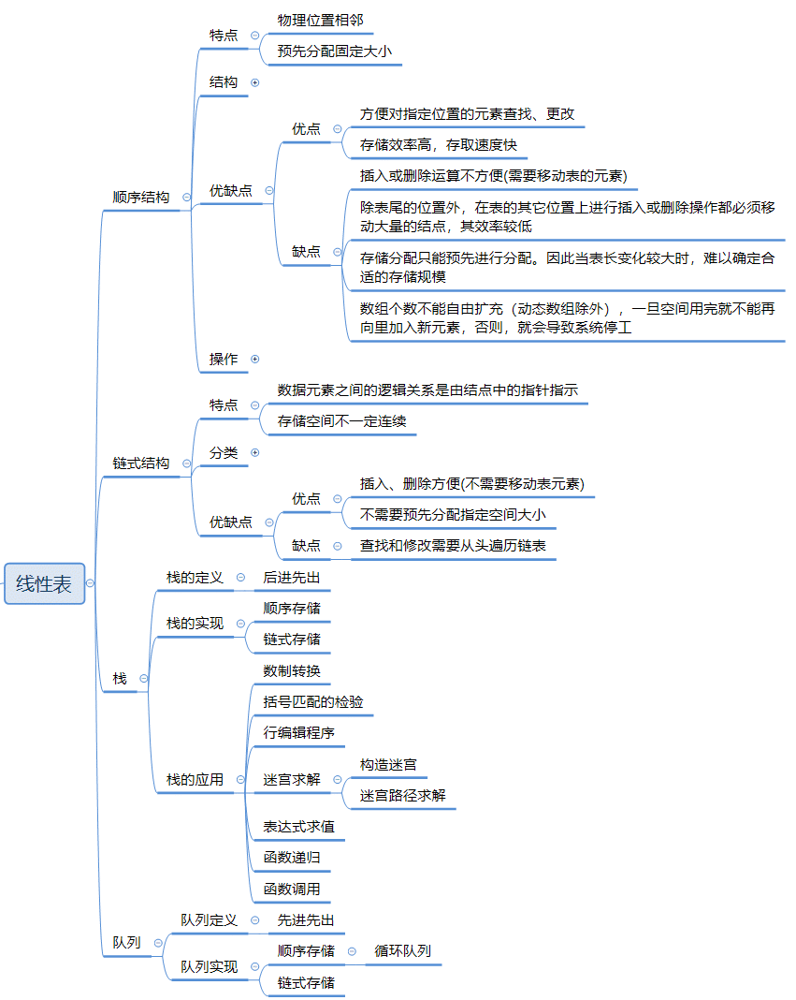
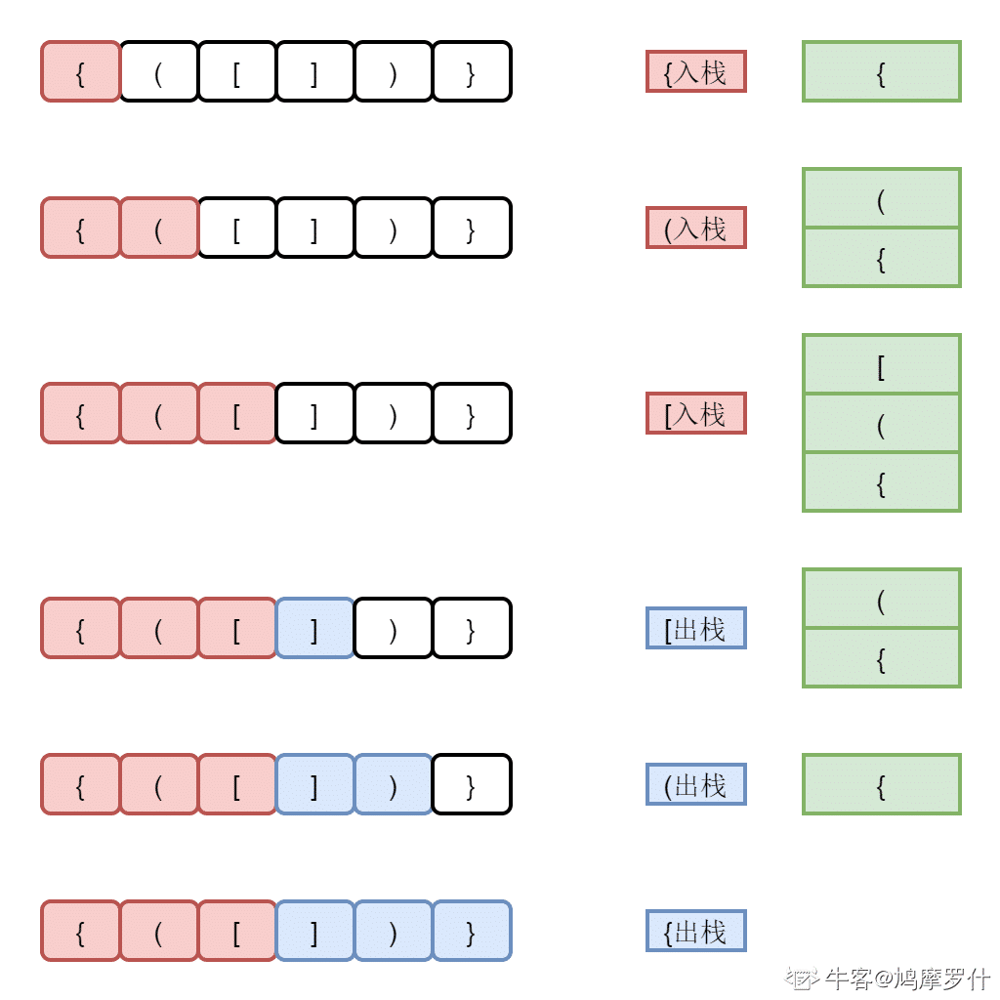
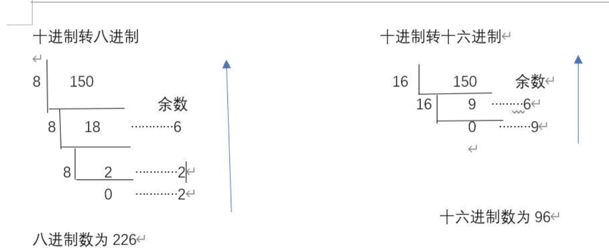
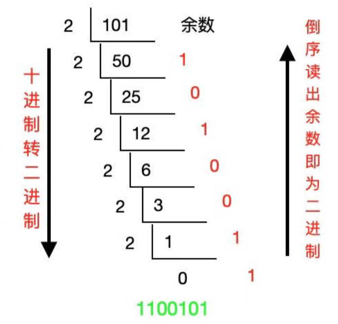
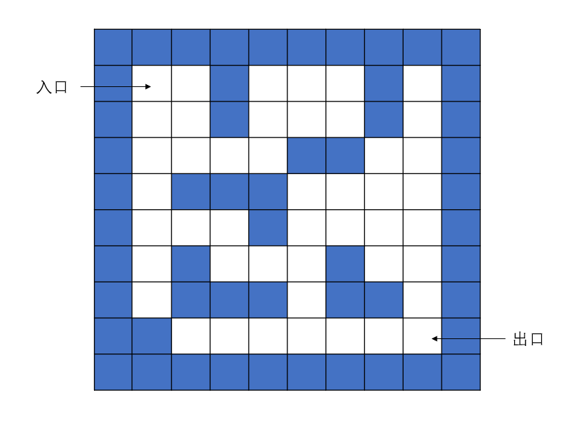

# 栈和队列



## 栈（Stack）

* 定义和特点
  * 栈是一种线性数据结构，具有后进先出（LIFO）的特性。
  *  可以类比为一叠盘子，只能从顶部放入和取出元素。
  * 可以使用数组的`push()`和`pop()`方法来实现。
* 基本操作
  * 入栈（Push）：将元素放入栈顶。
  * 出栈（Pop）：从栈顶移除元素，并返回移除的元素。
  *  获取栈顶元素（Top）：返回栈顶的元素，并不移除该元素。
  * 判断栈是否为空（isEmpty）：检查栈是否为空。
* 应用场景
  * 逆序输出、括号匹配、函数调用和递归等。

## 队列

* 定义和特点
  * 队列是一种线性数据结构，具有先进先出（FIFO）的特性。
  * 可以类比为排队买票，先来的人先被服务。
  * 可以使用数组的`push()`和`shift()`方法来实现。
* 基本操作
  * 入队（Enqueue）：将元素放入队列的末尾。
  * 出队（Dequeue）：从队列的头部移除元素，并返回移除的元素。
  * 获取队头元素（Front）：返回队列头部的元素，并不移除该元素。
  * 判断队列是否为空（isEmpty）：检查队列是否为空。


## 算法题

### 用两个队列实现一个栈（简单）

* 题目：用两个队列实现一个栈

* 思路

  > 1. 创建两个队列，分别命名为 `queue1` 和 `queue2`。
  > 2. 入栈操作：
  >    - 将元素添加到非空的队列中（初始时选择其中一个队列）。
  >    - 如果两个队列都为空，可以选择任意一个队列添加元素。
  > 3. 出栈操作：
  >    - 将非空队列中的元素逐个出队并入队到另一个空队列，直到队列中只剩下一个元素。
  >    - 移除最后剩下的元素并返回，即为出栈的元素。
  > 4. 获取栈顶元素操作：
  >    - 同出栈操作，将非空队列中的元素逐个出队并入队到另一个空队列，直到队列中只剩下一个元素。
  >    - 返回最后剩下的元素，即为栈顶元素。

* 代码：

  ```javascript
  class Stack {
    constructor() {
      this.queue1 = [];
      this.queue2 = [];
    }
  
    push(element) {
      if (this.queue1.length === 0) {
        this.queue2.push(element);
      } else {
        this.queue1.push(element);
      }
    }
  
    pop() {
      if (this.queue1.length === 0 && this.queue2.length === 0) {
        return null;
      }
  
      let nonEmptyQueue, emptyQueue;
      if (this.queue1.length === 0) {
        nonEmptyQueue = this.queue2;
        emptyQueue = this.queue1;
      } else {
        nonEmptyQueue = this.queue1;
        emptyQueue = this.queue2;
      }
  
      while (nonEmptyQueue.length > 1) {
        emptyQueue.push(nonEmptyQueue.shift());
      }
  
      return nonEmptyQueue.shift();
    }
  
    top() {
      if (this.queue1.length === 0 && this.queue2.length === 0) {
        return null;
      }
  
      let nonEmptyQueue, emptyQueue;
      if (this.queue1.length === 0) {
        nonEmptyQueue = this.queue2;
        emptyQueue = this.queue1;
      } else {
        nonEmptyQueue = this.queue1;
        emptyQueue = this.queue2;
      }
  
      while (nonEmptyQueue.length > 1) {
        emptyQueue.push(nonEmptyQueue.shift());
      }
  
      const topElement = nonEmptyQueue.shift();
      emptyQueue.push(topElement);
  
      return topElement;
    }
  
    isEmpty() {
      return this.queue1.length === 0 && this.queue2.length === 0;
    }
  }
  
  // 示例用法
  const stack = new Stack();
  stack.push(1);
  stack.push(2);
  stack.push(3);
  console.log(stack.top()); // 输出 3
  console.log(stack.pop()); // 输出 3
  console.log(stack.isEmpty()); // 输出 false
  ```

  

### 两个栈来实现一个队列（简单）

* 题目：两个栈来实现一个队列

* 思路：

  > 1. 创建两个栈，分别命名为 `stack1` 和 `stack2`。
  > 2. 入队操作：
  >    - 将元素压入 `stack1` 栈中。
  > 3. 出队操作：
  >    - 如果 `stack2` 不为空，直接从 `stack2` 栈顶弹出元素并返回。
  >    - 如果 `stack2` 为空，将 `stack1` 中的元素逐个弹出并压入 `stack2`，然后从 `stack2` 栈顶弹出元素并返回。
  > 4. 获取队头元素操作：
  >    - 如果 `stack2` 不为空，返回 `stack2` 栈顶元素。
  >    - 如果 `stack2` 为空，将 `stack1` 中的元素逐个弹出并压入 `stack2`，然后返回 `stack2` 栈顶元素。

* 代码：

  ```javascript
  class Queue {
    constructor() {
      this.stack1 = [];
      this.stack2 = [];
    }
  
    enqueue(element) {
      this.stack1.push(element);
    }
  
    dequeue() {
      if (this.stack2.length === 0) {
        while (this.stack1.length > 0) {
          this.stack2.push(this.stack1.pop());
        }
      }
      return this.stack2.pop() || null;
    }
  
    front() {
      if (this.stack2.length === 0) {
        while (this.stack1.length > 0) {
          this.stack2.push(this.stack1.pop());
        }
      }
      return this.stack2[this.stack2.length - 1] || null;
    }
  
    isEmpty() {
      return this.stack1.length === 0 && this.stack2.length === 0;
    }
  }
  
  // 示例用法
  const queue = new Queue();
  queue.enqueue(1);
  queue.enqueue(2);
  queue.enqueue(3);
  console.log(queue.front()); // 输出 1
  console.log(queue.dequeue()); // 输出 1
  console.log(queue.isEmpty()); // 输出 false
  ```

  

### 包含min函数的栈（简单）

* 题目：

  > 定义栈的数据结构，请在该类型中实现一个能够得到栈中所含最小元素的min函数（时间复杂度应为O（1））。

* 思路：

  > 题意理解：min 函数能够获取栈中最小元素，在栈进行入栈和出栈操作后，都能获取当前栈最小元素；
  >
  > 1. 创建两个栈，一个称为 `dataStack` 存储数据元素，另一个称为 `minStack` 存储最小元素。
  >
  > 2. 入栈操作：
  >
  >    - 将元素压入 `dataStack` 栈中。
  >    - 如果 `minStack` 为空，或者新入栈的元素小于等于 `minStack` 栈顶元素，则将新元素也压入 `minStack` 栈中。
  >
  > 3. 出栈操作：
  >
  >    - 从 `dataStack` 栈顶弹出元素，并将其返回。
  >    - 如果弹出的元素等于 `minStack` 栈顶元素，则也从 `minStack` 栈顶弹出元素。
  >
  > 4. 获取栈中最小元素操作：
  >
  >    - 直接返回 `minStack` 栈顶元素，即为栈中的最小元素。
  >
  > 5. 以数据[3,4,2,7,9,0]为例，让这组数字依次如栈，则栈和其对应的最小值栈如下：
  >
  >    

* 代码

  ```javascript
  class MinStack {
    constructor() {
      this.dataStack = []; // 存储数据元素的栈
      this.minStack = []; // 存储最小元素的栈
    }
  
    push(element) {
      this.dataStack.push(element);
  
      if(minStack.length === 0 ||  element < this.min()){
          minStack.push(element);
      }else{
          minStack.push(this.min());
      }
    }
  
    pop() {
      const poppedElement = this.dataStack.pop();
  
      if (poppedElement === this.minStack[this.minStack.length - 1]) {
        this.minStack.pop();
      }
  
      return poppedElement;
    }
  
    min() {
      return this.minStack[this.minStack.length - 1];
    }
  }
  
  // 示例用法
  const stack = new MinStack();
  stack.push(3);
  stack.push(2);
  stack.push(5);
  console.log(stack.min()); // 输出 2
  stack.pop();
  console.log(stack.min()); // 输出 2
  stack.push(1);
  console.log(stack.min()); // 输出 1
  ```

### 栈的压入、弹出序列（简单）

* 题目：

  > 输入两个整数序列，第一个序列表示栈的压入顺序，请判断第二个序列是否可能为该栈的弹出顺序。假设压入栈的所有数字均不相等。例如序列`1,2,3,4,5`是某栈的压入顺序，序列`4,5,3,2,1`是该压栈序列对应的一个弹出序列，但`4,3,5,1,2`就不可能是该压栈序列的弹出序列。（注意：这两个序列的长度是相等的）

* 思路：

  > 题意理解：
  >
  > * 栈的弹出顺序并是指在栈的压入过程中，任意一次压入时再弹出，记录的弹出的顺序；
  > * 题中只要求判断第二个栈是否为第一个栈的可能弹出顺序，并未要求列出弹出顺序，第一个栈的弹出顺序有很多种；
  >
  > 解题思路：
  >
  > * 使用辅助栈和模拟的方法来解决：
  >   1. 初始化一个辅助栈和一个指针 `pushIndex`，`pushIndex`指向辅助栈，初始时 `pushIndex` 的值为 0，既辅助栈为空。
  >   2. 遍历弹出序列，依次取出每一个元素：
  >      - 如果辅助栈的栈顶元素（起始辅助栈为空）不等于当前弹出序列的元素，表示还需要继续压栈，将压栈序列中 `pushIndex` 之前的元素依次压入辅助栈，直到找到与当前弹出序列元素相等的元素为止。
  >      - 如果辅助栈的栈顶元素等于当前弹出序列的元素，表示可以直接弹出，将栈顶元素弹出，然后继续遍历下一个弹出序列元素。
  >   3. 如果弹出序列遍历完成后，辅助栈为空，表示该弹出序列是可能的，否则不可能。
  >
  > 举例：
  >
  > * 例如序列`1,2,3,4,5`是某栈的压入顺序，序列`4,5,3,2,1`是该压栈序列对应的一个弹出序列，判断过程如下：
  >   * 起始辅助栈为空，弹出序列第一个元素为 4，序列 `1,2,3`,入栈，每次栈顶元素不等于 4，继续入栈直到 4 入辅助栈顶，此时辅助栈为：`1,2,3,4`；
  >   * 栈顶 4 等于辅助栈栈顶 4，辅助栈 4 出栈，记录出栈数字 4，弹出序列下移动一个；
  >   * 此时弹出栈栈顶为 3，弹出序列为 5，不相等，辅助栈继续将剩余元素 5 入栈；
  >   * 此时辅助栈栈顶元素 5 等于 弹出序列当前指针指向元素 5， 辅助栈出栈 5，弹出序列下移动一个；
  >   * 此时辅助栈剩余元素与弹出序列剩余元素顺序相同，辅助栈出栈，弹出序列下移动；直到辅助栈为空并且没有需要入栈的元素，则序列`4,5,3,2,1`是该压栈序列对应的一个弹出序列。

* 代码：

  ```javascript
  function isPopOrder(pushSequence, popSequence) {
    if (pushSequence.length !== popSequence.length) {
      return false;
    }
  
    const stack = [];
    let pushIndex = 0;//指向栈序列
  
    for (let i = 0; i < popSequence.length; i++) {//遍历弹出序列
      const current = popSequence[i];//获取弹出序列第一个元素
  	// 栈为空或栈顶元素不等于弹出序列
      while (stack.length === 0 || stack[stack.length - 1] !== current) {
        if (pushIndex >= pushSequence.length) { //栈指针超出序列，退出
          return false;
        }
  
        stack.push(pushSequence[pushIndex]); // 入栈序列元素入栈
        pushIndex++;
      }
  	// 栈顶元素等于弹出序列顶部元素，栈顶出栈
      if (stack[stack.length - 1] === current) {
        stack.pop();
      }
    }
  
    return stack.length === 0; 
  }
  
  // 示例用法
  console.log(isPopOrder([1, 2, 3, 4, 5], [4, 5, 3, 2, 1])); // 输出 true
  console.log(isPopOrder([1, 2, 3, 4, 5], [4, 3, 5, 1, 2])); // 输出 false
  ```

### 有效括号序列（简单）

* 题目：

  > 给出一个仅包含字符'(',')','{','}','['和']',的字符串，判断给出的字符串是否是合法的括号序列
  > 括号必须以正确的顺序关闭，"()"和"()[]{}"都是合法的括号序列，但"(]"和"([)]"不合法。
  >
  > 数据范围：字符串长度 0≤n≤10000
  >
  > 要求：空间复杂度O*(*n*)，时间复杂度 O*(*n*)

* 思路一：

  > 解题思路：
  >
  > 1. 创建一个空栈。
  > 2. 遍历输入的字符串，对于每个字符：
  >    - 如果是左括号（'(', '{', '['），将其推入栈中。
  >    - 如果是右括号（')', '}', ']'），检查栈是否为空：
  >      - 如果栈为空，说明右括号多于左括号，返回 false。
  >      - 如果栈不为空，将栈顶元素出栈，并与当前右括号进行匹配：
  >        - 如果匹配成功，继续遍历下一个字符。
  >        - 如果匹配失败，返回 false。
  > 3. 遍历完字符串后，检查栈是否为空：
  >    - 如果栈为空，说明所有括号都匹配成功，返回 true。
  >    - 如果栈不为空，说明左括号多于右括号，返回 false。
  >    - 

  * 代码一：

    ```js
    function isValidParentheses(s) {
      if(s.length<0 || s.length > 10000) return false;
      const stack = []; // 创建空栈
    
      for (let i = 0; i < s.length; i++) {
        const char = s[i];
        if (char === '(' || char === '{' || char === '[') {
          stack.push(char); // 左括号入栈
        } else {
          if (stack.length === 0) {
            return false; // 右括号多于左括号，返回 false
          }
          const top = stack.pop(); // 弹出栈顶元素
          if (
            (char === ')' && top !== '(') ||
            (char === '}' && top !== '{') ||
            (char === ']' && top !== '[')
          ) {
            return false; // 括号不匹配，返回 false
          }
        }
      }
    
      return stack.length === 0; // 栈为空则括号匹配成功，返回 true，否则返回 false
    }
    
    module.exports = {
        isValid: isValidParentheses,
    };
    ```

  * 代码二：使用栈和 map 代替 if 判断

    ```js
    /**
      * 
      * @param s string字符串 
      * @return bool布尔型
      */
    function isValid( s ) {
      let stack = [];
      let pair = {
        '{': '}',
        '(': ')',
        '[': ']'
      };
      for (let i = 0; i < s.length; i++) {
        if (pair[s[i]]) stack.push(s[i]);    // 左括号入栈
        else if (pair[stack[stack.length - 1]] !== s[i]) return false; // 匹配到右括号，栈顶元素是否与当前括号不匹配，返回false
        else stack.pop();// 匹配到右括号，栈顶元素是否与当前括号匹配，栈顶出栈
      }
      return stack.length <= 0;
    }
    module.exports = {
        isValid : isValid
    };
    ```

    

* 思路二：

  > * 分析：题目中仅包含字符串，如果是合法字符串，那么括号内部一定有一个正确的左右括号，因此可以使用正则匹配，将最中心的左右括号去除，剩余的括号依然可以组成合法的左右括号的话，那么就可以继续正则去除；
  > * 注意：
  >   * 该代码的思路是通过不断替换括号对来判断合法性，但并没有使用栈这种数据结构。
  >   * 相比使用栈的方法，该方法的时间复杂度较高，因为每次替换都需要遍历整个字符串。
  >   * 同时，该方法也无法处理括号嵌套的情况，例如 "(())" 是合法的括号序列，但该方法无法正确判断。
  >   * 因此，建议使用栈的方法来解决该题目。

  * 代码：

    ```js
    function isValid(s) {
        // write code here
        let len = s.length
        for (let i = 0; i < len / 2; i++){
            s = s.replace("{}", "").replace("()", "").replace("[]", "");
            console.log(s)
        }
         
        return s === ''
    }
    
    module.exports = {
        isValid: isValid,
    };
    
    ```


### 数制转换（简单）

* 题目：

  > 编写一个函数，实现十进制数转换任意进制数

* 解法一：使用队列：

  > 1. 定义一个队列，用于存储转换后的数字的每一位。
  >
  > 2. 定义一个变量 `num`，用于保存待转换的十进制数。
  >
  > 3. 定义一个变量 `base`，表示目标进制数。
  >
  > 4. 进入循环，直到 num 等于 0：
  >
  >    - 求余数：将 `num` 对 `base` 取余，得到当前位的数字。
  >    - 将余数入队：将余数入队，表示当前位的数字。
  >    - 更新 `num`：将 `num` 除以 `base`，向下取整，更新 `num` 的值。
  >
  > 5. 循环结束后，队列中的每个元素就是转换后的数字的每一位。
  >
  > 6. 弹出队列元素：从队列中依次弹出元素，组成转换后的数值。
  >
  > 7. 返回转换后的数值。
  >
  >    
  >
  >    

  * 代码：

    ```js
    class Queue {
      constructor() {
        this.items = [];
      }
    
      enqueue(item) {
        this.items.push(item);
      }
    
      dequeue() {
        return this.items.shift();
      }
    
      isEmpty() {
        return this.items.length === 0;
      }
    }
    
    /**
     * params {} decimal 十进制数
     * params {} base 转换进制
    **/
    function decimalToBase(decimal, base) {
      const queue = new Queue();
      let num = decimal;
    
      if (num === 0) { // 商结果为0，出队列
        queue.enqueue(num);
      }
    
      while (num !== 0) {
        const remainder = num % base; // 取模获得余数
        queue.enqueue(remainder); // 余数入队列
        num = Math.floor(num / base); // 除法获得商
      }
    
      let result = "";
    
      while (!queue.isEmpty()) {
        result += queue.dequeue();
      }
    
      return result;
    }
    
    // 示例用法
    const decimalNumber = 123; // 十进制数
    const base = 2; // 目标进制数
    
    const convertedNumber = decimalToBase(decimalNumber, base);
    console.log(convertedNumber); // 输出: "1111011"
    ```

    

* 解法二：使用数组

  > * 定义一个空字符串或数组，用于存储转换后的结果。
  > * 使用循环，将输入的十进制数不断除以目标进制数，直到商为 0。
  > * 在每一次循环中，将当前的余数添加到结果中，并将商更新为上一步的商。
  > * 当商为 0 时，循环结束。
  > * 将结果反转，得到最终转换后的任意进制数。
  > * 

  * 代码：


  ```js
  /**
   * params {} decimal 十进制数
   * params {} base 转换进制
  **/
  function decimalToArbitraryBase(decimal, base) {
    if (decimal === 0) {
      return "0"; // 十进制数为 0，则结果为 "0"
    }
  
    const digits = "0123456789ABCDEFGHIJKLMNOPQRSTUVWXYZ"; // 可用的数字字符
  
    let result = "";
    let quotient = Math.abs(decimal); // 取绝对值，以处理负数的情况
  
    while (quotient > 0) {
      const remainder = quotient % base; // 取模获取当前的余数
      result = digits[remainder] + result; // 根据余数获取数字，并拼接结果
      quotient = Math.floor(quotient / base); // 获取商：更新商为上一步的商
    }
  
    return decimal < 0 ? "-" + result : result; // 处理负数的情况
  }
  
  // 示例用法
  const decimal = 123; // 十进制数
  const base = 16; // 目标进制数
  
  const result = decimalToArbitraryBase(decimal, base);
  console.log(result); // 输出: "7B"
  ```

  

### 表达式求值（中等）

* 题目：

  > 请写一个整数计算器，支持加减乘三种运算和括号。
  >
  > 数据范围：0≤∣s∣≤100，保证计算结果始终在整型范围内
  >
  > 要求：空间复杂度：O*(*n)，时间复杂度O(n)

* 思路：

  > 1. 对于上述两个要求，我们要考虑的是两点，一是处理运算优先级的问题，二是处理括号的问题。
  >
  >    处理优先级问题，那必定是乘号有着优先运算的权利，加号减号先一边看，我们甚至可以把减号看成加一个数的相反数，则这里只有乘法和加法，那我们优先处理乘法，遇到乘法，把前一个数和后一个数乘起来，遇到加法就把这些数字都暂时存起来，最后乘法处理完了，就剩余加法，把之前存起来的数字都相加就好了。
  >
  >    处理括号的问题，我们可以将括号中的部分看成一个新的表达式，即一个子问题，因此可以将新的表达式递归地求解，得到一个数字，再运算：
  >
  >    - **终止条件：** 每次遇到左括号意味着进入括号子问题进行计算，那么遇到右括号代表这个递归结束。
  >    - **返回值：** 将括号内部的计算结果值返回。
  >    - **本级任务：** 遍历括号里面的字符，进行计算。
  >
  >    **具体做法：**
  >
  >    - step 1：使用栈辅助处理优先级，默认符号为加号。
  >    - step 2：遍历字符串，遇到数字，则将连续的数字字符部分转化为int型数字。
  >    - step 3：遇到左括号，则将括号后的部分送入递归，处理子问题；遇到右括号代表已经到了这个子问题的结尾，结束继续遍历字符串，将子问题的加法部分相加为一个数字，返回。
  >    - step 4：当遇到符号的时候如果是+，得到的数字正常入栈，如果是-，则将其相反数入栈，如果是*，则将栈中内容弹出与后一个元素相乘再入栈。
  >    - step 5：最后将栈中剩余的所有元素，进行一次全部相加。

* 代码：

  ```js
  /** 
   * 代码中的类名、方法名、参数名已经指定，请勿修改，直接返回方法规定的值即可
   * 返回表达式的值
   * @param s string字符串 待计算的表达式
   * @return int整型
   */
  function solve( s ) {//递归会出现深浅拷贝的问题，每次重新调用所有同名变量将改变
      // write code here
      let stack=[]; //辅助栈，记录数字和乘法计算结果
      let sign='+'; // 符号记录
      let i=0; // 遍历下标
      let num=0; // 记录遍历到的数字
      while(i<s.length){ // 遍历字符串
          if(s[i]=='('){ // 遇到左括号，遍历查找该左括号对应的右括号
              let flag=1; // flag 用于查找当前左括号对应的右括号
              let star=i+1; //记录左括号内部字符串的开始下标
              while(flag>0){ // 查找当前左括号对应的右括号, 当 flag == 0 表示找到
                  i++;
                  if(s[i]=='('){flag++;}
                  if(s[i]==')'){flag--;}
              }
              let end=i; // end 表示左括号对应的右括号下标，括号内为一个子表达式
              let arr=s.slice(star,i); // 截取子表达式子串
              num=solve(arr); // 递归计算子表达式
              i=end; // 子表达式后一个下表开始重新遍历
          }
          else if(s[i]>='0'&&s[i]<='9'){ // 遍历字符串，遇到数字，则将连续的数字字符部分转化为int型数字。
              num=num*10+Number(s[i])
          }
          if(s[i]<'0'||s[i]>'9'||i==s.length-1){ // 遇到非数字，则计算后入栈
            
              if(sign=='+'){stack.push(num);} // 遇到加号直接入栈
              if(sign=='-'){stack.push(num*(-1));} // 减法，则将数字转化为负数入栈
              if(sign=='*'){stack.push(stack.pop()*num);} // 乘法，将栈顶元素和当前数字相乘后入栈
              sign=s[i]; // 记录当前计算符号
              num=0; // 重置数字记录
          }
          i++; // 指针后移
      }
      // 将栈内剩余元素全部累加
      return stack.reduce(function(a,b){
          return a+b;
      })
  }
  module.exports = {
      solve : solve
  };
  
  ```


### 滑动窗口最大值 (双端队列)（较难）

* 题目：

  > 给定一个数组 nums，有一个大小为 k 的滑动窗口从数组的最左侧移动到数组的最右侧。你只可以看到在滑动窗口 k 内的数字。滑动窗口每次只向右移动一位。 返回滑动窗口最大值。
  >
  > ```javascript
  > 输入: nums = [1,3,-1,-3,5,3,6,7], 和 k = 3
  > 输出: [3,3,5,5,6,7] 
  > 解释: 
  >   滑动窗口的位置                最大值
  > ---------------               -----
  > [1  3  -1] -3  5  3  6  7       3
  >  1 [3  -1  -3] 5  3  6  7       3
  >  1  3 [-1  -3  5] 3  6  7       5
  >  1  3  -1 [-3  5  3] 6  7       5
  >  1  3  -1  -3 [5  3  6] 7       6
  >  1  3  -1  -3  5 [3  6  7]      7
  > 
  > ```
  >
  > 

* 思路：

  > 1. 创建一个双向队列（deque）来保存滑动窗口中的元素索引。队列会按照元素大小的降序排列，即队首元素为当前滑动窗口的最大值。(注意：队列保存的是滑动窗口的元素索引，但是队列内索引对应元素是降序排序的)
  >
  > 2. 遍历数组 nums，对于每个元素 nums[i]：
  >
  >    - 在插入元素之前，首先检查队首元素是否已经超出滑动窗口的范围（索引范围超过 i-k）。
  >    - 如果队首元素过期，则从队列中删除它，保证队列中的元素都在滑动窗口范围内。
  >    - 然后，将当前元素 nums[i] 与队列中的元素进行比较：
  >      - 从队列的尾部开始，如果尾部元素小于等于当前元素 nums[i]，则将尾部元素从队列中移除。重复此过程直到队列为空或者队列的尾部元素大于当前元素。
  >      - 将当前元素的索引插入到队列的尾部。
  >    - 检查当前索引 i 是否已经达到滑动窗口的大小 k。如果是，则滑动窗口形成，此时队首元素即为当前窗口的最大值。
  >
  > 3. 将滑动窗口的最大值保存在结果数组中。
  >
  > 4. 返回结果数组。
  >
  >    
  >
  >    时间复杂度：`O(n)`
  >
  >    空间复杂度：`O(n)`
  >
  >    - 使用优先队列也可以实现，时间复杂度为`O(nlogk)`

* 代码：

  ```javascript
  function maxSlidingWindow(nums, k) {
    if (k <= 0 || nums.length === 0) {
      return [];
    }
  
    const result = [];
    const deque = []; // 双向队列
  
    for (let i = 0; i < nums.length; i++) {
      // 检查队首元素是否超出滑动窗口的范围
      if (deque.length > 0 && deque[0] <= i - k) {
        deque.shift();
      }
  
      // 与队列中的元素进行比较，保持队列中的元素有序
      while (deque.length > 0 && nums[deque[deque.length - 1]] <= nums[i]) {
        deque.pop();
      }
  
      deque.push(i); // 将当前元素的索引插入到队列的尾部
  
      // 检查当前索引是否已经达到滑动窗口的大小 k
      if (i >= k - 1) {
        result.push(nums[deque[0]]); // 队首元素即为当前窗口的最大值
      }
    }
  
    return result;
  }
  ```


### 迷宫求解（教难）

* 题目：

  > * 给定一个`M * N `的迷宫图，求一条从指定入口到出口的迷宫路径。
  >
  >   * 假设一个迷宫图如图所示(这里M=8,N=8),其中的每个方块用空白表示通道，用蓝色阴影表示障碍物。
  >   * 一般情况下,所求迷宫路径是简单路径，即在求得的迷宫路径上不会重复出现同一方块。
  >   * 一个迷官图的迷宫路径可能有多条，这些迷宫路径有长有短，
  >   * 这里仅仅考虑用栈求一条从指定入口到出口的迷宫路径。
  >
  >   

* 思路：

  > 1. 定义一个栈，用于**存储当前的路径**。
  >
  > 2. 定义一个二维数组或矩阵来表示迷宫图，其中空白方块表示通道，蓝色阴影方块表示障碍物。
  >
  > 3. 定义一个二维数组或矩阵来标记已经访问过的方块，初始化为全部为 false。
  >
  > 4. 定义一个对象或元组来表示入口坐标，将入口坐标压入栈中。
  >
  > 5. 进入循环，直到栈为空或找到出口坐标：
  >
  >    - 弹出栈顶元素，表示当前所在位置。
  >    - 如果当前位置是出口坐标，表示找到了一条路径，循环结束。
  >    - 否则，标记当前位置为已访问，并根据当前位置的四个相邻方块（上、下、左、右）进行判断：
  >      - 如果**相邻方块是通道且未访问过**，将其坐标压入栈中。
  >
  > 6. 如果栈为空，表示没有找到从入口到出口的路径；否则，栈中的元素就是路径的顺序，可以按照栈中元素的顺序输出路径。
  >
  >    
  >
  > 

* 代码：

  ```js
  class Stack {
    constructor() {
      this.items = [];
    }
  
    push(item) {
      this.items.push(item);
    }
  
    pop() {
      return this.items.pop();
    }
  
    isEmpty() {
      return this.items.length === 0;
    }
  }
  
  //`maze` 代表迷宫图的二维数组，`start` 代表入口坐标的数组 `[row, col]`，`end` 代表出口坐标的数组 `[row, col]`。
  function findMazePath(maze, start, end) {
    const stack = new Stack(); //用于存储当前的路径
    const visited = [];//`visited`，用于标记已经访问过的方块
    const directions = [[-1, 0], [1, 0], [0, -1], [0, 1]]; // 上下左右四个方向,用于在迷宫中移动
  
    // 初始化 visited 数组，全部置为 false
    for (let i = 0; i < maze.length; i++) {
      visited[i] = [];
      for (let j = 0; j < maze[i].length; j++) {
        visited[i][j] = false;
      }
    }
  
    stack.push(start);// 入口坐标入栈
    // 循环查找栈内位置四个方便，直到栈内元素为空
    while (!stack.isEmpty()) {
      const current = stack.pop();//弹出栈顶元素，表示当前所在位置
  
      if (current[0] === end[0] && current[1] === end[1]) {
        // 找到出口坐标，返回路径
        return stack.items;
      }
  	// 标记当前位置已经访问过
      visited[current[0]][current[1]] = true;
  	// 按照上下左右依次访问四个方向位置
      for (const direction of directions) {
        const newRow = current[0] + direction[0];
        const newCol = current[1] + direction[1];
  	 //相邻方块是通道且未访问过，将其坐标压入栈中
        if (isValidMove(maze, newRow, newCol) && !visited[newRow][newCol]) {
          stack.push([newRow, newCol]);
        }
      }
    }
  
    // 栈为空，表示没有找到路径
    return null;
  }
  
  function isValidMove(maze, row, col) {
    const numRows = maze.length;
    const numCols = maze[0].length;
  
    return row >= 0 && row < numRows && col >= 0 && col < numCols && maze[row][col] === " ";
  }
  
  // 示例用法
  const maze = [
    [" ", " ", " ", " ", " ", " ", " ", " "],
    [" ", "X", "X", " ", " ", "X", "X", " "],
    [" ", " ", " ", "X", " ", " ", " ", " "],
    [" ", "X", " ", "X", " ", "X", " ", "X"],
    [" ", " ", " ", " ", " ", " ", " ", " "],
    [" ", "X", "X", "X", " ", "X", "X", " "],
    [" ", " ", " ", " ", " ", " ", " ", " "],
    [" ", " ", "X", "X", " ", "X", "X", " "]
  ];
  
  const start = [0, 0]; // 入口坐标
  const end = [7, 7]; // 出口坐标
  
  /**
  路径的函数是 `findMazePath`，它接受三个参数：`maze` 代表迷宫图的二维数组，`start` 代表入口坐标的数组 `[row, col]`，`end` 代表出口坐标的数组 `[row, col]`。
  
  首先，我们定义一个栈 `stack`，用于存储当前的路径。我们还定义了一个二维数组 `visited`，用于标记已经访问过的方块。`directions` 是一个表示四个方向的数组，用于在迷宫中移动。
  
  接下来，我们初始化 `visited` 数组，将其全部置为 `false`。
  
  然后，将入口坐标 `start` 压入栈中。
  
  在循环中，我们不断弹出栈顶元素，表示当前所在位置。如果当前位置是出口坐标 `end`，则表示找到了一条路径，循环结束，我们返回栈中的元素，即路径的顺序。
  
  否则，我们将当前位置标记为已访问，并根据四个方向进行判断。对于每个方向，我们计算出相邻方块的坐标，如果该方块是通道且未访问过，则将其坐标压入栈中。
  
  如果循环结束，栈为空，表示没有找到路径，我们返回 `null`。
  
  示例用法展示了如何使用以上代码来找到从入口 `[0, 0]` 到出口 `[7, 7]` 的迷宫路径。
  请注意，这只是一种基于栈的解法，可能存在多条从入口到出口的路径，该解法只返回其中一条路径。如果需要找到所有路径，可以使用递归或其他搜索算法。
  **/
  
  ```

  
