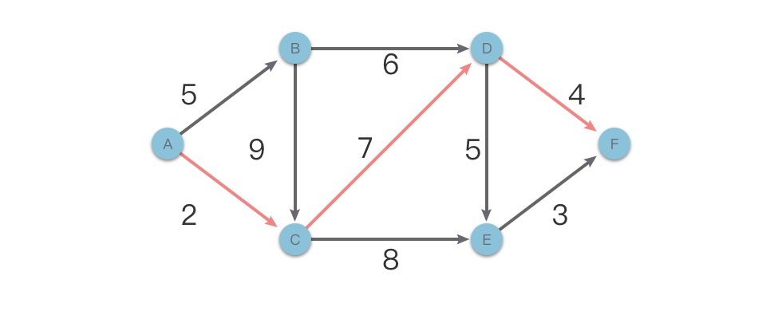
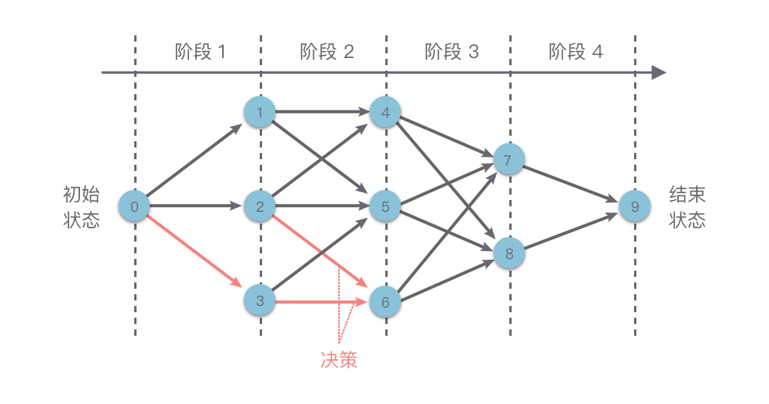

# 动态规划基础


**动态规划（Dynamic Programming）**：简称 **DP**，是一种求解多阶段决策过程最优化问题的方法。在动态规划中，通过把原问题分解为相对简单的子问题，先求解子问题，再由子问题的解而得到原问题的解。

## 思想

**动态规划的核心思想**：

1. 把「原问题」分解为「若干个重叠的子问题」，每个子问题的求解过程都构成一个 **「阶段」**。在完成一个阶段的计算之后，动态规划方法才会执行下一个阶段的计算。
2. 在求解子问题的过程中，按照「自顶向下的记忆化搜索方法」或者「自底向上的递推方法」求解出「子问题的解」，把结果存储在表格中，当需要再次求解此子问题时，直接从表格中查询该子问题的解，从而避免了大量的重复计算。

### 动态规划的简单例子

下面我们先来通过一个简单的例子来介绍一下什么是动态规划算法，然后再来讲解动态规划中的各种术语。

> **斐波那契数列**：数列由 𝑓(0)=1,𝑓(1)=2*f*(0)=1,*f*(1)=2 开始，后面的每一项数字都是前面两项数字的和。也就是：
>
> 

通过公式  `𝑓(𝑛)=𝑓(𝑛−2)+𝑓(𝑛−1)` ，我们可以将原问题 𝑓(𝑛)  递归地划分为 𝑓(𝑛−2)  和 𝑓(𝑛−1) 这两个子问题。其对应的递归过程如下图所示：


从图中可以看出：如果使用传统递归算法计算 𝑓(5) ，需要先计算 𝑓(3)  和 𝑓(4) ，而在计算 𝑓(4) 时还需要计算 𝑓(3) ，这样  f(3) 就进行了多次计算。同理 𝑓(0) 、𝑓(1) 、𝑓(2)  都进行了多次计算，从而导致了重复计算问题。

为了避免重复计算，我们可以使用动态规划中的「表格处理方法」来处理。

这里我们使用「自底向上的递推方法」求解出子问题 f*(*n−2) 和 f*(*n−1) 的解，然后把结果存储在表格中，供随后的计算查询使用。

具体过程如下：

1. 定义一个数组 𝑑𝑝 ，用于记录斐波那契数列中的值。
2. 初始化 𝑑𝑝[0]=0，𝑑𝑝[1]=1。
3. 根据斐波那契数列的递推公式 𝑓(𝑛)=𝑓(𝑛−1)+𝑓(𝑛−2) ，从 𝑑𝑝(2) 开始递推计算斐波那契数列的每个数，直到计算出 𝑑𝑝(𝑛) 。
4. 最后返回 𝑑𝑝(𝑛)  即可得到第 n*项斐波那契数。

这种使用缓存（哈希表、集合或数组）保存计算结果，从而避免子问题重复计算的方法，就是「动态规划算法」。

```typescript
function fib(n: number): number {  
    if (n === 0) {  
        return 0;  
    }  
    if (n === 1) {  
        return 1;  
    }  
  
    const dp: number[] = new Array(n + 1).fill(0);  
    dp[0] = 0;  
    dp[1] = 1;  
  
    for (let i = 2; i <= n; i++) {  
        dp[i] = dp[i - 2] + dp[i - 1];  
    }  
  
    return dp[n];  
}  
```


## 特征

**最优子结构**：如果问题的最优解所包含的子问题的解也是最优的，就称该问题具有最优子结构。动态规划利用这一性质，通过求解子问题的最优解来构建原问题的最优解。

**无后效性**（或称为“无后向性”）：“未来与过去无关”，即“将来与过去无关”，只与当前的状态有关。这是指“无后效性”是指某阶段的状态一旦确定，则此后过程的演变不再受此前各种状态及决策的影响。也就是说，“未来与过去无关”，只与当前的状态有关。

**子问题重叠**：在求解过程中，动态规划将原问题分解为若干个子问题。这些子问题中有很多是重复出现的，即子问题重叠。动态规划通过保存已解决的子问题的解，避免了重复计算，从而提高了效率。

### 最优子结构性质

> **最优子结构**：指的是一个问题的最优解包含其子问题的最优解。

举个例子，如下图所示，原问题 `𝑆={𝑎1,𝑎2,𝑎3,𝑎4}` ，在 𝑎1  步我们选出一个当前最优解之后，问题就转换为求解子问题 `𝑆子问题={𝑎2,𝑎3,𝑎4}` 。如果原问题 𝑆 的最优解可以由「第 𝑎1  步得到的局部最优解」和「 𝑆子问题 的最优解」构成，则说明该问题满足最优子结构性质。

也就是说，如果原问题的最优解包含子问题的最优解，则说明该问题满足最优子结构性质。


### 重叠子问题性质

> **重叠子问题性质**：指的是在求解子问题的过程中，有大量的子问题是重复的，一个子问题在下一阶段的决策中可能会被多次用到。如果有大量重复的子问题，那么只需要对其求解一次，然后用表格将结果存储下来，以后使用时可以直接查询，不需要再次求解。


之前我们提到的「斐波那契数列」例子中，𝑓(0) 、𝑓(1) 、𝑓(2) 、𝑓(3)  都进行了多次重复计算。

动态规划算法利用了子问题重叠的性质，在第一次计算𝑓(0) 、𝑓(1) 、𝑓(2) 、𝑓(3)   时就将其结果存入表格，当再次使用时可以直接查询，无需再次求解，从而提升效率。

### 无后效性

> **无后效性**：指的是子问题的解（状态值）只与之前阶段有关，而与后面阶段无关。当前阶段的若干状态值一旦确定，就不再改变，不会再受到后续阶段决策的影响。

也就是说，**一旦某一个子问题的求解结果确定以后，就不会再被修改**。

举个例子，下图是一个有向无环带权图，我们在求解从 𝐴 点到 𝐹 点的最短路径问题时，假设当前已知从 𝐴 点到 𝐷  点的最短路径（2+7=92+7=9）。那么无论之后的路径如何选择，都不会影响之前从 𝐴 点到 𝐷 点的最短路径长度。这就是「无后效性」。

而如果一个问题具有「后效性」，则可能需要先将其转化或者逆向求解来消除后效性，然后才可以使用动态规划算法。




## 动态规划的基本思路

如下图所示，我们在使用动态规划方法解决某些最优化问题时，可以将解决问题的过程按照一定顺序（时间顺序、空间顺序或其他顺序）分解为若干个相互联系的「阶段」。然后按照顺序对每一个阶段做出「决策」，这个决策既决定了本阶段的效益，也决定了下一阶段的初始状态。依次做完每个阶段的决策之后，就得到了一个整个问题的决策序列。

这样就将一个原问题分解为了一系列的子问题，再通过逐步求解从而获得最终结果。



这种前后关联、具有链状结构的多阶段进行决策的问题也叫做「多阶段决策问题」。

通常我们使用动态规划方法来解决问题的基本思路如下：

1. **划分阶段**：

   * 将原问题按顺序（时间顺序、空间顺序或其他顺序）分解为若干个相互联系的「阶段」。
   * 划分后的阶段⼀定是有序或可排序的，否则问题⽆法求解。

   - 这里的「阶段」指的是⼦问题的求解过程。每个⼦问题的求解过程都构成⼀个「阶段」，在完成前⼀阶段的求解后才会进⾏后⼀阶段的求解。

2. **定义状态**：

   * 将和子问题相关的某些变量（位置、数量、体积、空间等等）作为一个「状态」表示出来。状态的选择要满⾜⽆后效性。

   - 一个「状态」对应一个或多个子问题，所谓某个「状态」下的值，指的就是这个「状态」所对应的子问题的解。

3. **状态转移**：

   * 根据「上一阶段的状态」和「该状态下所能做出的决策」，推导出「下一阶段的状态」。或者说根据相邻两个阶段各个状态之间的关系，确定决策，然后推导出状态间的相互转移方式（即「状态转移方程」）。

4. **初始条件和边界条件**：根据问题描述、状态定义和状态转移方程，确定初始条件和边界条件。

5. **最终结果**：确定问题的求解目标，然后按照一定顺序求解每一个阶段的问题。最后根据状态转移方程的递推结果，确定最终结果。


## 算法题

| 题号 | 标题                                                         | 标签                             | 难度 |
| :--- | :----------------------------------------------------------- | :------------------------------- | :--- |
| 0509 | [斐波那契数](https://leetcode.cn/problems/fibonacci-number/) | 递归、记忆化搜索、数学、动态规划 | 简单 |
| 0070 | [爬楼梯](https://leetcode.cn/problems/climbing-stairs/)      | 记忆化搜索、数学、动态规划       | 简单 |
| 0062 | [不同路径](https://leetcode.cn/problems/unique-paths/)       | 数学、动态规划、组合数学         | 中等 |

### [爬楼梯](https://leetcode.cn/problems/climbing-stairs/)

#### 题目

假设你正在爬楼梯。需要 `n` 阶你才能到达楼顶。

每次你可以爬 `1` 或 `2` 个台阶。你有多少种不同的方法可以爬到楼顶呢？

 

**示例 1：**

```
输入：n = 2
输出：2
解释：有两种方法可以爬到楼顶。
1. 1 阶 + 1 阶
2. 2 阶
```

**示例 2：**

```
输入：n = 3
输出：3
解释：有三种方法可以爬到楼顶。
1. 1 阶 + 1 阶 + 1 阶
2. 1 阶 + 2 阶
3. 2 阶 + 1 阶
```


#### 解法一：动态规划

**思路和算法**

我们用 f(x) 表示爬到第 xxx 级台阶的方案数，考虑最后一步可能跨了一级台阶，也可能跨了两级台阶，所以我们可以列出如下式子：

`f(x)=f(x−1)+f(x−2)` 

它意味着爬到第 x 级台阶的方案数是爬到第 x−1 级台阶的方案数和爬到第 x−2 级台阶的方案数的和。

很好理解，因为每次只能爬 1 级或 2 级，所以 f(x) 只能从 f(x−1) 和 f(x−2) 转移过来，而这里要统计方案总数，我们就需要对这两项的贡献求和。

以上是动态规划的转移方程，下面我们来讨论边界条件：

1. 我们是从第 0 级开始爬的，所以从第 0  级爬到第 0 级我们可以看作只有一种方案，即 f(0)=1f ；
2. 从第 0 级到第 1 级也只有一种方案，即爬一级，f(1)=1 。
3. 这两个作为边界条件就可以继续向后推导出第 n  级的正确结果。

验证：根据转移方程得到 f(2)=2 ，f(3)=3 ，f(4)=5 ，……，我们把这些情况都枚举出来，发现计算的结果是正确的。

本题可转化为 求斐波那契数列的第 n 项，区别仅在于初始值不同：

跳台阶问题： f(0)=1 , f(1)=1 , f(2)=2  。
斐波那契数列问题： f(0)=0  , f(1)=1 , f(2)=1 。


我们不难通过转移方程和边界条件给出一个时间复杂度和空间复杂度都是 O(n) 的实现，但是由于这里的 f(x) 只和 f(x−1) 与 f(x−2) 有关，所以我们可以用「滚动数组思想」把空间复杂度优化成 O(1) 。

下面的代码中给出的就是这种实现：

```typescript
function climbStairs(n: number): number {
  let pre: number = 0, next: number = 0, res: number = 1;
  for (let i = 1; i <= n; ++i) {
      pre = next; 
      next = res; 
      res = pre + next;
  }
  return res;
};
```

**复杂度分析**

- 时间复杂度：循环执行 n 次，每次花费常数的时间代价，故渐进时间复杂度为 O(n) 。

- 空间复杂度：这里只用了常数个变量作为辅助空间，故渐进空间复杂度为 O(1) 。

