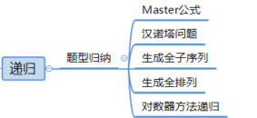

# 递归




## 应用

### ElementUI 级联选择器选中对象匹配

**题目：**

在 [elements-ui 级联选择器](https://element.eleme.cn/#/zh-CN/component/cascader) 选择器中，级联选项的下拉配置项 `options` 是一个含有 `children` 属性的递归数组对象，结构如下：

```js
 options: [{
          value: 'zhinan',
          label: '指南',
          children: [{
            value: 'shejiyuanze',
            label: '设计原则',,
            other: '其他附加字段1'
            children: [{
              value: 'yizhi',
              label: '一致',
               other: '其他附加字段2'
            }, {
              value: 'fankui',
              label: '反馈',
               other: '其他附加字段3'
            }, {
              value: 'xiaolv',
              label: '效率',
               other: '其他附加字段4'
            }, {
              value: 'kekong',
              label: '可控',
               other: '其他附加字段5'
            }]
          }, 
          {
            value: 'daohang',
            label: '导航',,
             other: '其他附加字段6'
            children: [{
              value: 'cexiangdaohang',
              label: '侧向导航',
              children: [
                {
                  value: 'cexiangdaohang1',
                  label: '侧向导航1',
                  other: '其他附加字段7'
                },
                {
                  value: 'cexiangdaohang2',
                  label: '侧向导航2',
                  other: '其他附加字段8'
                }
             ],
            }, 
            {
              value: 'dingbudaohang',
              label: '顶部导航',
              other: '其他附加字段9'
            }]
          }]
```

级联选项 `options` 可以通过后端接口返回，嵌套层级动态变化，级联组件 `change` 事件回调中，传入参数为选中值的 value 数组，并且按照级联层级返回，如，选中以上选项中的 `侧向导航1` 后，  `change` 事件回调参数为:

```js
['daohang','cexiangdaohang', 'cexiangdaohang1']
```

请根据以上内容，获取级联选择器中选中值对象的 `other` 字段内容。

**思路一： 栈**

>   `change` 事件回调参数中无法直接获取 `options` 选项中的对象，要想获取 `options` 选项中选中值的 `other` 字段内容，必须先通过遍历 `options` 获取选中值的对象；
>
> 根据  `change` 事件回调参数，通过深度遍历，递归 `options` 选项对象，获取选中对象：
>
> 1. 初始化栈，保存 `options`  的对象；
> 2. 初始化  `change` 事件回调参数回调队列 `values`;
> 3. 循环遍历栈，判断栈是否为空，不为空执行以下操作：
>    1. 弹出栈内容，获取选项`opt`;
>    2. 队列 `values`出队列，获取 `val;
>    3. 过滤查找 `opt` 数组中的 value 属性等于 val 的对象 `opts` ；
>    4. 判断对象 `opts[0]` 是否有 `children` ，有，则将  `opts[0]`  入栈；
> 4. 返回 `opt` 对象

```js
    /**获取 other 属性
   	 * select 选中 values 回调参数，数组，内容为选项 value 组成数组
   	 * options 下拉选项
	**/
    getOtherParams(select,options) {
      const opt = this.selectedOption(
        JSON.parse(JSON.stringify(options)),
        JSON.parse(JSON.stringify(select))
      );
      if (opt && opt.length > 0) {
        return opt[0]?.other;
      }
      return null;
    },

    // 获取部门下拉对象
    selectedOption(options, select) {
      // 初始化栈，为初始下拉选项数据
      const stacks = [options];
      // 选中值数组队列
      let ids = select; 
      let opts = null;
      // 栈不为空或 id不为空，
      while (stacks.length > 0 && ids && ids.length > 0) {
        let opt = stacks.pop();
        let id = ids.shift();
        opts = opt && opt.filter((o) => o.id === id);
        if (opts && opts[0].children) {
          stacks.push(opts[0].children);
        }
      }
      return opts;
    },
```

